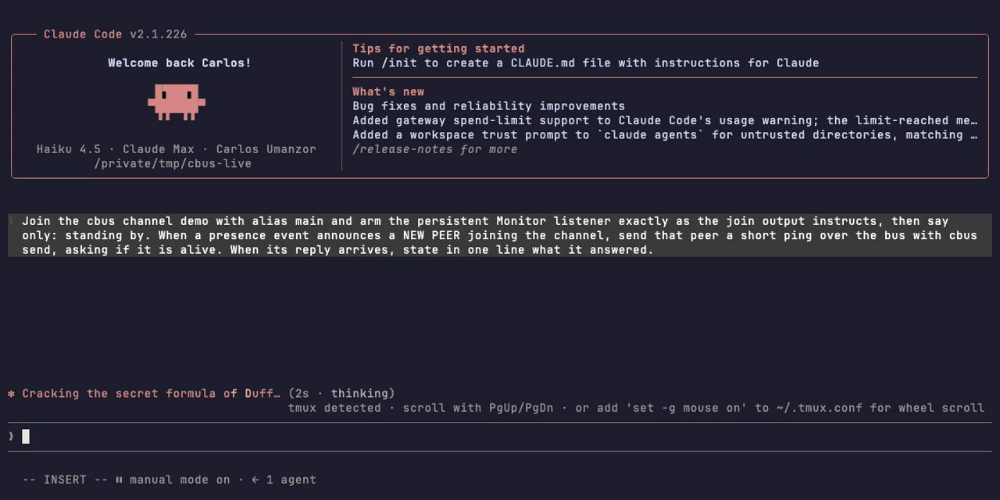
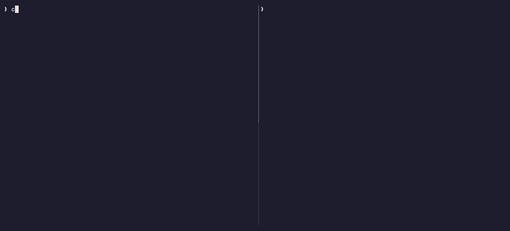

# claudebus

A tiny **file-based message bus that lets two (or more) live Claude Code sessions
talk to each other** — an orchestrator and the worker sessions it spawned, two
windows working the same repo, or a session on your laptop and one on a home
server — so results flow between them live instead of through handoff files you
carry over by hand.



Under the hood, this is what the armed Monitor is tailing — the same exchange at
the CLI level:



Built entirely from **supported primitives** — the `Monitor` tool plus plain
files — so it depends on no undocumented internals and works across terminal
windows, tabs, tmux, and CCS profiles. The client is a single static Go binary.

> **Scope — bespoke by design.** A personal, single-operator tool wired to one
> specific setup (a homelab NUC reachable over a Cloudflare tunnel). It's here to
> be *read* — an honest write-up of the architecture and tradeoffs — not packaged
> for others to deploy. Read [docs/security.md](docs/security.md) before pointing
> any of it at a network.

## Quickstart

```sh
# from source
go build -o ~/.local/bin/cbus ./cmd/cbus
cbus install-commands && cbus install-roles

# or bootstrap from a release (see docs/install.md), then stay current with
cbus selfupdate
```

Two shells, one channel:

```sh
# shell 1                          # shell 2
cbus join demo                     cbus join demo
cbus tail demo/main                cbus send main "build's green — merging"
```

Inside Claude Code the tail runs under the persistent **Monitor** tool (the
`/bus-join` skill wires it), so an incoming message lands in the receiving
session's conversation as a live event — an idle session wakes and answers.

Bring a whole fleet back after a reboot:

```sh
cbus formation save myeffort      # snapshot the channel: peers, roles, models
cbus formation resume myeffort    # after the reboot: one command; the restored
                                  # anchor gets a decision brief and reconciles
                                  # the rest itself
```

## What's in the box

- **Channels & aliases** — named N-way registries with real process liveness,
  auto-assigned aliases, presence events, and self-cleaning state —
  [docs/how-it-works.md](docs/how-it-works.md)
- **Session launchers** — `/bus-branch` forks a window with the bus pre-wired;
  `cbus spawn --role coder` opens a fresh peer briefed from a committed role
  file — [docs/usage.md](docs/usage.md)
- **Formations** — save a fleet's shape, restore it with one command, stamp out
  fresh fleets from starter templates; there's a three-peer fleet demo at the
  top of the doc — [docs/formations.md](docs/formations.md)
- **Harness-neutral peers** — a Codex CLI session can hold a channel alias
  today; cbus does the listening for it. Grok Build and OpenCode are planned
  next — [docs/codex.md](docs/codex.md)
- **Cross-machine relay** — a std-lib-only Go daemon extends channels across
  machines (`<channel>@<host>/<alias>`) behind an authenticated tunnel —
  [docs/relay.md](docs/relay.md)

## Docs

| doc | what's in it |
|---|---|
| [CHEATSHEET.md](CHEATSHEET.md) | the quick-reference card — every verb in one screen |
| [docs/how-it-works.md](docs/how-it-works.md) | store, join, tail, send; delivery semantics, caveats, and why the built-in teammate mailbox doesn't cover this |
| [docs/install.md](docs/install.md) | releases, `selfupdate`, from-source, what gets installed where |
| [docs/usage.md](docs/usage.md) | forking, spawning, roles, the global channel, presence |
| [docs/formations.md](docs/formations.md) | save / apply / resume, starter templates, birth records, drift anchors |
| [docs/codex.md](docs/codex.md) | Codex sessions as bus peers |
| [docs/relay.md](docs/relay.md) | the networked relay and `@host` remote channels |
| [docs/security.md](docs/security.md) | the trust boundary, stated honestly |
| [docs/architecture/](docs/architecture/) | the deep end: system overview, full command reference, wire protocol, port map |

## License

[MIT](LICENSE) — © 2026 Carlos Umanzor. A fun, single-operator personal project:
fork it, read it, take ideas from it — that's what it's here for. No support,
warranty, or contribution process is implied; see the *bespoke by design* note above.
