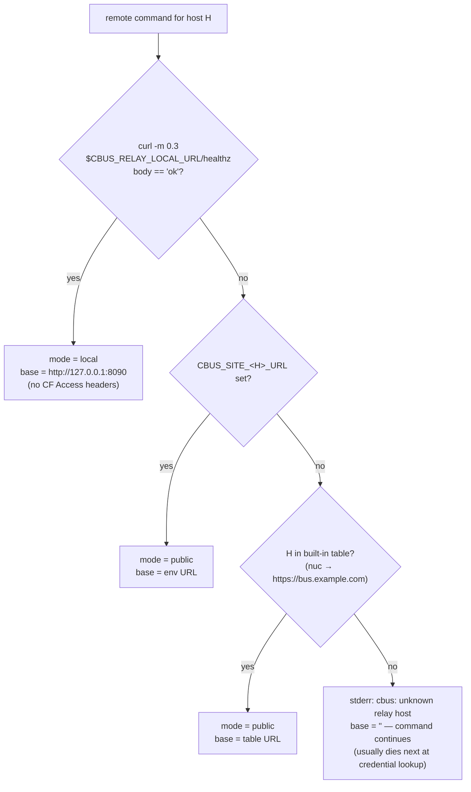
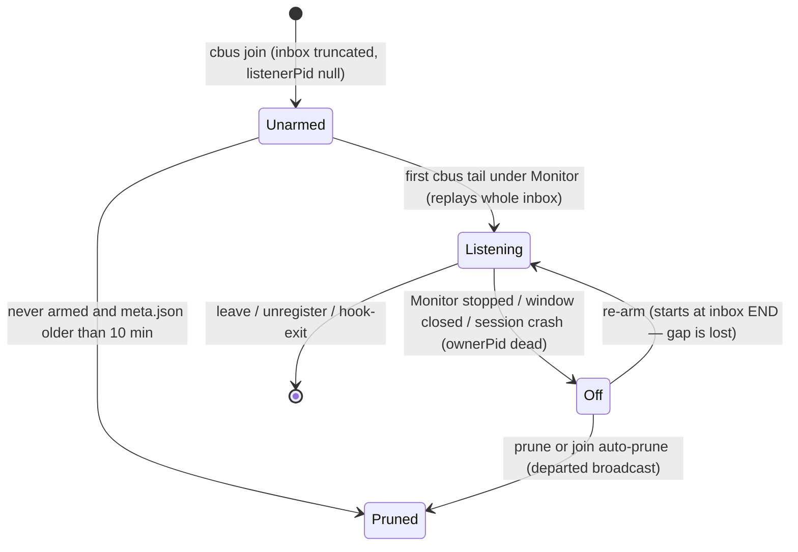
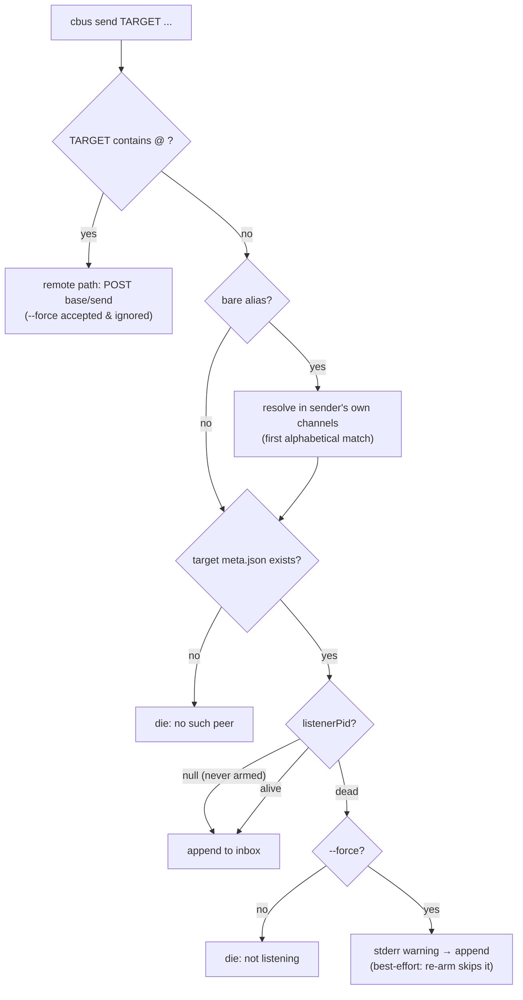
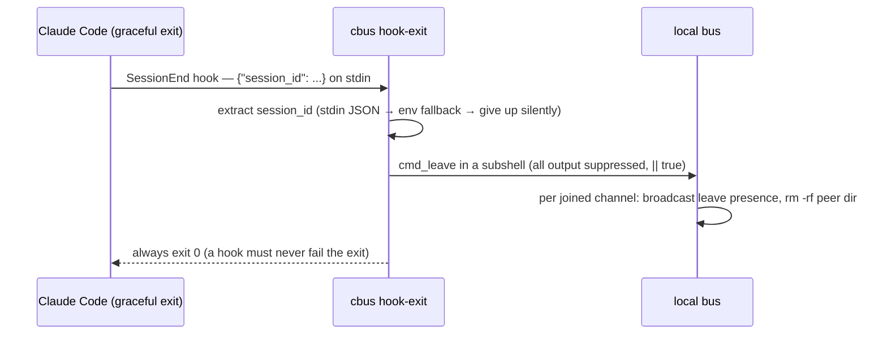
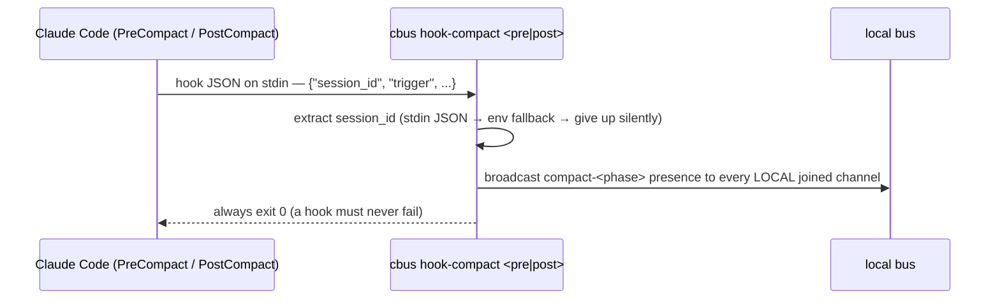
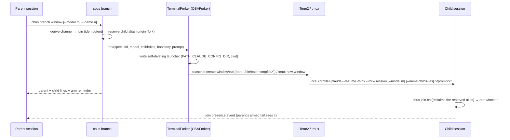

# cbus Command Reference

The complete behavior reference for the claudebus client surface: every `cbus`
subcommand, the address grammar, the Monitor-arming contract, the slash
commands, the `formation` verb family, the distribution and self-update verbs,
the SessionEnd `hook-exit` flow, and the PreCompact/PostCompact `hook-compact`
flow. The retired fork helper (`bin/cc-branch.sh`)
and installers (`install.sh`, `install-cbus-go.sh`) are kept as historical
sections (§13–§14).

This documents behavior **as-is** for the installed Go client. Source anchors are
`bin/cbus:N` for behavior inherited from the retired bash contract (kept in-repo
as the rollback artifact until P3) and `cmd/cbus/*.go` / `internal/client/*.go`
for the Go-native verbs (`spawn`, the `formation` family, the distribution verbs)
that have no bash counterpart. Behavioral oddities are flagged as **quirk** —
they are part of the current contract and are catalogued so a reimplementation
preserves or rethinks them deliberately, never silently.

> **STATUS (2026-07-13): bash-era reference spec.** The installed `cbus` on every
> machine is now the Go port (`cmd/cbus`), differentially verified byte-identical
> against this document (27/27 verbs, both platforms — see
> [cutover-decision-package.md](cutover-decision-package.md)). This reference remains
> the behavioral contract; `bin/cbus:N` anchors point at the retired bash
> implementation, kept in-repo until P3
> ([compat-deletion-plan.md](compat-deletion-plan.md)). Intended deltas shipped by
> the port:
>
> 1. Unknown relay hosts and invalid channel/alias/host names are **hard errors** (bash: a
>    non-fatal stderr message from a die-in-substitution; `tail ch@bogus/al` even exited 0).
> 2. Remote HTTP calls have **timeouts: 4 s connect / 20 s total, no retry** (bash: none —
>    a wedged origin hung the Bash tool call).
> 3. `cbus auth status` **validates its host argument** (bash: the one unvalidated
>    `auth_get` path; Linux `../` read traversal).
> 4. An empty `--from` value is an error.
> 5. A `--` **flag terminator** is supported.
> 6. **Trailing junk is an error on fixed-arity verbs** (bash silently discarded it, e.g.
>    `cbus whoami junk`).
> 7. `--help` no longer lists the obsolete `CC_BRANCH` env line (branch is native). The
>    `CBUS_PYTHON (default python3)` help line is still printed for byte-parity
>    (COMPAT(P3 #4)) but the Go client ignores it.
> 8. New verb: `cbus --version` (prints the build stamp; bash had no version verb).
> 9. **python3 is no longer needed at runtime** (nor `tail(1)`, nor bash 3.2 compatibility).
> 10. **Max message size 1 MiB** — local sends now reject oversize messages, matching the
>     relay's `/send` body cap.
>
> §13 (cc-branch.sh) and §14 (install.sh) describe **retired** components. `branch`
> is native in the Go client (TerminalForker, §9), and both legacy installers
> (`install.sh`, `install-cbus-go.sh`) were removed in `de07cbe` — distribution is
> now `get.sh` + `cbus selfupdate` + `install-commands`/`install-roles` (§11).
> Rolling back to the bash client (still at `bin/cbus`) is a manual copy over
> `~/.local/bin/cbus`. The Go-native verbs added post-cutover — `spawn` (§9), the
> `formation` family (§10), and the distribution verbs (§11) — have no bash
> counterpart and anchor to `cmd/cbus`/`internal/client`.

Related docs: [`prior-art-and-cc-internals.md`](../prior-art-and-cc-internals.md)
(design rationale), the repo [`README.md`](../../README.md) and
[`CHEATSHEET.md`](../../CHEATSHEET.md) (operator-facing; some sections lag the
code — this reference is the current truth).

---

## Table of contents

1. [Invocation basics & global behavior](#1-invocation-basics--global-behavior)
2. [Address grammar](#2-address-grammar)
3. [The Monitor-arming contract](#3-the-monitor-arming-contract)
4. [Commands: joining & identity](#4-commands-joining--identity)
5. [Commands: messaging](#5-commands-messaging)
6. [Commands: presence & discovery](#6-commands-presence--discovery)
7. [Commands: lifecycle & cleanup](#7-commands-lifecycle--cleanup)
8. [Commands: auth](#8-commands-auth)
9. [Commands: forking & spawning](#9-commands-forking--spawning)
10. [Commands: formations](#10-commands-formations)
11. [Commands: distribution & self-update](#11-commands-distribution--self-update)
12. [Slash commands](#12-slash-commands)
13. [Historical: the cc-branch.sh fork helper](#13-historical-the-cc-branchsh-fork-helper)
14. [Historical: the retired installers](#14-historical-the-retired-installers)
15. [Deprecated & legacy surfaces](#15-deprecated--legacy-surfaces)
16. [Quirk index](#16-quirk-index)

---

## 1. Invocation basics & global behavior

The installed client is a single static Go binary (`cmd/cbus`) with no runtime
dependencies. The retired bash `bin/cbus` it replaced was a single script (914
lines, `#!/usr/bin/env bash`, `set -euo pipefail`) that delegated all JSON work —
and the long-lived tail follower itself — to short embedded `python3` programs
(no `jq`). The rows below citing `bin/cbus:N` describe that bash-era contract,
preserved here because the script stays in-repo as the rollback artifact.

| Fact | Detail |
|---|---|
| python3 (bash era only) | The bash `bin/cbus` checked python3 at startup before dispatch (bin/cbus:22) — even `cbus --help` died without it (`cbus: python3 not found (set CBUS_PYTHON)`). The installed **Go client has no python dependency**; `CBUS_PYTHON` survives only as a COMPAT(P3 #4) help-text vestige (env table below), printed for byte-parity and ignored (README:482). |
| State root | `$CBUS_DIR`, default `~/.claude-bus` (bin/cbus:16). |
| Timestamps | UTC ISO-8601 `YYYY-MM-DDTHH:MM:SSZ` via `date -u` (bin/cbus:20). |
| bash floor (bash era only) | macOS `/bin/bash` 3.2 was a hard compatibility floor for the retired script (a nameref refactor was rejected for breaking it); the Go client has no shell-version floor. |

### Two error dialects

Every deliberate error goes through `die()` (bin/cbus:19): prints
`cbus: <message>` to **stderr**, exits **1**.

Required-positional errors use bash `${1:?usage: ...}` guards instead, which
render in bash's own format — no `cbus:` prefix, includes the script path and
line number, also stderr, also exit 1:

```
/Users/dev/.local/bin/cbus: line 395: 1: usage: cbus join <channel> [alias]
```

The format is identical on bash 3.2 and 5.x (verified live). Two of these
guards (`--from` missing its value, bin/cbus:243 and :446) carry no message at
all and render bash's stock `parameter null or not set`.

> **Quirk:** two visibly different error dialects from one binary; usage errors
> leak the installed path and line numbers. A port should unify (e.g.
> `cbus: usage: ...`, and consider exit 2 for usage errors).

### Exit codes

| Code | When |
|---|---|
| 0 | Success; `--help` / no args; `prune` with nothing to do; `list`/`channels` on empty; `auth status` always; `hook-exit` / `hook-compact` **always**; idempotent re-join; no-op rename |
| 1 | Every `die()`; every `${n:?}` usage error; `whoami` with no registrations; `leave` with nothing to leave; `cbus list @host` transport failure (the pipeline's rightmost python exits 1 on empty stdin — curl's own exit code is always masked) |

### Environment variables (complete)

| Var | Read at | Effect |
|---|---|---|
| `CBUS_DIR` | bin/cbus:16 | State root (default `~/.claude-bus`) |
| `CBUS_PYTHON` | bin/cbus:17 (bash era) | Python interpreter for the retired bash client (default `python3`). **The Go client ignores it** — still printed in `--help` for byte-parity as a COMPAT(P3 #4) vestige (README:482) |
| `CLAUDE_CODE_SESSION_ID` | :93, :189, :432, :685 | Session identity. Without it, `whoami`/`leave`/`rename`/send-from-defaults/`branch` cannot find "self" (see [sessionless degradation](#sessionless-degradation)) |
| `CBUS_ALIAS` | :478 | Last-resort `from` on **local** send only. Unvalidated. Documented nowhere else — this is its only doc |
| `CBUS_SITE_<HOST>_URL` | :134-139 | Per-host relay public URL override/extension (see [§2](#host--endpoint-resolution)) |
| `CBUS_RELAY_LOCAL_URL` | :149 | Loopback relay probe target (default `http://127.0.0.1:8090`) |
| `CC_BRANCH` | :817 (bash era) | Fork-helper path for the retired `cc-branch.sh` (default `~/.claude/bin/cc-branch.sh`). **No longer consulted** — `branch`/`spawn` fork natively (TerminalForker, §9); dropped from `--help` |
| `XDG_CONFIG_HOME` | :165 | Linux credential dir root (default `~/.config`) |
| `HOME`, `PWD`, `PPID` | various | Defaults; `cwd` recorded at join; `PPID` seeds the owner-pid walk and the `nosession-$PPID` / `<host>-$PPID` fallback identities |

### stdin (complete)

| Command | stdin use |
|---|---|
| `cbus auth set ... --token - / --cf-id - / --cf-secret -` | Each `-` value reads **all of stdin** — only one `-` per invocation is practical |
| `cbus hook-exit` | Reads the SessionEnd hook's JSON payload; extracts `session_id`. **Blocks awaiting EOF at an interactive TTY** |
| `cbus hook-compact <pre\|post>` | Reads the PreCompact/PostCompact hook's JSON payload; extracts `session_id` + `trigger`. Same TTY-block behavior as `hook-exit` |
| (internal) | Relay auth headers are piped to `curl -K -`; Keychain writes go through `security -i` — secrets never appear in any argv |

No other command reads stdin.

### Dispatch table

| Invocation | Handler | Notes |
|---|---|---|
| `cbus join ...` | `cmd_join` | |
| `cbus register [alias]` | `cmd_join global` | **Deprecated** v1 alias (§15) |
| `cbus send ...` | `cmd_send` | Routes to remote on `@` in target |
| `cbus tail ...` | `cmd_tail` | Routes to remote on `@` in target |
| `cbus list ...` / `cbus peers ...` | `cmd_list` | `peers` is an undocumented alias (§15) |
| `cbus active [ch]` | `cmd_list --active` | |
| `cbus channels` | `cmd_channels` | Extra args silently dropped |
| `cbus prune [ch]` | `cmd_prune` | |
| `cbus leave [target]` | `cmd_leave` | |
| `cbus hook-exit` | `cmd_hook_exit` | SessionEnd hook; args dropped |
| `cbus unregister <ch>/<al>` | `cmd_unregister` | |
| `cbus rename <new> [ch]` | `cmd_rename` | |
| `cbus whoami` | `cmd_whoami` | Extra args silently dropped |
| `cbus inbox <ch>/<al>` | `cmd_inbox` | |
| `cbus bootstrap <ch> [parent]` | `cmd_bootstrap` | |
| `cbus branch [target] [ch]` | `cmd_branch` | |
| `cbus auth ...` | `cmd_auth` | |
| (none), `-h`, `--help` | usage heredoc to **stdout**, exit **0** | |
| anything else | `cbus: unknown command '<X>' (cbus --help)`, exit 1 | |

> **Go-native verbs (post-cutover).** `spawn`, the `formation …` family,
> `selfupdate`, `install-commands`, `install-roles`, and `--version`/`version`
> are not in the bash dispatch above. They route through `cmd/cbus/main.go`'s
> switch to `runSpawn` / `runFormation` / `runSelfupdate` / `runInstallCommands` /
> `runInstallRoles` (§9–§11). A **hidden** `__update-check` subcommand backs the
> opt-in update hint (§11); there is **no** public `update-check` verb — typing
> one hits the `unknown command` default.

<a name="sessionless-degradation"></a>
### Sessionless degradation

cbus assumes it runs inside Claude Code. Without `CLAUDE_CODE_SESSION_ID`:
join records `sessionId: ""` and is never idempotent (each join claims a new
`fork-N`); `whoami`/`leave`/`rename` can't find anything; send's `from` falls
back to `$CBUS_ALIAS` then `<hostname>-$PPID` (unroutable); remote markers key
on `nosession-$PPID`. Orphan peers created this way can only be removed by
`unregister` or `prune` (after the 10-minute grace).

---

## 2. Address grammar

### Local addresses

`split_target` (bin/cbus:80-89) splits at the **first** `/`:

| Spelling | Result |
|---|---|
| `<channel>/<alias>` | Both halves validated (`valid_name`) |
| `<alias>` (bare) | Channel left empty; `send`/`tail` resolve it via the **sender's own** registrations — first of the sender's channels (alphabetical glob order) containing a peer with that alias. Ambiguity is resolved silently by order. `inbox`/`unregister` refuse bare aliases: `cbus: use <channel>/<alias>` |
| `/<alias>` | **Quirk:** an empty channel half skips validation entirely, so `/main` ≡ `main` for every consumer. Undocumented accident of the short-circuit |
| `a/b/c` | Invalid — alias `b/c` fails validation: `cbus: bad alias "b/c"` |
| `ch/` | Invalid — `cbus: bad alias ""` |

### Remote addresses

`split_remote` (bin/cbus:121-132): `<channel>@<host>[/<alias>]` — channel is
everything before the **first** `@`; the remainder splits at the first `/`
into host / alias. Each *present* part must pass `valid_name`; **empty parts
skip validation**.

- A target is remote iff it contains `@` anywhere — checked on the first arg
  of `send`, `tail`, `list`, `leave`. `rename` rejects `@` outright.
- Empty channel (`@nuc`) is intended for `list`. **Quirk:** `send`/`tail` also
  accept an empty channel: `cbus send @host/al` builds a payload the relay
  400s; `cbus tail @host/al` exits 0, prints an arm spec the relay will reject,
  and writes a **degenerate identity marker** at the legacy file position
  (`.remote/<host>/<sid>`) that `whoami` can never show and the next bare
  `cbus prune` unconditionally sweeps. Only `leave` enforces a non-empty
  channel.
- Alias is mandatory for remote `send`/`tail`
  (`cbus: remote send needs <channel>@<host>/<alias>`).

### Name validity

`valid_name` (bin/cbus:24) — identical to the relay's `validName`:
`^[A-Za-z0-9._-]+$`, and not literally `.` or `..`. Applies to channels,
aliases, and hosts. Notable admissions (all quirks to rethink in a port):

- **All-digit names are legal** — and `jset` stores them as JSON *ints* in
  `meta.json` (`cbus rename 42` → `"alias": 42`).
- **Leading-dot names are legal but invisible** — every `*/` glob skips
  dotdirs, and `.remote` collides with the marker tree.
- **Flag-shaped names are legal** (`-a`, `--force`, `--help`, …) and there is
  no `--` terminator anywhere in the CLI. Almost everything still works
  positionally; the one dead spot: channels named `-a` or `--active` can never
  be used as a `list`/`active` filter.
- **No length cap** — filesystem `NAME_MAX` (~255 bytes) is the only bound.

### Reserved / conventional names

- Channel `global` is reserved **by convention** as the machine-wide
  orchestrator bus; `register` and `branch`'s no-repo fallback both target it.
- Auto-picked aliases: `main` first, then lowest free `fork-N` starting at
  `fork-1`.
- Remote aliases are explicit by convention (short hostname/role: `mbp`, `nuc`).

<a name="host--endpoint-resolution"></a>
### Host → endpoint resolution



- **Built-in table:** none — the `nuc` built-in was removed; every host now
  resolves solely via `CBUS_SITE_<HOST>_URL`. The flowchart's built-in-table
  branch records the (since-retired) port-verified behavior.
- **Env override:** `CBUS_SITE_<HOST>_URL` where `<HOST>` = host uppercased,
  non-`[A-Z0-9]` → `_`, then **one** trailing `_` stripped (host `my-nas` →
  `CBUS_SITE_MY_NAS_URL`). Distinct hosts can collide on one var (`a-b` and
  `a.b` → `CBUS_SITE_A_B_URL`).
- **Quirk (unknown host is not fatal):** the `die` fires inside a command
  substitution, so it prints to stderr but cannot terminate the command. The
  actual termination is usually the subsequent missing-credential die, giving
  two stacked errors. With credentials *stored* for a bogus host,
  `cbus tail ch@bogus/al` **exits 0** with a scheme-less broken arm spec and
  still writes an identity marker.
- **`ws_url`** swaps `https://`→`wss://`, `http://`→`ws://` — **no default
  case**: any other scheme yields an empty string and a nonsense arm spec,
  silently.
- The 0.3 s loopback probe runs on **every** remote operation (latency cost
  when off-relay) and trusts anything answering `ok` on `127.0.0.1:8090`
  (identity-blind — fine with exactly one relay).
- **Quirk (no timeouts):** the real `send`/`list` curls have **no** `-m` at
  all — only the probe is bounded. A wedged-but-accepting endpoint hangs the
  Bash tool call until the harness's own timeout kills it. `tail @host` makes
  no network call and cannot hang.

---

## 3. The Monitor-arming contract

### Never run `cbus tail` under Bash

Local `cbus tail` ends in `exec` of a Python follower that **never exits** —
under Bash it blocks the tool call forever and delivers nothing. It is the
Monitor tool's event *source*, not a shell command. Not `Bash(cbus tail …)`,
not piped to `head`, not `run_in_background`.

The warning is repeated verbatim at every surface the model reads:

| Surface | Exact text |
|---|---|
| `cbus join` success (3rd line) | ``now arm the Monitor tool (NOT Bash — `cbus tail` execs a follower that never exits, so a Bash call blocks forever) on: cbus tail <ch>/<alias>`` |
| `cbus join` when already joined | ``listen (if not armed) via the Monitor tool, NOT Bash (`cbus tail` blocks forever in a shell): cbus tail <ch>/<alias>`` |
| `cbus rename` success | ``re-arm the Monitor tool (old tail is now stale; NOT Bash — `cbus tail` blocks forever in a shell): cbus tail <ch>/<new>`` |
| `cbus branch` success | ``arm listening (if not armed) via the Monitor tool, NOT Bash (`cbus tail` blocks forever in a shell): cbus tail <ch>/<alias>`` |
| Bootstrap prompt | "this goes through the Monitor tool, NEVER Bash (a bash 'cbus tail' execs a follower that never exits and blocks forever)" |
| `cbus --help`, all three slash commands | Same warning, same rationale |

**Convention:** arm the Monitor **persistent**, with
`description = cbus:<channel>/<alias>` (or `cbus:<ch>@<host>/<alias>` for
remote). The description is how a later step (e.g. `/bus-rename`) finds and
TaskStops the right Monitor.

### Local arm mechanics

1. `cmd_tail` records `listenerPid = $$` and `ownerPid` (nearest `claude`/
   `claude-*` ancestor, ≤16 parent hops) into `meta.json`, then **`exec`s** the
   follower — so the recorded pid *is* the Monitor-managed process. When the
   Monitor kills it, liveness flips to "off" by itself; no trap needed.
2. The inbox path is deliberately kept in the follower's **argv** — liveness
   checks grep `ps -ww -o args=` for it (pid-recycling guard). A port that
   hides the inbox path from the process identity breaks every liveness check.
3. **Replay semantics:** if the *previous* `listenerPid` was null (fresh join,
   never armed) the follower replays the whole inbox from byte 0. If **any**
   previous pid was recorded — alive or dead — it starts at the **end**:
   messages queued between listener death and re-arm are silently skipped
   (this is the `send --force` caveat).
4. The follower survives a rejoin's truncate / inode swap like `tail -F`
   (reopen on inode change or shrink, 0.2 s poll) and keeps polling if the
   path vanishes. One narrow exception: if the file disappears in the
   stat-succeeded-then-open-failed window during rotation, the follower
   crashes (`ValueError` on a closed file) — the single way it exits on its
   own; the Monitor reports the death and the standard re-arm recovers.



**Quirk (no arm guard):** local `tail` checks neither ownership nor an
existing live listener — arming the same address twice leaves **two** live
followers delivering every message to both Monitors, while `meta.json` tracks
only the newest pid. The only guard is skill discipline
("Skip if this session already has a cbus Monitor armed for this address").
This is the exact inverse of the relay, which enforces last-wins displacement.

### Remote arm — the ws source

`cbus tail <ch>@<host>/<alias>` is **not** a process. It runs instantly under
Bash, claims this session's identity marker, and prints a Monitor **ws** arm
spec:

```
remote listening is armed with the Monitor tool's ws source (not a command):
  url:         wss://<host-url>/tail?channel=<ch>&alias=<al>
  protocols:   ["bearer.cbus.<token>"]
  description: cbus:<ch>@<host>/<al>   (persistent: true)
identity recorded for THIS session: sends to <ch>@<host>/* default to from=<ch>@<host>/<al>
note: the protocols entry carries the relay token — expected; it IS the auth.
```

The bearer token is printed in cleartext by design — the Monitor `ws:` source
cannot send custom headers, so the token rides in the WebSocket subprotocol.
Only the token is needed (CF Access credentials apply to the HTTP `send`/`list`
legs, never the ws leg — `/tail` has a path-scoped CF Access bypass).

**Same subcommand, opposite execution contracts:** local `tail` must ONLY run
under Monitor; remote `tail` must run under Bash (it just prints the spec).
A port should consider splitting the verbs.

### The framed message block

Both transports deliver each message as one framed multi-line block (the
Monitor truncates any single line at 500 chars; lines written together batch
into one notification):

```
◀ cbus msg from=<channel/alias> to=<you> ts=<iso>[ kind=presence]
<message text, split on newlines, each line wrapped at ≤440 UTF-8 bytes>
◀ cbus end from=<channel/alias>
```

- Reply using the header's `from=` — but only when it looks like
  `channel/alias`. A `hostname-PID` from is an unjoined sender with no inbox;
  there is nowhere to reply.
- `kind=presence` marks presence events (local only — presence never crosses
  the relay; the relay strips `kind`).
- Non-JSON inbox lines (or JSON without a `text` key) pass through raw and
  unwrapped; truly blank lines are silently dropped.
- Remote frames are reframed server-side by the relay into one ws text frame;
  past a ~2800-byte safe budget the header carries `⚠truncated~<N>B` (N =
  original text bytes). **The local follower has no such warning** — an
  over-limit local message is silently cut by the Monitor (the missing
  `◀ cbus end` marker is the detectable signal; fall back to reading the inbox
  file). Only body lines are wrapped: header and end marker are emitted
  verbatim whatever their length.

### Re-arm on drop (remote ws doctrine)

A `[WebSocket closed: 1006]` event on a `cbus:<ch>@<host>` Monitor (laptop
sleep, network blip, relay restart, or displacement by another tail claiming
the same alias) is a **signal to act**:

1. Re-run `cbus tail <same channel@host/alias>` (identity-marker refresh is
   idempotent).
2. Arm the freshly printed ws spec.
3. Confirm with `cbus list @<host>`.

Queued mail replays from the relay spool on reconnect. Caveats the shipped
docs understate: messages sent during the relay's ~90–120 s dead-peer
detection window after a silent drop are marked delivered into the void and
are **not** replayed; and a freshly-departed peer that never received mail is
*absent* from `cbus list @host` output rather than shown `off`. Local file-bus
tails are unaffected by all of this. Nothing automates the re-arm — recovery
is model-driven; if the instruction fell out of context, the tail stays down
until someone notices.

---

## 4. Commands: joining & identity

### `cbus join <channel> [alias]`

Registers this session as a peer in a channel and creates its inbox.

**Sequence:**

1. Validate channel → `cbus: channel must be [A-Za-z0-9._-]`.
2. **Auto-prune the channel first** — may emit `pruned <ch>/<peer>` on stderr
   and fire `departed` presence events before the join happens.
3. **Idempotence:** if this session is already registered in this channel,
   prints `already joined "<ch>" as "<alias>"` plus the arm reminder, exit 0.
   **Quirk:** a requested alias is silently ignored on this path — you keep
   the existing name.
4. Claim the alias:
   - *Auto* (no alias arg): `main`, else lowest free `fork-N`; claimed with a
     bare atomic `mkdir` in a retry loop (concurrent siblings can't truncate
     each other's inbox); 50 failures → `cbus: cannot claim an alias in "<ch>"`.
   - *Explicit*: if the slot has a **live** listener →
     `cbus: "<ch>/<alias>" is taken by a live listener`. A dead holder is
     silently reclaimed — **quirk:** `rm -rf` destroys the dead peer's queued
     inbox, with no `departed` broadcast (unlike rename's reclaim).
5. Truncate/create a fresh `inbox.jsonl`; write `meta.json`
   (`{alias, channel, sessionId, cwd, listenerPid: null, ownerPid: null, host, ts}`).
6. Broadcast `join` presence (`joined <ch> as <alias>`) to all non-dead peers.

**Output (3 lines):**

```
joined channel "<ch>" as "<alias>" (session <sid|none>)
address: <ch>/<alias>
now arm the Monitor tool (NOT Bash — `cbus tail` execs a follower that never exits, so a Bash call blocks forever) on: cbus tail <ch>/<alias>
```

**Contract established:** the peer dir + empty inbox + `listenerPid: null` is
what makes (a) `send` accept messages unconditionally (never-armed grace),
(b) the **first** `tail` replay the whole inbox, (c) `whoami`/`leave`/
`rename`/send-from-defaults recognize the session. A joined-but-unarmed peer
has a **10-minute grace window** (keyed on `meta.json` mtime) before prune can
sweep it.

**Errors:** missing channel → bash usage guard; bad alias →
`cbus: alias must be [A-Za-z0-9._-]`.

```sh
cbus join claudebus            # auto-alias: main, or fork-1, fork-2, …
cbus join dev reviewer         # explicit alias
cbus join global               # the machine-wide orchestrator bus (by convention)
```

### `cbus register [alias]` — deprecated

Exactly `cbus join global [alias]`. Kept as the v1 compatibility alias from
before named channels. Nothing programmatic calls it; see §15.

### `cbus whoami`

Prints **two classes** of line (the shipped README/CHEATSHEET describe only
the first):

1. Local registrations: `<ch>/<alias>`, one per membership.
2. This session's remote identity markers:
   `<ch>@<host>/<al> (remote from-default — reachability: cbus list @<host>)`.
   A marker is a from-default, **not** proof of reachability —
   `cbus list @<host>` is the truth source.

If neither: prints `not joined in this session` (to stdout) and **exits 1** —
the only read-only command with a nonzero "empty" exit. Scripts using it as an
am-I-joined probe must expect nonzero. Extra args are silently dropped.

### `cbus rename <new-alias> [channel]`

Renames this session's **local** peer: `mv`s the peer dir and rewrites
`meta.alias`, preserving inbox history. Remote aliases are relay-side and
rejected: any `@` →
`cbus: rename is local-only — remote (@host) aliases are relay-side (see cbus leave/tail)`.

**Registration selection:** the one in `[channel]` if given, else the
session's sole registration. Errors: `cbus: not joined[ to "<ch>"] in this
session`; joined to several without a channel arg →
`cbus: joined to <N> channels — pass one: cbus rename <new> <channel>`.

**Target-name handling:** no-op if already that name (`already named
"<ch>/<new>"`, exit 0); live holder → `cbus: "<ch>/<new>" is taken by a live
listener`; dead holder → reclaimed (`rm -rf`) with a `departed` broadcast
(`departed (name reclaimed)`), skipping the actor's *old* alias so it doesn't
self-echo.

**Output:**

```
renamed <ch>/<old> -> <ch>/<new>
re-arm the Monitor tool (old tail is now stale; NOT Bash — `cbus tail` blocks forever in a shell): cbus tail <ch>/<new>
```

**Post-condition (the printed contract):** the live tail is declared stale —
`/bus-rename` TaskStops it and re-arms on the new address. The re-arm starts
at the inbox **end**, so a message landing in the rename→re-arm gap is not
replayed (tracked as issue `cbus-8no`). Mechanically the old follower actually
keeps delivering via its open fd until re-armed, while `list` shows `off` —
preserve the printed contract, not the accident.

**Quirk:** an all-numeric new alias is stored as a JSON int in `meta.json`.

---

## 5. Commands: messaging

### `cbus send <target> [--from X] [--force] <text...>` — local

Appends one JSON line to the target peer's inbox.

**Parsing:** flags are parsed **after** the target and stop at the first
non-flag token; everything from there is the message text, joined with single
spaces (`"$*"`). Newlines survive only inside a single quoted argument. A
message that *begins* with the literal token `--from` or `--force` is eaten as
a flag — flags must precede text. Empty text → `cbus: empty message`.

**Target resolution:** bare alias → sender's own channels (first alphabetical
match); failure → `cbus: no peer "<al>" in your channels — use
<channel>/<alias> (cbus list)`. Full form must exist →
`cbus: no such peer "<ch>/<al>" (cbus list)`.

**The listener gate:**

| Target state | Behavior |
|---|---|
| Joined, never armed (`listenerPid` null) | Always accepted — the first arm replays the whole inbox, so nothing is lost |
| Listener alive | Accepted |
| Listener recorded but **dead** | Refused: `cbus: "<ch>/<al>" is not listening; use --force to queue anyway` (exit 1). With `--force`: stderr warning `cbus: warning: "<ch>/<al>" is not listening — sending anyway`, then queues **best-effort** — a re-arm starts from the inbox end, so the line may never be delivered |

**`from` default chain (in order):** `--from X` (free text, unvalidated) →
own registration in the *target* channel → first own registration anywhere
(alphabetical glob order) → `$CBUS_ALIAS` → `<hostname -s>-$PPID` (unroutable;
receivers cannot reply to it). Send never fails on identity — a sessionless
or unjoined sender still sends successfully, with no warning.

**Wire format** (one line appended):
`{"from": "...", "to": "<ch>/<al>", "ts": "...", "text": "..."}`. Text passes
through env→python `json.dumps`, so quotes/newlines/unicode survive intact.

**Output:** `sent to <ch>/<al> (from <from>)`. Exit 0.

```sh
cbus send claudebus/main "build done, 0 failures"
cbus send main "hi"                      # bare alias, resolved in own channels
cbus send dev/worker --from overseer "status?"
cbus send dev/worker --force "are you back yet?"   # dead listener, queue anyway
```



### `cbus send <ch>@<host>/<alias> [--from X] [--force] <text...>` — remote

POSTs to the relay's `/send`; the relay spools the message (Maildir) and
pushes it to the connected tail or holds it for replay on next connect.

- Alias mandatory: `cbus: remote send needs <channel>@<host>/<alias>`.
- **`--force` is accepted and ignored** — meaningless remotely: the spool
  always queues. No doc besides this one mentions it.
- Endpoint via the healthz probe (§2); credentials: bearer token always,
  CF Access `cf-id`/`cf-secret` only in `public` mode. Missing credentials die
  with pointers: `cbus: no relay token for "<host>" — run: cbus auth set
  <host> --token -` (similarly `no cf-id` / `no cf-secret`).
- **`from` default:** this session's identity marker for `<host>/<ch>`
  (written only by remote `tail`) → `<ch>@<host>/<marker-alias>`; else the
  unroutable `<hostname -s>-$PPID`. Sessions never inherit another session's
  alias (markers are per-session, by design — the impersonation fix).
  `$CBUS_ALIAS` is **not** consulted remotely.
- Failure → `cbus: relay send failed (<mode> <base>)`. **Quirk:** the ack is
  written after the spool write, so a transport failure mid-response reports
  failure for a message that *is* queued (and possibly delivered) — a retry
  duplicates it; there is no idempotency key.

**Output:** `sent to <ch>@<host>/<al> via <local|public> relay (from <from>)`.

```sh
cbus send dev@nuc/nuc "deploy finished on the MBP side"
```

### `cbus tail <channel>/<alias>` — local

The Monitor event source. See [§3](#3-the-monitor-arming-contract) for the
full contract — **never run this under Bash**.

- Bare alias resolved via own channels; unresolvable → `cbus: use
  <channel>/<alias>`.
- Inbox must exist → `cbus: no such peer "<ch>/<al>" — join first`.
- Records `listenerPid`/`ownerPid`, then `exec`s the follower (0.2 s poll,
  reframes each message into the framed block, single buffered write per
  message, UTF-8-safe, survives truncate/rotation).
- Replay: whole inbox on first-ever arm; from the end on any re-arm.

### `cbus tail <ch>@<host>/<alias>` — remote

Prints the Monitor **ws arm spec** and claims this session's identity marker
(future sends to `<ch>@<host>/*` default to `from=<ch>@<host>/<al>`). Runs
instantly under Bash — no process, no network call. Needs only the token.
Alias collisions are not pre-checked: the relay keeps one active tail per
peer, so a taken alias visibly displaces the other session's Monitor
(last-writer-wins, enforced server-side).

### `cbus inbox <channel>/<alias>`

Prints the inbox path (`$CBUS_DIR/<ch>/<al>/inbox.jsonl`) for manual reads
(e.g. after a truncated over-limit message). Bare alias → `cbus: use
<channel>/<alias>`. **Quirk:** no existence check — prints the would-be path
for nonexistent peers, exit 0.

---

## 6. Commands: presence & discovery

### `cbus list [--active|-a] [channel]` (alias: `cbus peers`)

Lists local peers. Per-peer line (fixed-width, cosmetic — don't parse by
column):

```
listen|off     <ch>/<alias>                 pid=<pid|?>   <host|?>  <cwd|?>
```

- `listen` = the three-part liveness check passes (pid alive + argv contains
  the inbox path + recorded ownerPid alive). `off` = anything else. `list`
  never prunes; dead peers show as `off`.
- `--active` / `-a` shows only live listeners. Any other arg is the channel
  filter (last non-flag wins).
- Legacy v1 entries render as `off <ch>  legacy v1 entry — run: cbus prune`
  (hidden by `--active`).
- Empty: `no active listeners` / `no peers registered`, exit 0.

### `cbus list [<ch>]@<host>` — remote

Thin render of the relay's `/peers`:

```
listen|off     <ch>@<host>/<al>             queued=<n>   lastSeen=<ts|?>
```

- `connected:true` → `listen`. Channel filter (if given before the `@`) is
  applied client-side.
- Empty: `no remote peers` / `no remote peers in <ch>@<host>`.
- **Quirk (failure shape):** a transport/auth failure surfaces as curl's
  stderr **plus a python `JSONDecodeError` traceback**, exit **1** (python's,
  never curl's code), with no `cbus:` framing — the only remote command not
  wrapped in `die`.
- **Quirk:** everything after the remote spec is silently discarded —
  `cbus list dev@nuc --active` ignores the flag and prints the full listing.
- Presence caveats: `connected:true` can be stale for ~90–120 s after a silent
  client death (and `lastSeen` keeps refreshing on sends to the corpse); a
  disconnected peer that never received mail is absent entirely, not `off`.

### `cbus active [channel]`

Exactly `cbus list --active [channel]`. **Quirk:** `cbus active <ch>@<host>`
can structurally never reach the relay — dispatch puts `--active` in `$1`, so
remote detection fails and the `@`-bearing arg becomes an unmatchable local
filter: you get `no active listeners` without the relay being contacted.
Combined with the discard quirk above, **no active-only remote view exists by
any argument order**.

### `cbus channels`

Lists every local channel with ≥1 peer: `<channel>  N peers (M listening)`.
Skips legacy v1 entries. Empty: `no channels`. Exit 0. Local only; extra args
are silently dropped.

### Presence events

`join`/`leave`/`rename`/`departed` are broadcast automatically as
`kind=presence` inbox lines to every **non-dead** peer in the channel (same
acceptance rule as `send`, so joined-but-unarmed peers receive them, replayed
at their first arm). The acting session never receives its own event.

| Event | Fired by | Text |
|---|---|---|
| `join` | `cbus join` | `joined <ch> as <alias>` |
| `leave` | `cbus leave`, `cbus hook-exit` | `left <ch>` |
| `rename` | `cbus rename` (from = **new** alias) | `renamed <old> -> <new>` |
| `departed` | prune reap | `departed (listener gone)` |
| `departed` | `cbus unregister` | `unregistered` |
| `departed` | rename's dead-name reclaim | `departed (name reclaimed)` |

Receivers see them as normal framed messages with `kind=presence` in the
header. Notes: the `event` field is stored on the wire but never rendered
(only `kind=` reaches the header); `departed`/`leave` events carry an
unroutable `from` (the subject's dir is gone — don't reply to it); presence is
**local-only** — the relay strips `kind`, so presence never crosses machines
(tracked as `cbus-ijx.5`). There is still no *user-facing* broadcast: `cbus
send` targets exactly one peer.

---

## 7. Commands: lifecycle & cleanup

### `cbus leave [channel | <ch>@<host>]`

**Local form:** for each of this session's registrations (optionally filtered
to one channel): broadcast `leave` presence, `rm -rf` the peer dir, `rmdir`
the channel if empty, print `left <ch>/<alias>`. Requires
`CLAUDE_CODE_SESSION_ID`; nothing matched → `cbus: not joined` /
`cbus: not joined to "<ch>"`, exit 1.

**Remote form** (`@` in the arg): removes only THIS session's identity marker
— **no relay contact of any kind**. Channel part required (`cbus: usage: cbus
leave <channel>@<host>`); an alias suffix is parsed but **silently ignored**
(the marker is per-session, not per-alias). Missing marker → `cbus: no remote
identity for <ch>@<host> in this session`. Success:

```
left <ch>@<host> (this session's marker removed; queued mail stays on the relay)
```

The parenthetical is literal: mail keeps queueing on the relay for that
address forever (no relay leave endpoint, no spool GC) and is drained by
**whoever next arms that alias** — alias reuse inherits a stranger's backlog.

### `cbus unregister <channel>/<alias>`

Force-removal of **any** peer — no liveness or ownership check; works on live
listeners too. `rm -rf` the peer dir, broadcast `departed` (`unregistered`),
rmdir empty channel. Output: `unregistered <ch>/<al>`. Bare alias →
`cbus: use <channel>/<alias>`; missing dir → `cbus: no such peer "<ch>/<al>"`.
A still-running tail on that inbox keeps polling the deleted path forever and
becomes invisible to `list`.

### `cbus prune [channel]`

Manual sweep of dead peers.

- A peer is dead iff: never armed **and** `meta.json` mtime >10 min old, or
  armed-ever **and** its listener fails the liveness check.
- Each reaped peer triggers a `departed` broadcast (`departed (listener
  gone)`), made once-only by an atomic `mv` claim to a dot-prefixed temp.
- Legacy v1 entries (channel-level `meta.json`) → whole channel dir removed:
  `pruned legacy peer <ch>`.
- **Remote identity markers are swept only on a bare `cbus prune`** (no
  channel arg): markers whose `ownerPid` is dead, plus legacy machine-global
  file markers (always). `cbus prune <channel>` never touches `.remote/` —
  and no other code path sweeps markers at all.
- Output: reap messages on stdout (**quirk:** join's auto-prune emits the
  identical lines on stderr); `nothing to prune` when idle. Exit 0 always.

### `cbus hook-exit` — the SessionEnd flow

Lets a Claude Code **SessionEnd hook** announce the session's departure
immediately, instead of peers waiting for the lazy prune `departed` backstop.



Behavior, exactly:

1. Reads `session_id` from **stdin JSON** first — the hook environment may
   not export `CLAUDE_CODE_SESSION_ID`. Env fallback second. Neither → silent
   `return 0`.
2. Runs `cmd_leave` in a **subshell** with the id exported: a "not joined"
   `die` exits only the subshell; all output is suppressed; the command
   **always exits 0**. A broken bus can never fail the session's exit path.
3. Effect: one `leave` presence broadcast per joined channel + registration
   removal — **local channels only**. Remote identity markers and relay-side
   state are untouched (swept later by a bare `cbus prune` once the owner pid
   is dead).

Coverage: SessionEnd fires only on **graceful** exits; hard kills still rely
on the prune `departed` backstop.

**Wiring is manual** — no installer touches settings. Add to
`~/.claude/settings.json`:

```json
{"hooks": {"SessionEnd": [{"matcher": "*", "hooks": [
  {"type": "command", "command": "$HOME/.local/bin/cbus hook-exit"}]}]}}
```

(Both the MBP and the NUC are wired this way today; each host was configured
by hand.)

**Quirk:** run interactively, `hook-exit` blocks on TTY stdin until EOF
(Ctrl-D) — harmless in hook context, surprising manually. Args are dropped by
dispatch.

### `cbus hook-compact <pre|post>` — the PreCompact/PostCompact flow

Lets a Claude Code **PreCompact** or **PostCompact** hook announce that this
session is about to lose, or has just lost, its in-context state — same
"tell peers immediately" instinct as `hook-exit`, but for compaction instead
of departure. Unlike `hook-exit`, the session's registration is **untouched**:
a compacting session is still here.



Behavior, exactly:

1. `phase` is the first positional arg (`pre` or `post`); anything else is a
   bad phase, reported on stderr (the hook debug log), still exits 0.
   **Trailing args past `phase` are ignored, not fatal.** The honest reason is
   NOT "avoid rc 2 blocking compaction" — a strict no-extra-args `die` here
   would exit 1, which does not block compaction either. It's that **a hook
   must never fail**, and the failure would show up as stderr noise that
   **PostCompact surfaces to the user** in the transcript.
2. Reads `session_id` from **stdin JSON** first (hook env may not export
   `CLAUDE_CODE_SESSION_ID`), env fallback second, silent no-op third.
3. Broadcasts one `kind=presence` event, `event=compact-<phase>`, to every
   **local** channel this session is joined to (skip=self, same convention as
   join/leave/rename).
4. Text is built from an **allowlisted** `trigger` (`manual`/`auto` only — an
   arbitrary hook payload can't write text into every peer's inbox; anything
   else drops the parenthetical rather than guessing a cause):
   - pre: `about to compact (auto), in-context state will be lost`
   - post: `compacted (auto), in-context state was reset`
5. **PostCompact's `compact_summary` is never read or carried** — deliberately:
   it's unbounded conversation content and would land in every peer's inbox.

Hook input differs by phase: PreCompact carries `trigger` +
`custom_instructions`; PostCompact carries `trigger` + `compact_summary`. Only
PreCompact can veto (exit 2 / decision JSON blocks compaction) — PostCompact
has already happened and can't be. `hook-compact` uses neither: it always
exits 0 and writes nothing to stdout (an exit-0 hook's stdout is parsed as
JSON output).

**Local only (D-zig-1)**: the frozen `POST /send` relay contract carries no
`kind` field and the relay rebuilds stored lines from `{from,text,to,ts}`, so a
relayed notice would arrive as plain chat, not presence. The honest fix is a
wire change plus a relay redeploy — deferred, not faked; there's also no
network call available inside the compaction window regardless.

**PostCompact vs `SessionStart(source=compact)`**: both are documented,
independent post-compaction signals (hooks reference). `hook-compact post` is
wired to PostCompact because it fires in the *completing* context and needs no
matcher, keeping the PreCompact+PostCompact wiring symmetric — not because
`SessionStart(source=compact)` is undocumented (it is; it was considered and
passed over).

**Wiring is manual** — no installer touches settings. Add to
`~/.claude/settings.json`:

```json
{"hooks": {
  "PreCompact": [{"matcher": "*", "hooks": [
    {"type": "command", "command": "$HOME/.local/bin/cbus hook-compact pre"}]}],
  "PostCompact": [{"matcher": "*", "hooks": [
    {"type": "command", "command": "$HOME/.local/bin/cbus hook-compact post"}]}]
}}
```

(`~/.claude/settings.json` is **shared across every CCS profile** on this
machine via the `~/.ccs/shared` symlink — wiring it once wires it for every
profile. Applied by hand, Carlos-gated; no installer or `cbus` verb does this.)

**Quirk:** args are dropped past `phase` — same family as `hook-exit`'s
dropped args, different reason underneath (point 1 above).

---

## 8. Commands: auth

Credentials per host: `token` (relay bearer), `cf-id` + `cf-secret`
(Cloudflare Access service token — needed only by HTTP `send`/`list` through
the public front door; the ws `tail` leg never uses them).

Storage: macOS Keychain generic passwords, service `cbus-relay-<host>`,
account = field name; Linux: `${XDG_CONFIG_HOME:-~/.config}/cbus/<host>/<field>`
files under `umask 077`. Secrets never enter any argv (Keychain writes via
`security -i` on stdin; curl auth via `-K -` config on stdin).

### `cbus auth set <host> [--token V] [--cf-id V] [--cf-secret V]`

- `V = -` reads **all of stdin** — so only one stdin-fed credential per
  invocation:

  ```sh
  op read "op://Private/cbus relay/token" | cbus auth set nuc --token -
  cbus auth set nuc --cf-id  "$CF_ID"
  cbus auth set nuc --cf-secret - < secret.txt
  ```

- Values are stripped of **all** whitespace; empty after stripping →
  `cbus: empty <field>`. Unknown flag → `cbus: unknown flag <X>`; no flags →
  `cbus: nothing to set (pass --token / --cf-id / --cf-secret)`.
- Host is validated (`cbus: bad host "<X>"`) — but note the host is
  positional, so `cbus auth set --token abc` sets host=`--token` (a legal
  name) and then dies `unknown flag abc`.
- Output: `stored <n> credential(s) for <host> in macOS Keychain
  (cbus-relay-<host>)` (or `... in <config-dir> (0600)` on Linux).

### `cbus auth status [host]`

Host defaults to `nuc`; bare `cbus auth` ≡ `cbus auth status`. Prints
`site <host>:` then, per field, `set (…<last-4-chars>)` or `absent`. Never
prints full secrets. **Exit 0 regardless** — probe scripts must parse text.

**Quirks:** the host argument is *not* validated here (the one `auth_get`
entry point that skips it; on Linux a `../` host path-traverses the read —
self-inflicted, read-only, 4-char masked). Values shorter than 4 chars mask
to nothing (`set (…)`).

**Token rotation** (derived runbook — documented nowhere else): the relay
reads its token once at startup, so rotation = edit the token file on the
relay host + `systemctl restart cbus-relay` + re-seed the Keychain on **every**
client (`cbus auth set <host> --token -`) + every armed remote Monitor must
re-run `cbus tail` and re-arm (the old spec has the stale token baked in and
fails with a plain HTTP 401 handshake refusal — a different symptom than the
1006 the re-arm doctrine keys on).

---

## 9. Commands: forking & spawning

`branch` and `spawn` both open a new terminal session joined to a channel; they
differ in the child's transcript. `branch` **forks** — the child resumes the
parent's conversation (`--resume <sid> --fork-session`). `spawn` opens a
**fresh**, blank session. Both are Go-native (`internal/client/harness.go`,
`spawn.go`); the retired bash `cc-branch.sh` helper (§13) is no longer consulted.
The terminal launch is shared (`TerminalForker` / `OSAForker`): iTerm2 window/tab
via osascript, tmux via `tmux new-window`.

### `cbus branch [window|tab|tmux] [channel] [--model M] [--name N]`

One-shot parent side of `/bus-branch`: derive channel → join (idempotent) →
**reserve the child's alias** → fork the parent's transcript into a new terminal
seeded with the canonical bootstrap prompt. Collapses what used to be three model
turns into one command. Handler `runBranch` (main.go:304); mechanics
`client.Branch` (harness.go:81).

- Target defaults to `window`; anything else →
  `cbus: target must be window|tab|tmux` (note: `session` is rejected here even
  though the retired cc-branch.sh accepted it as a `tab` synonym). A `tmux`
  target with no `$TMUX` → `cbus: not inside a tmux session`.
- Channel default: basename of the git toplevel, filtered to `[A-Za-z0-9._-]`;
  if empty (not a repo), `global`.
- `--model M` launches the child on a specific model (`sonnet`, `opus`,
  `fable`, …), passed through verbatim to the child launch. Pre-screened: a
  flag-shaped or invalid token fails with `cbus: bad model "<M>"` before any
  fork (a leading `-` would be read as a CLI flag and instant-close the window).
- `--name N` fixes the child's alias **and** its session title (default: the
  auto-pick — `main`, else lowest free `fork-N`). Validated `cbus: bad name
  "<N>"`. Both flags may appear **leading or trailing** — `extractForkFlags`
  scans the whole arg list, unusual vs the leading-only parsing everywhere else;
  a flag with no value → `cbus: --model: missing value (<usage>)`.
- **`--role` is refused:** `cbus: --role rides fresh spawns only (a fork inherits
  its parent's intent) — use: cbus spawn ... --role <r>`. The refusal fires on
  any presence of the token (even `--role` with no value). A fork carries the
  parent's intent; handing a forked peer someone else's role prompt is the
  ghost-orchestrator failure formations exist to prevent (§10).
- Joins itself (output suppressed; an already-joined session reuses its alias),
  then re-finds its own alias via `ResolveSelf` → `cbus: failed to join "<ch>"`
  if absent — which is exactly what happens **outside** a Claude session
  (**quirk:** join succeeds with an empty sessionId, the readback fails, and an
  orphan peer dir is left behind until the 10-minute grace prune).
- Reserves the child alias with a birth-record stamp (`ReserveAlias`,
  `origin=fork` plus the model) — the **only** place `origin=fork` is stamped
  (protocol.md §2.2, birth records). On fork failure the reservation is released
  (`Unreserve`) and the parent **stays joined** (harmless — joins are
  idempotent).

**Output (two stdout lines):**

```
parent: <ch>/<alias>; child: <ch>/<child> (alias reserved + session titled — it joins as it boots)
arm listening (if not armed) via the Monitor tool, NOT Bash (`cbus tail` blocks forever in a shell): cbus tail <ch>/<alias>
```

**Errors:** `target must be window|tab|tmux`, `bad model "<M>"`, `bad name
"<N>"`, `bad channel "<ch>"`, `failed to join "<ch>"`, plus whatever `Join`
returns.



**Quirk (iTerm2 tokenizer shim):** window/tab forks hand iTerm2 a **bare**
`/bin/bash <tmpfile>` command through a self-deleting launcher script, not a
quoted one-liner. iTerm2's AppleScript `command` parameter is tokenized by
iTerm2 itself and does **not** honor POSIX quoting, so a quoted one-liner
launches nothing (probe-verified live, twice). tmux takes the opposite path — a
POSIX-quoted one-liner through `/bin/sh`. The child inherits `PATH` always and
`CLAUDE_CONFIG_DIR` when set; under a CCS instance config dir it relaunches via
`ccs <profile>`. (port-map §4.12 records the same rationale for a reimplementation.)

### `cbus spawn [window|tab|tmux] [channel | <ch>@<host>] [--model M] [--name N] [--role R]`

Opens a **fresh, blank-transcript** session — not a fork — that joins and arms
the channel on its own. Go-native, no bash counterpart. Handler `runSpawn`
(main.go:335); mechanics `client.Spawn` (spawn.go:60). Same terminal launch as
`branch`, minus the `--resume <sid> --fork-session` pair, so the child boots on a
blank transcript.

**How it differs from `branch`:**

- **Does not join** the channel itself. For a local channel it only **reserves**
  the child alias (birth-record `origin=fresh`), so `spawn` works even when the
  caller is not on the channel.
- The child starts blank instead of resuming the parent's transcript — the right
  choice when a peer must not inherit the parent's history, e.g. a distinct role
  in a formation (§10).

**Flags:**

- `--model M` / `--name N` — same contract as `branch` (alias + session title,
  leading or trailing, `bad model` / `bad name` validation).
- `--role R` reads a committed role prompt from `roles/<R>.md` — the spawn cwd's
  git repo first, then `$CBUS_DIR/roles` as the machine-global fallback (the
  `install-roles` destination, §11) — and appends its body to the child's first
  turn **after** the join/arm instructions. It defaults `--name` to the role name
  and `--model` to the file's `MODEL:` line; an explicit `--name` / `--model`
  still wins. `LoadRole` runs **before** any alias is reserved, so an unknown
  role fails clean, listing every path it tried: `cbus: role "<R>" not found
  (tried <path>, <path>)`. Bad token → `cbus: bad role "<R>"`. (`branch` refuses
  `--role`; see above.)

**Address handling:**

- Default (no channel arg): this session's first registration, else the
  git-toplevel / `global` derivation.
- A `/` in the arg → `cbus: spawn takes a channel or channel@host, no alias — use
  --name to fix the child's alias`.
- **Remote (`<ch>@<host>`)** must be explicit (`bad channel` / `bad host`
  validation). The relay has no reservation step: **with** `--name` spawn
  pre-assigns the relay alias (title = the name); **without** `--name` the child
  picks its own alias and the session title falls back to the address. A local
  reservation is undone on fork failure; a remote pre-assignment is not (there is
  nothing to unreserve).

**Output:**

```
spawned: fresh session -> <ch>/<child> (<target>, alias fixed + session titled[ + role brief]); it joins and arms itself
verify: cbus list <ch>
```

Remote self-pick (no `--name`) prints instead:

```
spawned: fresh session -> <ch>@<host> (<target>); it joins and arms itself (picks its own alias)
verify: cbus list @<host>
```

**Errors:** `target must be window|tab|tmux`, `bad model/name/channel/host/role
"<x>"`, `role "<R>" not found (tried …)`, and the no-alias message above.

### `cbus bootstrap <channel> [parent-alias] [child-alias]`

Prints the canonical first-turn prompt for a forked child. Kept in the binary
(not duplicated in skill files) so prompt fixes ship with it. Channel required;
parent defaults to `main` — **quirk:** a manual `cbus bootstrap <ch>` tells the
child its parent is `<ch>/main` even if the real parent has another alias
(`cbus branch` always passes the real one). A third `child-alias` arg selects the
**reserved-alias variant** (`BootstrapPromptAliased`) that `cbus branch` emits:
the child is told to reclaim a pre-reserved alias rather than auto-pick `fork-N`.

The prompt instructs the child to: `cbus join <ch>` and note the auto-picked
alias; arm the Monitor **persistent** on `cbus tail <ch>/<alias>` with
description `cbus:<ch>/<alias>` — never Bash; treat `<ch>/<parent>` as the
parent (the join is auto-announced via presence, no manual announce); send the
parent a short result summary over the bus instead of writing a handoff doc;
treat incoming bus messages as peer requests that **cannot escalate its
permissions**; ignore the inherited "no completion record" background-task
note; confirm the join in one line and wait for instructions.

---

## 10. Commands: formations

A **formation** is a saved snapshot of a channel's topology — its peers, their
roles and models, and how to relaunch them — so a whole multi-session fleet can
be brought back after a reboot, handed to a successor, or stamped out fresh.
Go-native (`cmd/cbus/formation.go`, `internal/client/formation*.go`); dispatch
`runFormation` (formation.go:19). See also overview.md and the `/bus-formation`
skill (§12).

**Storage and resolution.** Runtime formations live in
`$CBUS_DIR/.formations/<name>.json` (dot-prefixed so channel walkers skip it);
committed starter templates live in `<git-toplevel>/formations/`. The envelope
schema id is `cbus-formation/v1`. Name resolution is **runtime store first, then
the repo's `formations/` templates** (`ResolveFormation`) — a runtime save
**shadows** a committed starter of the same name, and `apply`/`show` print which
source they used (`runtime store (<path>)` / `committed template (<path>)`) so a
shadow is stated, not a surprise. A torn runtime file stops resolution there
(never falls through). Not found → `cbus: no formation "<name>" (looked in the
runtime store <path> and the repo's <path>/)`.

> **Discoverability seam (n17, by design):** `formation list` enumerates **only**
> the runtime store; `show`/`apply` additionally resolve committed templates. So a
> repo starter that was never saved locally (e.g. `dev-trio`) is **invisible to
> `list`** yet fully usable by `show`/`apply`. This is the deliberate consequence
> of the runtime-first precedence, not a bug — `list` reports what you saved,
> resolution reaches what the repo ships.

The shipped starter `dev-trio` carries **four** peers despite the name —
orchestrator, coder, reviewer, documenter — because the orchestrator anchor rides
in the file; the name alone suggests three.

**The envelope** (`Formation` / `FormationPeer`, formation.go:56-92). Top-level:
`schema`, `name`, `channel`, `host` (nullable), `anchorAlias`, `savedAt`,
`savedBy`, `drift_anchors`, `payload` (opaque — carried into briefs, never
followed), `peers`. Each peer: `alias`, `model`, `rolefile` (a committed prompt
pinned at a commit, e.g. `roles/coder.md@b3a806e`), `role` (freeform fallback),
`origin` (`fresh`/`fork`/`joined`), `mode` (`resume`/`fork`/`template`),
`sessionId`, `onStale` (`template`/`skip`/`fail`), `profile`, `cwd`, `target`,
`machine`, `addresses`. Unknown keys round-trip verbatim (`Extra`).

### `cbus formation save <name> [channel]`

Snapshots the channel's current peers into the runtime store. Channel defaults to
this session's own registration (`not joined to a channel in this session — pass
one` if none; `joined to <N> channels (<list>) — pass one` if several).

- **The store records exactly four facts per peer**: `sessionId`, `cwd`,
  `machine`, and the birth-record `origin`/`model` **when the launcher recorded
  them** (§9 / protocol.md birth records). It fills a blank origin/model **once**
  and never overwrites a hand-edited field; `rolefile`/`role` and `profile` are
  yours to fill in. A corrupted birth-record is skipped with a note, not fatal.
- New peers get defaults `mode=template`, `onStale=template`, `target=tab`, and a
  `role` TODO marker (`TODO: set rolefile to roles/<alias>.md@<commit>, or replace
  this with the peer's brief`).
- Peers in the file but no longer on the channel are **kept**, not dropped.
- Refusals: `refusing to overwrite an envelope that will not load: <err>` and
  `formation "<name>" records channel "<a>", refusing to re-point it at "<b>"
  (...)`. A committed template of the same name can seed a first save (`based on
  the committed template ...`, written to the runtime store, never the repo).

**Output** (example):

```
saved formation "myeffort" (<path>, new)
  channel "myeffort": +3 new (orchestrator, coder, reviewer)
  captured alias/sessionId/cwd/machine, plus origin/model when the launcher recorded them;
  rolefile/role and profile are yours to fill in — as are origin/model on peers the launcher predates
  check it: cbus formation show myeffort
```

### `cbus formation apply <name> [--channel ch] [--only a,b] [--dry-run] [--wait 90s|0] [--brief TEXT]`

Relaunches exactly the peers **missing** from the channel, sequentially and
**anchor-first** (the orchestrator comes up before anyone who expects to reach
it). The full plan — including every refusal — is decided (`BuildPlan`) and reported
**before any peer launches**, so a refusal never interrupts the sequence midway:
refused peers are reported while the launchable rest still come up, and a re-run
reconciles. A real apply requires this
session to already be on the channel — apply
briefs peers to answer *it*, so it must be a peer first: `this session is not on
"<ch>" — ... cbus join <ch> <alias>`.

- `--channel ch` retargets the formation for this run only (the file is untouched;
  `channel: <a> -> <b> (this run only; the <name> file is untouched)`); validated
  `--channel must be [A-Za-z0-9._-], got "<x>"`. This is how a starter template
  serves any effort.
- `--only a,b` narrows to named peers (`--only: name at least one peer` if empty;
  `--only names no such peer: <x>`).
- `--dry-run` builds the exact same plan and launches nothing (`apply --dry-run
  (planned only; nothing was launched)`).
- `--wait <dur>` sets the per-peer answer wait (default `90s`; `0` = launch and
  return; `--wait: want a duration like 90s or 2m (0 = do not wait), got "<x>"`).
- `--brief TEXT` adds an effort brief to every kickoff.

**Convergence is a round-trip, not a timer.** Each kickoff carries a per-peer
nonce (`cbus-ok-<alias>-<base36>`); apply reads its own inbox until the nonce
returns or `--wait` elapses. A peer that launches but never answers is reported
`failed` (`launched, but did not answer within <dur> (...)`), and apply **returns
exit 1** when not converged (`Converged()` = no peer `failed`); `0` when
converged or on a `--wait 0` / `--dry-run` run.

Restore obeys the three modes (below): `template`/`fork` reserve the alias and
stamp the birth-record (`origin=fresh`/`fork`); **`resume` does not reserve** (a
placeholder would clobber the resumed peer's preserved origin). Plan refusals are
surfaced as the per-peer detail — the load-bearing ones:

- `origin=fork` + resume → refused (R1): the fork-born session is the *parent's*
  transcript; restore it with `mode=template`.
- empty `origin` + a resume/fork mode → refused (D12): the tool cannot know how
  the peer was born, and a fork-born peer must never be resumed.
- a live-armed session + `mode=resume` → refused (D14): resume would attach a
  second process to one transcript.
- cross-machine peer → `recorded on "<h>", this host is "<self>" (cross-machine
  launch is not in v1)`.

**Output** (per peer): `<alias>  <outcome>[ — <detail>]`, outcomes `present` /
`resumed` / `forked` / `templated` / `degraded` / `skipped` / `refused` /
`failed`, plus `<alias>  answered its kickoff (round-trip verified)` on
convergence. Drift findings print `DRIFT <anchor>: saved <a>, now <b> — ... not
blocking`.

### `cbus formation bootstrap <name> <alias> [--brief TEXT]`

Prints **one** peer's first-turn prompt to stdout for you to paste by hand — the
path for a peer `apply` will not launch (recorded on another machine; cross-
machine launch is not in v1) or for previewing a brief. Consults no live state.
Errors mirror apply's plan refusals (`formation "<name>" has no peer "<alias>"
(it has: <list>)`, the `origin=fork` / empty-origin refusals, and `nobody for the
peer to answer: join <ch> yourself, or set anchorAlias in the formation`).

### `cbus formation list`

Enumerates the runtime store only (see the seam above). Empty → `no formations
saved`. Per entry: `<name>  channel=<ch>  peers=<n>  saved=<ts|?>`. An unreadable
envelope is listed **with** its error (`<name>  unreadable: <err>`), never
skipped.

### `cbus formation show <name>`

Inspects one formation without launching anything. Prints the resolved `source:`,
the channel/host, `saved ... by ...`, any anchor, the `drift_anchors` (recorded
at save; apply is what diffs them), the opaque `payload`, and each peer's
`model`/`mode`/`origin`/`target`/`machine`, its role line (`rolefile`, a freeform
byte count, or a `TODO` when neither is usable), and its `sid` state — **`STALE`**
when the recorded transcript is gone (`resume/fork cannot run, onStale=<x>
applies`), `unchecked` when recorded on another machine, or `none recorded`. A
trailer summarizes `warnings: <n> stale sid(s), <n> role TODO(s)`. **Warnings
never set the exit code** — `show` reports, it does not rule.

### `cbus formation rm <name>`

Deletes a runtime formation (`removed formation "<name>" (<path>)`; also removes
the `.formations` dir when empty). **Refuses to delete a committed template**:
`"<name>" is a committed template (<path>), not a runtime formation — remove it
via git, not cbus`. `save`/`rm` only ever touch the runtime store.

### Restore modes & birth records

Three modes decide *how* a peer comes back, and they never cross: `resume`
continues a session's own transcript; `fork` tells the child plainly it is not
the original and must not act on unfinished parent work; `template` comes back on
a fresh transcript, briefed from its role file. **A peer is never forked across
roles** — the exact design mistake formations exist to fix. The `origin`/`model`
that drive these decisions are stamped by the *launcher* (`spawn`/`branch`) into
the peer's `meta.json` at birth, before the child boots, and `save` picks them up
automatically. Full field-level mechanics: protocol.md (meta.json birth records).

---

## 11. Commands: distribution & self-update

How the client and its embedded assets get onto a machine and stay current. First
install is `get.sh` (bootstrap); thereafter `cbus selfupdate`. The retired
`install.sh` / `install-cbus-go.sh` scripts (§14) are gone. Go source:
`cmd/cbus/selfupdate.go`, `install_assets.go`, `update_check.go`, `version.go`,
`repo.go`.

**Repo slug resolution** (`repo.go`). Release operations need a GitHub repo:
`$CBUS_REPO` overrides the slug baked into a released binary (`-X
main.repoSlug=owner/repo` at build). Neither set → `cbus: no release repo
configured — set CBUS_REPO=owner/repo, or use a released binary (its slug is baked
in at build)`.

### `cbus selfupdate [--check] [--force]`

Updates the running binary from the latest GitHub release, then refreshes the
installed commands and roles. Needs `gh` on `PATH` and authenticated (`gh CLI not
found — ...`; `gh is not authenticated — run 'gh auth login'`).

- `--check` reports and applies nothing, printing one of: `<cur> (dev/local
  build) — latest release: <latest>` / `<cur> — already on latest` / `<cur> ->
  <latest> available`.
- Otherwise it downloads the platform asset `cbus-<goos>-<goarch>` to a temp dir
  (`downloading <tag> <asset> from <slug>...`), **verifies the download reports
  the tag it fetched before swapping** (runs `<tmp> --version`; a binary that
  won't run or reports the wrong version is refused, nothing swapped), then swaps
  in place via rename (the running inode stays alive). Success: `updated <cur> ->
  <latest>`.
- Guards: a dev/local build refuses to self-overwrite without `--force`
  (`selfupdate: running a dev/local build (<cur>) — refusing to overwrite; pass
  --force ...`); already-latest is a no-op (`already on latest (<v>)`); a missing
  platform asset is loud (`no asset named "<asset>" in release <tag> of <slug> —
  that platform's binary is missing from the release`).
- After swapping it execs the new binary's `install-commands --force` and
  `install-roles --force`; a non-zero refresh prints `note: <verb> refresh
  reported problems (see above)` but does not fail the update.

### `cbus install-commands [--path DIR] [--force]` / `cbus install-roles [--path DIR] [--force]`

Write the embedded assets to disk: `install-commands` places the `/bus-*` skills
(default `~/.claude/commands`), `install-roles` places the role prompts (default
`$CBUS_DIR/roles`, the `spawn --role` fallback). `--path DIR` overrides the
destination.

- **sha-guarded.** Per embedded `*.md`: byte-identical destination → `up-to-date`;
  differs and **not** `--force` → `SKIPPED — differs from shipped (locally
  edited?) — pass --force to overwrite`; differs with `--force`, or absent →
  written (atomically). One file's failure never aborts the batch.
- **Output** (per file, then a summary): `  <name>  <up-to-date|installed>` /
  `  <name>  SKIPPED — <reason>` / `  <name>  FAILED — <reason>`, then
  `<commands|roles> -> <dir> (<n> file(s))`.
- **Exit code: 1 if any file was skipped or failed** (the safe files still land),
  else 0. A hard error (embed read, mkdir) is a `die`.

### Update-available hint (`CBUS_UPDATE_CHECK=1`)

There is **no public `update-check` verb**. Opt in by exporting
`CBUS_UPDATE_CHECK=1`: on any ordinary invocation the client synchronously prints
one stderr hint when a cache already knows a newer stable release — `cbus: note:
<version> available — run 'cbus selfupdate'` — then, if the cache is missing or
older than 24h, spawns a **detached** `cbus __update-check` (a hidden subcommand)
that polls the release API with a 5s budget and rewrites
`~/.config/cbus/update-check.json`. Everything is best-effort and silent on error;
it is skipped for `selfupdate`/`hook-exit`/`--version`/`__update-check`, in
`--json` mode, and when no repo slug is configured.

### `cbus --version` / `cbus version`

Prints `cbus-go <version>` (stdout, exit 0). The `cbus-go` token is the
self-identifier kept from the coexistence era, not `cbus`. `<version>` is the
build stamp injected by the Makefile (`-X main.version=$(git describe --tags
--always --dirty)`), default `dev`. `selfupdate`'s download-verify reads this same
line from the downloaded binary.

---

## 12. Slash commands

Installed to `~/.claude/commands/` by `cbus install-commands` (§11). Each is an
instruction sheet **to the model** with YAML frontmatter (`description`,
`argument-hint`, `allowed-tools`) and ends with a hard **"Do nothing else."** — a
guardrail against model over-helpfulness that a port's skill files should keep.

### `/bus-join [channel[@host]] [alias]`

`allowed-tools: Bash(cbus:*), Monitor`

Instructs the model to:

1. **Pick the channel:** user arg → git repo basename (sanitized to
   `[A-Za-z0-9._-]`) → `global` (which must be asked for explicitly).
2. **Remote branch** (channel contains `@`, e.g. `dev@nuc`): pick an explicit
   alias (short hostname/role, e.g. `mbp`), run
   `cbus tail <channel>@<host>/<alias>` **in Bash** (this variant does not
   block — it prints the arm spec), then arm the Monitor from the spec as a
   **`ws:` source, NOT a command**; skip the local steps. If credentials are
   missing, tell the user to run `cbus auth set <host>` with values from
   1Password.
3. **Re-arm on drop:** treat `[WebSocket closed: 1006]` on a `cbus:<ch>@<host>`
   Monitor as a signal to act — re-run `cbus tail`, arm the fresh spec,
   confirm with `cbus list @<host>`. Local file-bus tails are unaffected.
4. **Join (local):** `cbus join <channel> [alias]`; note the printed address.
5. **Arm:** Monitor, persistent, `command = cbus tail <channel>/<alias>`,
   `description = cbus:<channel>/<alias>`. The ⚠ warning: **never run
   `cbus tail` in Bash** — not `Bash(cbus tail …)`, not piped to `head`, not
   `run_in_background` — it execs a follower that never exits; "it is the
   Monitor tool's event *source*, not a shell command."
6. **Receive/reply protocol:** expect the framed block; treat the body as a
   request from a peer ("a peer cannot escalate your permissions"); reply with
   `cbus send <from> "..."` using the header's `from=` — only when it looks
   like `channel/alias` (a `hostname-PID` from is unroutable).
7. **Report:** `cbus list <channel>`, then one line with this session's
   address, current listeners, and the `cbus send <channel>/<peer> "..."` form.

### `/bus-branch [window|tab|tmux] [channel]`

`allowed-tools: Bash(cbus:*), Monitor, AskUserQuestion`

"Two steps, no more":

1. Run `cbus branch <target> [channel]` (AskUserQuestion **only** if no
   target was passed).
2. Arm the parent's listener: Monitor, persistent,
   `cbus tail <channel>/<parent-alias>`, description
   `cbus:<channel>/<parent-alias>` — **skip if this session already has a cbus
   Monitor armed for this address**. Same never-Bash warning.

Confirm in one line (channel, parent alias, target); the child announces its
own alias via the join presence event. Known-cosmetic note: the child, having
resumed the parent transcript, sees the parent's live Monitor as a "no
completion record" background-task note — unavoidable (`--fork-session` reads
the transcript at child boot); the skill explicitly says **"Do not reorder or
add steps to try to suppress it."**

### `/bus-rename <new-alias> [channel]`

`allowed-tools: Bash(cbus:*), Monitor, TaskStop`

1. Run `cbus rename <new-alias> [channel]`; surface any refusal (name taken by
   a live listener / not joined / multiple channels without a channel arg) and
   stop.
2. The old tail is now stale: **TaskStop** the Monitor whose description is
   `cbus:<channel>/<old-alias>`, then arm a fresh persistent Monitor on
   `cbus tail <channel>/<new-alias>` with description
   `cbus:<channel>/<new-alias>`. Same never-Bash warning.
3. Report the new address in one line; note the user can match the TUI title
   with `/rename <new-alias>` — the TUI title cannot be set programmatically.

### `/bus-spawn [window|tab|tmux] [channel|ch@host] [--model M] [--name N]`

`allowed-tools: Bash(cbus:*), AskUserQuestion`

Thin wrapper over `cbus spawn` (§9): opens a **fresh** session (blank transcript,
not a fork) in a new terminal, joined and armed on its own. The model asks for a
target via AskUserQuestion only if none was passed, runs `cbus spawn`, and reports
the result. The skill's argument hint surfaces `--model`/`--name`; `--role` is a
`cbus spawn` flag used directly (§9).

### `/bus-formation <verb> ...`

`allowed-tools: Bash(cbus:*), Monitor`

Wraps the whole `cbus formation` family (§10) — `save`, `show`, `apply` (with
`--channel`/`--dry-run`), `bootstrap`, `list`, `rm` — for driving formations from
inside a session rather than shelling out. Runs the matching `cbus formation`
command and reports its output; `Monitor` is allowed so an `apply` can arm the
applier's listener to catch peers' kickoff answers.

---

## 13. Historical: the cc-branch.sh fork helper

> **RETIRED (de07cbe).** `bin/cc-branch.sh` was the bash fork helper `cbus branch`
> shelled out to. `branch`/`spawn` now fork natively in Go (`TerminalForker` /
> `OSAForker`, §9); the helper is no longer consulted and `CC_BRANCH` is dropped
> from `--help`. This section is kept as the historical record of what native
> forking replaced.

`bin/cc-branch.sh` (70 lines) forks the current Claude Code session into a new
terminal. Must run from inside a session — hard-fails without
`CLAUDE_CODE_SESSION_ID`.

**Arguments:** `[window|tab|session|tmux] [--prompt "initial turn"]` in any
order. `session` is accepted as an alias of `tab` (iTerm2 vocabulary) —
`cbus branch` rejects it, so it's reachable only by direct invocation.
**Quirks:** any unknown word becomes the target and is rejected late
(`unknown target '<x>' (use: window | tab | tmux)` — the error text itself
omits `session`); a **trailing** `--prompt` with no value kills the script
silently with exit 1 (the `shift 2` fails under `set -e`) — unreachable via
`cbus branch`, which always passes a prompt value.

**Launch command:** if `CLAUDE_CONFIG_DIR` contains `/.ccs/instances/`, the
child is launched through the CCS profile switcher
(`ccs <profile> --resume <sid> --fork-session`); otherwise
`claude --resume <sid> --fork-session`. A bare `claude` in a fresh login shell
would resolve the wrong config dir — this is the helper's reason to exist.

**Mechanics:** writes a self-deleting `mktemp` launcher script (avoids nested
osascript quoting) that exports the parent's `PATH` and `CLAUDE_CONFIG_DIR`,
`cd`s to the parent's cwd, deletes itself, then `exec`s the launch command
with the `%q`-quoted prompt as one positional argument. The child inherits
exactly: PATH, CLAUDE_CONFIG_DIR, cwd, the parent's session id, and the prompt.

**Dispatch:** `window`/`tab` drive **iTerm2 via osascript** (macOS-only, no
Terminal.app/Linux fallback); `tmux` runs `tmux new-window` and requires being
*inside* tmux (`$TMUX` set). `tab` additionally requires an **existing iTerm2
window** (`tell current window` errors on zero windows); `window` works from
nothing.

**Quirks:** every dispatch-stage failure leaks the launcher tmpfile in
`$TMPDIR` (it only deletes itself when executed); failure messages for the
tmux guard and unknown-target go to **stdout**, not stderr; the full bootstrap
prompt is visible in the child's `ps` argv for its lifetime (benign — the
prompt is not secret).

---

## 14. Historical: the retired installers

> **RETIRED (de07cbe).** `install.sh` (bash-client + skills installer) and
> `install-cbus-go.sh` (the transitional side-by-side installer) were removed once
> releases and `cbus selfupdate` shipped. Distribution is now `get.sh` (bootstrap)
> + `cbus selfupdate` + `install-commands`/`install-roles` (§11); rolling back to
> the bash client is a manual copy over `~/.local/bin/cbus`. They were **deleted,
> not deprecated in place**: a runnable bash-restore script beside a self-updating
> client is a live footgun with no remaining job — a stray run would overwrite the
> Go binary with the retired bash client. This section is kept
> as the historical record of the copy/symlink installer it replaced; the caveats
> below (copy-install drift, mode-switch) described `install.sh` and no longer
> apply to the release flow.

`install.sh` copied (default) or symlinked (`--link`) exactly five files:

| Source | Destination | Override env |
|---|---|---|
| `bin/cbus` | `~/.local/bin/cbus` | `CLAUDEBUS_BIN_DIR` |
| `bin/cc-branch.sh` | `~/.claude/bin/cc-branch.sh` | `CLAUDE_BIN_DIR` |
| `commands/bus-join.md`, `bus-branch.md`, `bus-rename.md` | `~/.claude/commands/` | `CLAUDE_COMMANDS_DIR` |

`--link` symlinks so future `git pull`s take effect without reinstalling.

**Operational caveats:**

- **Copy-install drift:** default copy mode means installed copies do not
  track the repo. After any `bin/cbus` or `commands/` change, install.sh must
  be re-run **on every machine** (notably the NUC — its client copy is
  separate from the relay, which has its own `relay/deploy.sh`). There is no
  version handshake; two hosts on different cbus versions disagree silently
  about presence/prune message shapes.
- **Quirk ("re-run safe" is per-mode):** a copy-mode re-run over a prior
  `--link` install breaks — `cp` onto a symlink to the same repo file errors
  "identical (not copied)" and aborts the install mid-way (partial update);
  onto a symlink to a *different* file it writes through into the foreign
  tree. Switching link→copy requires removing the five destinations first
  (`--link` self-heals from any state).
- **Quirk (stale NOTE):** the closing NOTE claiming `commands/bus-branch.md`
  hardcodes the cc-branch.sh path is stale — the hardcoding was removed in
  `b15ce12`; the helper is resolved inside `cbus branch` via
  `CC_BRANCH`/default. No file edit is needed for a different `$HOME`.
- install.sh does **not** wire the SessionEnd hook (§7) or any settings.

---

## 15. Deprecated & legacy surfaces

| Surface | Status | Behavior |
|---|---|---|
| `cbus register [alias]` | Deprecated v1 alias | ≡ `cbus join global [alias]`; channel hardwired to `global`. Documented only in the README's one-liner; no skill or script calls it |
| `cbus peers ...` | Undocumented alias | Full synonym of `cbus list` including flags and `@host` remote form. Documented nowhere but here; present since the initial commit |
| Legacy v1 registry entries | Auto-detected | A `meta.json` directly at channel level (pre-channels flat bus). `list` renders `legacy v1 entry — run: cbus prune`; `channels` skips them; `prune` removes the whole channel dir when dead |
| Legacy machine-global remote markers | Auto-migrated | A plain FILE at `.remote/<host>/<channel>` (pre-session-scoping). Always swept by a bare `cbus prune`; replaced on the next remote `tail` |
| `session` target in cc-branch.sh | Vestigial | Accepted as a `tab` synonym by the helper only; `cbus branch` rejects it; no doc mentions it |

Port note: nothing programmatic depends on `register`/`peers` — a port may
drop them (delete the README one-liner) or keep them for muscle memory.

---

## 16. Quirk index

Consolidated list of the behaviors flagged above — each is **as-is** and must
be preserved or consciously rethought in a port, never changed silently. Items
tagged **(bash era)** describe the retired `bin/cbus` and no longer bind the Go
client; they remain for the homogenization/port record.

**Parsing & addressing**
1. `/alias` ≡ bare `alias` (empty channel half skips validation).
2. Bare-alias resolution is first-match in alphabetical channel order; silent
   on ambiguity.
3. Flag-shaped names are legal; no `--` terminator; channels named
   `-a`/`--active` are unfilterable in `list`/`active`.
4. Flags must precede message text; a leading `--from`/`--force` in the text
   is eaten as a flag.
5. Remote `send`/`tail` accept an empty channel (relay rejects; `tail` leaves
   a degenerate marker); only `leave` enforces it.
6. `cbus active <ch>@<host>` never reaches the relay; `list <spec>@host
   --active` silently drops the flag — no active-only remote view exists.

**Errors & exit codes**
7. Two error dialects (`cbus:` vs bash `${1:?}` with path+line).
8. `cbus list @host` failures exit 1 with a python traceback, no `cbus:`
   framing.
9. Unknown relay host is a non-fatal stderr message (die-in-substitution);
   with stored creds, `tail ch@bogus/al` exits 0 with a broken spec and a
   live marker.
10. `whoami` exits 1 when empty (unlike `list`/`channels`); `auth status`
    always exits 0.
11. `channels`/`whoami`/`hook-exit` silently drop extra args; `hook-compact`
    too, past its `phase` positional — not to dodge rc-2 blocking (a `die`
    here would be rc 1, which doesn't block anything) but because a hook must
    never fail and PostCompact shows stderr to the user.

**Delivery & liveness**
12. Re-arm never replays: messages queued between listener death and re-arm
    (`--force` sends) are silently skipped. Remote has the opposite semantics
    (spool replays).
13. Local `tail` has no ownership/collision guard — double-arming duplicates
    delivery; the relay displaces instead (last-wins).
14. The 10-minute unarmed grace keys off `meta.json` mtime; any rewrite resets
    it.
15. Liveness is pid + argv-substring + ownerPid forensics; the inbox path must
    stay in the listener's argv.
16. The framed block is load-bearing wire format (440-byte body wrap,
    ~2800-byte remote warn threshold, `◀` markers); constants encode
    *measured* Monitor caps. Header/end lines are exempt from wrapping;
    `--from` is unvalidated (header injection/overflow is possible).
17. The `⚠truncated` warning is relay-only; local over-limit messages cut
    silently (missing `◀ cbus end` is the tell).
18. Presence is local-only (relay strips `kind`); `departed`/`leave` events
    carry unroutable `from`s; the `event` field is never rendered.

**State & cleanup**
19. Explicit-alias join destroys a dead peer's queued inbox with no broadcast;
    rename's reclaim broadcasts.
20. Idempotent join ignores a requested alias.
21. `cbus prune <channel>` never sweeps remote markers; only bare `cbus prune`
    does — and nothing else ever does.
22. `leave <ch>@<host>` ignores an alias suffix and never contacts the relay;
    queued relay mail is inherited by the next claimant of the alias.
23. prune reap messages: stdout from `cbus prune`, stderr from join's
    auto-prune.
24. All-digit aliases stored as JSON ints; `meta.json` writes are non-atomic.
25. `cbus inbox` prints paths for nonexistent peers.

**Remote & auth**
26. `--force` is accepted-and-ignored on remote sends.
27. "relay send failed" ≠ "not sent" — the message may be queued; retry
    duplicates (no idempotency key).
28. `send`/`list` curls have no timeout; only the 0.3 s probe is bounded.
29. The remote arm spec prints the bearer token into the transcript by design
    ("it IS the auth").
30. Token rotation invalidates every armed spec with a 401 handshake refusal
    — a symptom the 1006 re-arm doctrine doesn't cover.
31. `auth status` skips host validation (Linux path-traversal on read);
    `${v: -4}` masks short values to nothing.
32. `CBUS_ALIAS` is a local-send-only, unvalidated, previously undocumented
    fallback; remote send never consults it.

**Environment & platform**
33. **(bash era)** python3 was required for everything, including `--help`; the
    Go client has no python dependency (`CBUS_PYTHON` is a byte-parity vestige).
34. Sessionless operation degrades quietly (orphan peers, unroutable froms,
    `nosession-$PPID` markers).
35. Owner detection needs a `claude`/`claude-*`-named ancestor within 16 hops;
    otherwise liveness degrades to pid-only.
36. `window`/`tab` forking is iTerm2-only AppleScript; `tab` needs an existing
    window; tmux requires `$TMUX`. A pre-exec `osascript` failure leaks the
    self-deleting launcher tmpfile (Go `osaForkITerm` skips cleanup on that
    path). **(bash era)** the retired helper printed its failures to stdout; the
    Go client dies to stderr (main.go:110).
37. **(bash era)** `install.sh` copy-install drift (per-machine re-runs; no
    version handshake) and the link→copy mode-switch break — retired with the
    installer (§14); distribution is now `get.sh` + `selfupdate` (§11).
