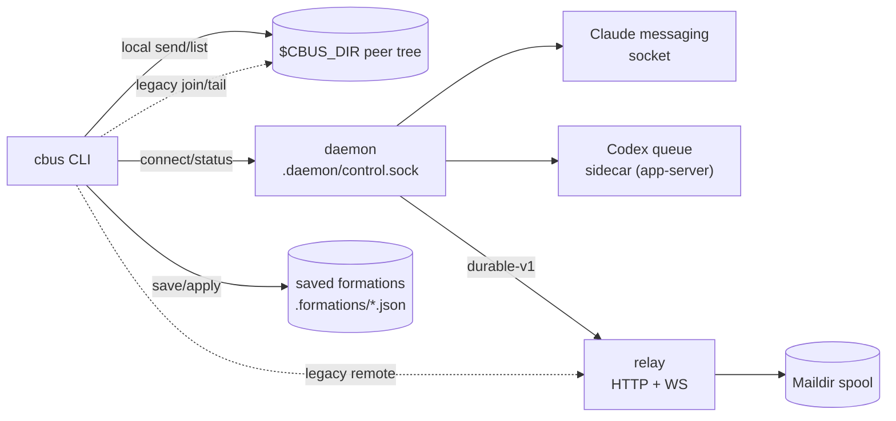

# claudebus: current architecture

Current as of 2026-09-22 (v0.14.1). This is the narrative map: what the
pieces are, how a message actually travels, and where each contract lives.
It links to [protocol.md](protocol.md) (wire/on-disk formats, exact
strings) and [command-reference.md](command-reference.md) (every command,
flag and output) rather than restating them; neither substitute reads this
page for the shape of the system. [overview.md](overview.md),
[design-space.md](design-space.md) and [port-map.md](port-map.md) are
historical records of the bash-era system and its 2026-07 port; this doc
describes what replaced them.

Every load-bearing claim below is anchored to a Go symbol, or to the
protocol.md or command-reference.md section that carries it; nothing here
was measured. Anywhere this page and those contracts conflict, trust
protocol.md's numbered sections; this page is the map, not the contract.

## 1. Components

- **CLI (`cbus`)**: one static binary, every verb (`cmd/cbus`).
  Command-reference.md documents the full surface.
- **Per-store daemon**: one process per `$CBUS_DIR`, started on demand by
  the first `connect`, holding every native connection's live state and
  serving a small control API over a unix socket (§3 below;
  protocol.md §14).
- **Native Claude adapter**: binds an existing Claude Code session's own
  messaging socket at connect time, sends messages as socket frames, and
  confirms delivery by tailing that session's own transcript (protocol.md
  §15.1).
- **Native Codex adapter**: launches a non-owning `codex app-server`
  sidecar per connection that can only ask a fixed set of read/enqueue
  questions, never start or resume a thread itself (protocol.md §15.2).
- **Legacy join/tail path**: the original file-based registration
  (`meta.json`/`inbox.jsonl`) plus a Monitor-driven tail follower. Still
  fully supported for peers that never connect natively; a daemon-managed
  peer refuses to be joined, renamed or tailed this way instead
  (protocol.md §2, §5).
- **Relay**: a single Go binary reachable locally or through a Cloudflare
  tunnel, serving both the legacy best-effort `/tail` and the durable,
  acknowledged `/tail/durable-v1` (protocol.md §9-10, §16).
- **Maildir spool**: the relay's own durable per-peer queue,
  `tmp/`→`new/`→`cur/` (protocol.md §11).
- **Formations**: saved channel topology snapshots and their restore/apply
  machinery (command-reference.md §10); out of scope for message delivery
  itself, mentioned here only as a component.

## 2. How a message travels

**Local send** (`LocalSend`, `send.go:23-81`): resolve the target, take
the peer's flock, refuse if armed-and-dead (unless `--force`), append the
JSON line to `inbox.jsonl`. What happens next depends on how the recipient
receives:

- **Native recipient**: the daemon already holds the connection and pushes
  into the harness's own socket/sidecar (§15), not a fire-and-forget
  append, but the push itself is not receipt. A Claude submission stays
  pending until its exact transcript receipt appears; Codex sidecar
  acceptance is likewise not receipt until `connection reconcile` finds it
  in history. An unresolved uncertain attempt blocks later mail to that
  peer until it is resolved or abandoned (protocol.md §15,
  [codex.md](../codex.md)).
- **Legacy recipient**: the append is all that happens; a Monitor-armed
  `cbus tail` follower notices the new line and frames it (protocol.md
  §4-§5).

**Cross-machine send**: the client resolves the relay's front door
(protocol.md §12.2), then either:

- **Legacy**: `POST /send` queues the message in the relay's spool; a
  connected legacy `/tail` gets it pushed live, best-effort, with a
  documented ~90-120s silent-loss window if the ws consumer died undetected
  (protocol.md §9.2, §10.7).
- **Durable**: the daemon dials `/tail/durable-v1`, completes the ready
  handshake, and receives messages it must explicitly ack before the relay
  marks them delivered. Retried-delivery dedup is client-side: the daemon
  skips re-appending a frame whose spool id already matches an inbox
  line's `relayId` (`daemon_relay.go:592-599`). The relay's own
  `WriteNamed` idempotency (protocol.md §11) is a separate mechanism that
  serves `/send` ingest and durable-presence fanout replay, not this path
  (protocol.md §9.8, §10.7, §16.1).

## 3. Daemon lifecycle & version fence

Started on demand by `ensureDaemon` (`connection.go:306-313`), which probes
`/health` and, only if the daemon is genuinely absent, launches one and
polls for up to 5s before giving up (`ensureDaemonWith`,
`connection.go:318-338`). One process per store, singleton-enforced by an
flock on `.daemon/lock` (protocol.md §14.1). `daemon.log` under `.daemon/`
records what the daemon itself printed. Every unix socket under
`$CBUS_DIR`, including the daemon's own control socket, is source-traced
to the OS's `sockaddr_un.sun_path` limit: 104 bytes including the NUL on
macOS, 108 on Linux (`sunPathMax`, `codexwrap.go:30-32`). A store path
that runs past it fails to dial with `connect: invalid argument`, a fact
already measured against the daemon control socket in
[CHEATSHEET.md](../../CHEATSHEET.md).

**Version fence**: `checkDaemonCompatibility` (`daemon_upgrade.go:31-36`)
refuses to use a running daemon whose reported protocol number or version
string doesn't match the calling binary's own, verbatim: `"running daemon
is incompatible (version=%q protocol=%d; this binary=%q protocol=%d); run
cbus daemon restart to load this binary; registrations and pending mail
are retained"`.

**Restart fencing** (`restartDaemonWith`, `daemon_upgrade.go:59-100`):
records the *original* daemon's `(pid, start)` identity, sends `/stop`
naming that exact pair (so a differently-identified daemon that raced in
is never stopped by mistake), then polls until the daemon is confirmed
absent, tolerating the EOF/reset errors an exiting server's own listener
teardown produces (`daemonExiting`, `daemon_upgrade.go:43-47`; this is the
fix that closed a real restart-abandonment bug, `05feade`), and only then
confirms the lock is actually released before starting a replacement. A
health response answering with a *different* identity than the one being
stopped is a hard error, `"daemon instance changed during restart"`, not a
silent proceed.

## 4. Connection journal

One durably-written JSON file per managed connection,
`.daemon/connections/<id>.json` (protocol.md §14.2). **Known defect**:
three of its embedded config structs (`CodexQueueConfig`,
`ClaudeConnectBinding`, `claudeEndpoint`) carry no `json` tags at all, so
their on-disk keys are bare, capitalized Go field names; renaming any of
those fields silently changes the on-disk shape with no compiler warning.
No fix is claimed here; see protocol.md §14.2 for the exact field list.

## 5. Native meta lifecycle

A managed peer's `meta.json` moves through null → daemon-pid-and-start →
`-1` across connect, arm and disconnect, with `ownerPid` always null
(protocol.md §2.2, §14.3). The **epoch fence** refuses to re-arm or replay
a connection whose journaled inbox identity no longer matches the file on
disk (`"inbox changed or truncated; refusing to rearm an unknown epoch"`,
`daemon_scheduler.go:42-43`). **Known defect**: on macOS, a plain reboot
can trip this fence on its own, with the inbox itself completely intact,
because the volume's device number changes across the reboot while the
inode does not; the daemon's dev+ino comparison cannot tell that apart from
a genuine replacement. Operator recovery steps are in
[usage.md](../usage.md)'s daemon section; no code fix is claimed here.

## 6. Send gate & liveness

`MetaListenerAlive` requires a structural `(pid, starttime)` identity match
before believing a recorded `listenerPid`, closing the pid-recycling gap
the bash-era argv check used to guard (protocol.md §6.1). `PeerDead`
returns unconditionally false for any peer with a `connectionId` set: a
managed peer's inbox and registration survive listener outages by design
and are removed only by an explicit `leave`/`unregister`, never by grace
expiry or prune (protocol.md §6.1, §7).

## 7. Presence

| | Native | Legacy |
|---|---|---|
| `listen`/`off` means | the daemon holds the connection | a process is (or isn't) alive at the recorded pid |
| `consumer.state` | the harness session's own observed state (`cbus connection status`) | not applicable |
| `join`/`departed`/`leave` origin | daemon-decided, sent as explicit frames the relay journals (durable) or a one-time legacy-to-durable handoff (protocol.md §10.3, §16.2) | relay-generated from ws attach/detach, or client-broadcast on join/leave/rename (protocol.md §8, §9.2) |
| Event allowlist | `join`/`departed`/`leave`: the only three that cross the relay for a durable connection (`acceptDurablePresence`, `durable_presence.go:35-43`) | `join`/`departed`/`leave` only, relay-generated from ws attach/detach or client-broadcast |

Compaction presence (`compact-pre`/`compact-post`) and `rename` never cross
the relay for either native or legacy peers; they are always local
(protocol.md §8). Native Codex emits `compact-post` itself on observed
compaction (`daemon_compaction.go:98`); native Claude and legacy peers
alike go through `cbus hook-compact pre|post`.

## 8. Credential store

Per-connection Claude messaging tokens live under
`.daemon/claude-credentials/`, one 0600 file per binding, created
exclusively so an existing reference is never silently overwritten
(protocol.md §14.4). The token crosses the control socket exactly once, on
`/connect`; the connection journal (§4) never holds it, only an opaque
reference.

## 9. Native per-verb behavior, at a glance

Exact output strings live in command-reference.md; this is the shape.

| Verb | Native peer | Legacy peer |
|---|---|---|
| `send` | pushed into the harness socket/sidecar; pending until an exact transcript receipt (Claude) or a history reconcile (Codex) | appended to inbox; delivered on next tail read |
| `tail` (arm) | refused, points at `cbus connect` (see command-reference.md for the exact text) | arms the in-process follower |
| `list` | `listenerPid` = daemon pid while armed, `-1` on disconnect | `listenerPid` = follower pid or null |
| `leave` | broadcasts `leave` presence, then removes the registration (`leaveSession`, `store.go:461-515`) | same: broadcasts `leave`, removes the peer dir |
| `unregister` | detaches the connection; the journal entry survives with state `detached` (`daemon_scheduler.go:37-39`) | unconditional removal, broadcasts `departed` (`Unregister`, `store.go:518-543`) |
| `close` | refused, points at `cbus connection disconnect` (see command-reference.md for the exact text) | SIGTERMs the owning process |
| `prune` | never reaped (`PeerDead` exemption, §6) | reaped once past grace |
| `hook-exit` | preserves the registration | removes it (graceful SessionEnd) |
| `hook-compact` | native Claude routes through it; Codex has its own separate compaction path | broadcasts `compact-pre`/`compact-post`, local only |
| `rename` | refused, not supported for a managed alias | renames in place, re-arms |
| `branch`/`spawn`/`bootstrap` | the child is always told to `cbus connect` on its own opening turn (`bootstrap_prompt.go:12-15`, `spawn.go:11-22`); there is no legacy child prompt | describes the *parent's own* registration: a `branch` parent that is not already daemon-managed falls back to a legacy `Join` for itself (`harness.go:237-248`) |

## 10. Known defects (current behavior, not a fix commitment)

- **Layout verbs cannot place native peers.** `arrange`/`scatter`/`focus`
  resolve a peer's pane via its owning process; a native peer's recorded
  `ownerPid` is null and its `listenerPid` is the daemon's own pid, whose
  ancestor walk never reaches a recognized harness process. Only the
  caller's own pane (`selfPane`) resolves. See command-reference.md's
  arrange section for the exact resolution failure text.
- **Epoch fence false-positive after a macOS reboot** (§5, above): the
  fence compares device number and inode together, so a reboot-induced
  device-number change alone trips it even though the inbox is untouched.
- **Connection journal json-tag hazard** (§4, above): three embedded
  config structs have no `json` tags, so their on-disk keys are bare Go
  field names, a silent compatibility break waiting on any future field
  rename.
- **Short-secret print in `auth status`.** `MaskTail` returns a stored
  credential *in full* when it is 4 bytes or shorter, the opposite of
  masking it (`cred.go:160-165`); command-reference.md §8 documents the
  exact behavior.

## 11. Where each contract lives

| Topic | Doc |
|---|---|
| Wire formats, on-disk state, every numeric constant | [protocol.md](protocol.md) §1-13 |
| Native daemon control API, connection journal, credential store | protocol.md §14 |
| Claude socket and Codex sidecar protocols | protocol.md §15 |
| Durable-v1 relay transport and presence journal | protocol.md §16 |
| Uncertain delivery, reconcile, abandon | [how-it-works.md](../how-it-works.md), protocol.md §14.1 |
| Every command, flag, and exact output string | [command-reference.md](command-reference.md) |
| Operator recovery steps (daemon, epoch fence, migration) | [usage.md](../usage.md), [install.md](../install.md) |
| Bash-era system and the 2026-07 port (historical) | [overview.md](overview.md), [design-space.md](design-space.md), [port-map.md](port-map.md) |
