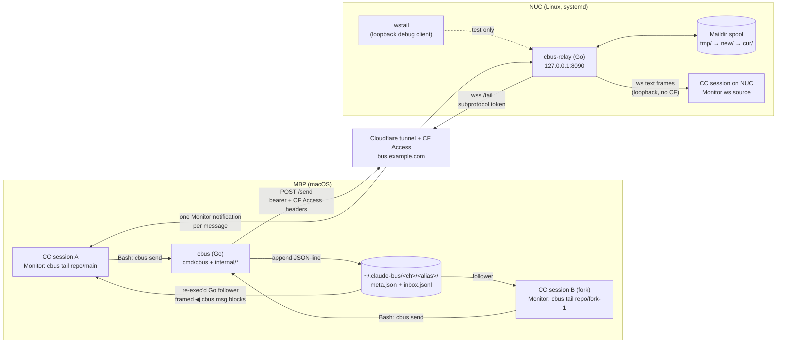

# claudebus — System Overview

> Audience: a developer browsing this repo. This document describes the system as
> audited at HEAD `f213e26` (2026-07-12), when the client was the bash `bin/cbus` —
> behavioral quirks flagged, not fixed. **As of 2026-07-13 the installed client is the Go
> port** (`cmd/cbus` + `internal/client` + `internal/core`), differentially verified
> byte-identical to the bash client (27/27 verbs; see
> [cutover-decision-package.md](cutover-decision-package.md)). Topology, protocol,
> semantics, and the security model below are unchanged; statements about bash/python3
> mechanics describe the retired reference implementation (kept in `bin/` until P3).
> Post-cutover feature additions — `spawn`, formations, roles, and the distribution
> surface — are folded into the component map (§2) and command-reference.md.
>
> Companion documents:
> - [command-reference.md](command-reference.md) — every subcommand, flag, output string, and exit code
> - [protocol.md](protocol.md) — on-disk formats, wire protocol, framing contract
> - [port-map.md](port-map.md) — what a port to a real language must preserve, and why
> - [../prior-art-and-cc-internals.md](../prior-art-and-cc-internals.md) — the landscape survey and the
>   Claude Code internals probes that justified building this at all (the design research, summarized
>   and kept as the historical record)
> - [cutover-decision-package.md](cutover-decision-package.md) — the executed cutover's
>   decision record and rollback procedure
> - [compat-deletion-plan.md](compat-deletion-plan.md) — the coexistence shims and bash
>   artifacts deleted at P3

---

## 1. What claudebus is, and the problem it solves

Two (or more) **live, human-attended Claude Code sessions** — for example a parent session and a
fork it opened in another terminal window — had no way to talk to each other. The prior workflow
was "write a handoff doc and carry it over by hand." claudebus replaces that with a message bus so
a fork can report results back live, and so idle sessions can be woken by peers to act.

The core loop:

1. A session **joins** a channel: `cbus join <channel>` creates
   `~/.claude-bus/<channel>/<alias>/` with a `meta.json` registration and an empty append-only
   `inbox.jsonl`.
2. It **arms delivery** by running `cbus tail <channel>/<alias>` under Claude Code's **Monitor
   tool** (never plain Bash — the command execs a follower that never exits, so a Bash call blocks
   the session forever).
3. Any peer runs `cbus send <channel>/<alias> "text"`, which appends one JSON line to the target's
   inbox. The follower turns the append into a Monitor notification — a conversation event. An
   **idle session wakes and acts autonomously**; a busy one sees the event when its current step
   completes.

Design pillars, stated up front in the README and held throughout:

- **Supported primitives only.** The Monitor tool plus plain files. No undocumented Claude Code
  internals, no hooks for delivery, no polling, no terminal injection. Works across terminal
  windows, tabs, tmux, and CCS profiles.
- **Named channels.** A parent/fork pair defaults to a per-repo channel so aliases stay short and
  unrelated work doesn't share an address space. `global` is reserved *by convention* as the
  machine-wide orchestrator bus.
- **Bespoke by design.** A personal, single-operator tool wired to one specific setup (a homelab
  NUC reachable over a Cloudflare tunnel). It is here to be *read*, not packaged for others to
  deploy.

### Why not the built-in teammate mailbox?

This was empirically probed across three live sessions before building anything (see
[prior-art-and-cc-internals.md](../prior-art-and-cc-internals.md)):

- **`SendMessage`'s addressable universe is one session's spawn tree, full stop.** There is no
  cross-session namespace.
- Teams are registered **in-process at spawn**; the on-disk `inboxes/*.json` files are persistence
  only — writing into them did nothing: no delivery, no error, silently inert.
- A hand-launched `claude` with fully matching flags comes up alive but unreachable — membership
  requires the in-process backend that only a real Agent-tool spawn creates.

Summary: the built-in mailbox is closed **by design**, not merely unarmed. `SendMessage` is
*vertical* (within one spawn tree); claudebus is *horizontal* (between independent
sessions/windows/profiles/machines). Complementary, not competing.

### Why not hooks, polling, or terminal injection?

The field survey found notification to be "the hard problem nobody has solved cleanly": hooks are
cwd-fragile, a `claude -p` polling watcher costs real money (a sibling project abandoned theirs),
and terminal keystroke injection (`amq wake`'s TIOCSTI) is a flagged security risk. The
Monitor-tail is the only turn-native answer with no hooks, no polling, and no injection.

---

## 2. Component map

| Component | Where | What it is |
|---|---|---|
| **Client CLI** | `cmd/cbus` + `internal/client` + `internal/core` | Single static Go binary installed as `cbus` (cutover 2026-07-13); every subcommand plus `cbus --version`. No runtime dependencies. The retired 914-line bash implementation remains at `bin/cbus` as the rollback artifact until P3. |
| **Local transport** | `~/.claude-bus/` | Plain files. `<channel>/<alias>/meta.json` (registration + liveness pids) and `inbox.jsonl` (append-only mailbox, one JSON message per line). `.remote/<host>/<channel>/<sessionId>` holds per-session remote identity markers. |
| **The follower** | exec'd by `cbus tail` | The cbus binary re-exec'd with `--inbox <path>` in argv (so bash-era liveness greps still match), running an in-process Go loop under the Monitor tool. Follows the inbox `tail -F`-style (0.2 s poll, reopen on inode change/shrink) and reframes each message via the shared `core.LocalEmit` framer into a `◀ cbus msg …` block sized for the Monitor's measured output caps. Its pid *is* the recorded `listenerPid`. |
| **Relay daemon** | `relay/cmd/cbus-relay` | Go, std-lib only, zero external deps. Runs on the NUC bound to `127.0.0.1:8090` under systemd. `POST /send` → Maildir spool; `GET /tail` → hand-rolled RFC 6455 WebSocket (in `relay/internal/wire`) that drains the queue and streams live; `GET /peers` presence; `GET /healthz`. |
| **Maildir spool** | `relay/internal/spool` | `<root>/<channel>/<alias>/{tmp,new,cur}` — write to `tmp/`, atomic rename into `new/`, move to `cur/` after delivery. Crash-safe by construction (no fsync — deliberately not power-loss durable). |
| **wstail** | `relay/cmd/wstail` | Loopback **debug/verification client** for `/tail`. TCP-only (no TLS) so it cannot cross the Cloudflare front door — it is not a production bridge. The real remote consumer is the Monitor's `ws:` source. |
| **CC integration** | `commands/*.md`, `roles/*.md` (embedded); placed by `cbus install-commands` / `install-roles` | Five slash commands (`/bus-join`, `/bus-branch`, `/bus-spawn`, `/bus-rename`, `/bus-formation`) that are deliberately thin — logic lives in the binary. `cbus branch` (fork) and `cbus spawn` (fresh session) place the child natively via a `TerminalForker` (see *Terminal coupling*, below) using `--resume <sid> --fork-session` for branch (CCS-profile-aware); `bin/cc-branch.sh` is retired. `cbus hook-exit` runs from a SessionEnd hook (wired manually in `~/.claude/settings.json` on each machine) to announce departure on graceful exit. |
| **Formations** | `cmd/cbus/formation.go` + `internal/client/formation*.go`; `$CBUS_DIR/.formations/`, repo `formations/` | Saved channel topologies — peers, roles, models, restore modes — that relaunch a fleet with `cbus formation apply`. Runtime saves shadow committed starter templates (`formations/dev-trio.json`); `save` captures the birth-record origin/model automatically. |
| **Roles** | `roles/*.md` (embedded via `go:embed`); `internal/client/role.go` | Committed role-prompt files that `cbus spawn --role <r>` appends to a fresh peer's first turn (repo `roles/` first, then `$CBUS_DIR/roles`). Each carries a `MODEL:` line that defaults the child's model. |
| **Distribution** | `get.sh`; `cmd/cbus/{selfupdate,install_assets,update_check,version}.go` | First install bootstraps via `get.sh` (downloads a GitHub release binary, then installs the embedded skills/roles); thereafter `cbus selfupdate`. `CBUS_UPDATE_CHECK=1` opts into a once-a-day update hint. The legacy `install.sh` / `install-cbus-go.sh` were retired (`de07cbe`). |



Two transports, one message shape: the relay stores and re-emits messages **byte-compatible with
local inbox lines** (`{from,to,ts,text}`), so the client needs no translation layer, and both
paths deliver the identical framed block to the receiving Monitor.

### Terminal coupling: the `TerminalForker` seam

`cbus branch` (fork) and `cbus spawn` (fresh session) place the child in a new terminal surface
through one interface, `TerminalForker` (`internal/client/harness.go`) — the deliberate seam
between the bus logic and the host terminal. The real implementation is `OSAForker`; tests inject
a fake, so every fork path is exercised without opening a window. This is the single place a port,
or a new terminal backend, plugs in.

| Target | Backend | Coupling | Mechanism |
|---|---|---|---|
| `window` | iTerm2 | **iTerm2-only** (macOS) | `osascript` → `create window` |
| `tab` | iTerm2 | **iTerm2-only** (macOS), needs an existing window | `osascript` → `create tab` |
| `tmux` | tmux | **terminal-agnostic** | `tmux new-window` (requires `$TMUX`) |

The two paths differ in one load-bearing way. **iTerm2's AppleScript `command` parameter is
tokenized by iTerm2 itself and does not honor POSIX quoting**, so a quoted one-liner launches
nothing (probe-verified live, twice). The window/tab path works around this by writing a
**self-deleting launcher script** and handing iTerm2 only the bare, whitespace-tokenized command
`/bin/bash <tmpfile>`; the launcher restores `PATH` / `CLAUDE_CONFIG_DIR` / cwd and execs the real
launch. The tmux path has no such constraint — it runs a normal POSIX-quoted one-liner through
`/bin/sh`. (port-map §4.12 records the same rationale for a reimplementation.)

The child launch itself is `ccs <profile>` (CCS-profile-aware) or plain `claude`, with
`--resume <sid> --fork-session` for `branch` and without that pair for `spawn`, plus `--model` /
`--name` when supplied. `window`/`tab` are the iTerm2-coupled surfaces; **tmux is the only
terminal-agnostic fork path** and the natural target on Linux or under a non-iTerm2 terminal.

---

## 3. Cross-machine topology

```
MBP session ── bin/cbus ──► https://bus.example.com  (CF tunnel front door)
                              │  POST /send: CF Access service token + relay bearer
                              │  GET  /tail: CF Access bypass (path-scoped); auth = ws subprotocol
                              ▼
NUC: cbus-relay on 127.0.0.1:8090 ──► Maildir spool ──► ws push to the single active tail per peer
```

- **Addressing**: remote targets are `<channel>@<host>/<alias>`. The `@host` maps to *which relay
  site to talk to* (each host resolved via its `CBUS_SITE_<HOST>_URL` env var — no built-in
  hosts); the relay itself has no notion of hosts — its namespace is flat
  `channel/alias`.
- **Endpoint autodetect**: every remote command first probes
  `http://127.0.0.1:8090/healthz` with a 0.3 s timeout. A session *on the relay host* gets
  `local` mode (loopback, no CF Access); everyone else gets `public` mode through the tunnel.
  Zero config, at the cost of a ~0.3 s probe per remote command when off-relay.
- **Remote receive** is not a process: `cbus tail <ch>@<host>/<alias>` *prints* a Monitor `ws:`
  arm spec (`url` + `protocols: ["bearer.cbus.<token>"]`) and records this session's identity
  marker. The Monitor connects directly; the relay replays everything queued in `new/`, then
  streams live.
- **Aliases are explicit** remotely (short hostname/role, e.g. `mbp`, `nuc`). There is no remote
  registry — a taken alias is self-evident because the relay keeps **one active tail per peer**
  and a new `/tail` visibly displaces the old Monitor.
- **Credentials** live in the macOS Keychain (Linux: `0600` files under `~/.config/cbus/<host>/`),
  seeded once via `cbus auth set`. They never appear in argv: curl auth rides a config on stdin
  (`curl -K -`), Keychain writes go through `security -i`.

### A remote send → deliver round trip

```mermaid
sequenceDiagram
    participant S as Sender session (MBP)
    participant C as bin/cbus
    participant CF as Cloudflare edge (Access)
    participant R as cbus-relay (NUC :8090)
    participant SP as Maildir spool
    participant M as Receiver Monitor (ws, already armed)

    S->>C: cbus send dev@nuc/nuc "text"
    C->>C: probe 127.0.0.1:8090/healthz (0.3 s) — miss → public mode
    C->>C: from = this session's identity marker for nuc/dev
    C->>CF: POST https://bus.example.com/send<br/>Authorization: Bearer + CF-Access-Client-Id/Secret
    CF->>R: forward (edge service-token check passed)
    R->>R: constant-time bearer check; validate channel/alias names
    R->>SP: write tmp/&lt;ts.seq&gt;.json → rename into new/ (atomic)
    R-->>C: 200 {"ok":true,"id":"&lt;spool filename&gt;"}
    C-->>S: sent to dev@nuc/nuc via public relay (from dev@nuc/mbp)
    R->>R: poke hub → attached tail wakes
    R->>SP: ListNew → Read (filename order)
    R->>M: ONE ws text frame: reframed ◀ cbus msg block
    R->>SP: MarkDelivered (new/ → cur/)
    M->>M: one Monitor notification → idle session wakes and acts
```

If the receiver is offline, the flow stops at the spool: mail queues in `new/` and the next
`/tail` attach for that `channel/alias` drains it in order — offline sends replay on connect.

### Operational constraints of the remote path

- **The remote ws drops on laptop sleep / network blips / relay restarts** — the Monitor reports
  `[WebSocket closed: 1006]`. Recovery is doctrine, not automation: the model treats the close
  event as a signal to act — re-run `cbus tail <same address>` (marker refresh is idempotent), arm
  the fresh spec, confirm with `cbus list @<host>`. Local file-bus tails are unaffected. Nothing
  watches the ws automatically; if the instruction has fallen out of context, the tail stays down
  until someone notices.
- **No forking across machines** (deferred, `cbus-b8m`): start a fresh session on the target box
  and join the shared channel; each side picks its own explicit alias.
- **Install drift**: the Go client is version-stamped (`cbus --version`) but there is
  still no version handshake between hosts — after any client change, update the NUC by hand
  (`cbus selfupdate`, or rebuild; the relay has its own deploy path, `relay/deploy.sh`).
  `commands/*.md` and `roles/*.md` install via `cbus install-commands`/`install-roles`
  (sha-guarded) and refresh on `selfupdate`.

---

## 4. Security and network model

The framing sentence is the design's thesis: claudebus deliberately aims to be a **trust
boundary, not a security boundary**, and the design is honest about that line.

### Local bus

Everything under `~/.claude-bus` is writable by anything running as your user. Any process can
append to any inbox with any `from` — there is **no sender authentication, by design**. The
guardrail lives on the receiving side: Claude Code treats an incoming bus message as an untrusted
peer request that cannot escalate permissions (this posture is seeded into every fork via the
bootstrap prompt). Safe on your own machine; do not put `~/.claude-bus` on a shared or networked
filesystem.

### Relay

A single-operator service with no multi-tenant auth. It must only be reachable on a trusted
LAN/tailnet or through an authenticated Cloudflare tunnel — which is how this deployment runs:
the daemon binds `127.0.0.1` only, with CF Access in front. Do **not** expose `:8090` directly.

The auth is deliberately **asymmetric per path**:

| Path | Edge (Cloudflare Access) | Origin (relay) |
|---|---|---|
| `POST /send`, `GET /peers` | service-token headers required | `Authorization: Bearer <token>`, constant-time compare |
| `GET /tail` (ws) | **bypass, scoped to this path only** | token in `Sec-WebSocket-Protocol: bearer.cbus.<token>`, constant-time compare |

The asymmetry exists because of a hard harness constraint: the Monitor's `ws:` source takes only
`{url, protocols}` — **no custom headers** — so CF Access header auth is impossible on the ws leg.
The token rides in the subprotocol instead (the "k8s-apiserver pattern"), chosen over a `?token=`
query param because query strings leak into edge and access logs. The trade was made knowingly in
the safe direction: compromising the bypass-path token only allows *eavesdropping* a channel;
the write path — the one that injects instructions into a live session — keeps the stronger
double guard.

Consequences to know about:

- The arm spec printed by `cbus tail <ch>@<host>/<alias>` contains the bearer token in cleartext.
  This is acknowledged in the output itself ("it IS the auth") — transcripts are local, an
  accepted trade-off.
- The token must be subprotocol-safe (no `=`, `,`, `/`, spaces); the deploy seeds
  `openssl rand -hex 32`. It is read **once at relay startup**: rotation requires editing the
  token file, restarting the unit, and re-seeding the Keychain/file store on every client — and a
  stale armed spec then fails as an HTTP 401 *handshake refusal*, which is **not** the 1006 close
  event the re-arm doctrine keys on. Rotation is an all-clients manual outage.
- TLS is entirely the CF tunnel's job; the relay binary has none.

### Identity

`from` is a convenience, not a credential — spoofable both locally (`--from`, `CBUS_ALIAS`, or a
direct file append) and remotely (`--from` on the POST). The session-scoped identity markers
prevent *accidental* impersonation only (see §5.3). Senders with no registration fall back to an
unroutable `<hostname>-<PID>` — receivers are taught to reply only to `from` values shaped like
`channel/alias`.

### Deliberate non-goals

No encryption at rest beyond filesystem permissions, no multi-user isolation, no message signing,
no user-facing broadcast. Channels are **namespaces, not isolation** — they scope addressing and
cleanup only. This is a coordination bus for one operator's machines, not a shared messaging
service.

---

## 5. Design decisions and their rationale

### 5.1 Push delivery via Monitor tail (the founding decision)

Receive = `cbus tail ch/alias` armed **persistent** under the Monitor tool. A Monitor event
re-invokes an idle session — proven live: a parent session acknowledged a bus message autonomously
with no human present. Busy sessions defer to the end of the current step. This upgraded claudebus
from a notification convenience into an autonomous coordination fabric — which is precisely why
incoming bus messages are treated as untrusted peer requests. The corollary is documented as a
caveat, not just a feature: a peer message can trigger action while you're away.

`cbus tail` must **never** run under Bash: it execs a follower that never exits, so a Bash call
blocks the session forever and delivers nothing. This warning is repeated at every surface the
model reads — join/rename/branch output, the usage text, the bootstrap prompt, and the slash
commands.

### 5.2 The closed mailbox (why this project exists)

The empirical probes of Claude Code's teammate mailbox (§1) are the load-bearing research: the
on-disk inbox files are persistence-only, the delivery backend is in-process and created only by a
real Agent-tool spawn. Since the native mailbox is closed by design and vertical-only, horizontal
session-to-session messaging needed its own transport built from supported primitives.

### 5.3 Session-scoped bridge identity

Remote identity markers live at `.remote/<host>/<channel>/<sessionId>` = `{alias, ownerPid, ts}`.
This fixed a live dogfooding bug: the original markers were machine-global and ownerless, so every
session's `whoami` reported every bridge, and — the sharper edge — any session sending to a
bridged channel auto-filled the marker owner's alias, **impersonating it and misrouting replies to
the wrong session's Monitor**. Now `whoami`/`send`/`leave` operate on the caller's marker only;
sessions never inherit each other's aliases; a session without a marker falls back to the
unroutable `hostname-PID`. A marker is a *from-default*, **not** proof of reachability —
`cbus list <ch>@<host>` is the truth source.

### 5.4 The send gate

`cbus send` distinguishes three receiver states:

| Target state | Behavior | Why |
|---|---|---|
| joined, never armed (`listenerPid` null) | **accepted unconditionally** | the peer's *first* arm replays the whole inbox from line 1, so nothing sent during setup is lost |
| listener alive | accepted | normal delivery |
| armed once, listener now dead | **refused** — `use --force to queue anyway`; `--force` queues best-effort | a re-arm follows from the *end* of the inbox, so a forced line may never be delivered |

The first row completes the no-lost-messages invariant: `join` truncates the inbox and the first
arm replays from the start, so the join→arm window is covered. (The initial release *refused*
joined-but-unarmed peers; review called that a self-contradiction — it defeated the very window
the replay exists to cover — and it was fixed the same day.) Remotely, `--force` is accepted and
ignored: the spool always queues, so there is nothing to force.

### 5.5 Other decisions worth knowing (summary table)

| Decision | Rationale |
|---|---|
| **Liveness is a real process, not a stale flag.** Alive = `listenerPid` exists **and** its argv still contains this peer's inbox path (pid-recycling guard) **and** the recorded `ownerPid` (the ancestor `claude` process) is alive (crash-orphan guard). No heartbeat files. | The `exec` design means the recorded pid *is* the follower; when the Monitor kills it, liveness flips to `off` with no trap or cleanup code. Independently validated: a sibling project's wake-lock staleness proof is the same design — convergent evolution. |
| **Self-cleaning registry + 10-minute arm grace.** `join` prunes dead peers first; never-armed peers get a 10-min grace window (keyed on `meta.json` mtime) before being sweepable. | A joined-but-unarmed sibling can't be swept mid-setup; aliases (`main`, lowest free `fork-N`) recycle naturally. |
| **Atomic join via bare `mkdir`; no local Maildir.** Auto-picked aliases are claimed with `mkdir` (atomic EEXIST) in a retry loop. | Closes the race where two concurrent joins both pick `main` and the loser truncates the winner's inbox. The atomic mkdir closes the realistic local race, so Maildir complexity "wasn't justified locally" — a standing POC decision. |
| **Maildir server-side only.** The relay spools `tmp→new→cur`. | A relay restart losing queued cross-machine messages is a real, higher-stakes failure mode — the direct application of the AMQ prior-art lesson. Declined with rationale: fsync durability (overkill for a session bus) and sequence-first spool names (would break ordering across restarts). |
| **Single active tail per peer.** A new `/tail` displaces the old (mutex-held `close(done)`, per-message displacement checks, pointer-compared detach). | Displacement *is* the collision feedback for explicit remote aliases; regression-tested handover. Note: the honest contract is at-least-once with no interleaved drains — a narrow handover race can deliver one in-flight message to both tails (the README's "no duplicate delivery" overstates). |
| **Reframed delivery format.** Both framers emit `◀ cbus msg from=… to=… ts=…` + body wrapped at 440 UTF-8 bytes + `◀ cbus end from=…`, written as one buffered write / one ws text frame. | The Monitor's caps were *measured*, not assumed: 500 chars per stdout line, ~200 ms line batching, and a second ~3000-char per-notification ceiling shared by both paths. `wsFrameSafe = 2800` with a `⚠truncated~<N>B` header notice (header delivered first, so the warning survives the cut) encodes those measurements — if the harness changes, the constants are suspect. |
| **Skills thin, logic in the binary.** The fork-child bootstrap prompt is emitted by `cbus bootstrap`; channel derivation lives in `cbus branch`. | Model-executed skill prose is prompt-drift-prone; shipping prompts and paths with the binary means fixes can't drift across skill-file copies. Each skill ends with "Do nothing else." as a guardrail against model over-helpfulness. |
| **Explicit remote aliases, no remote registry/presence build.** | Scope cut as over-engineering; the relay's one-active-tail rule makes collisions self-evident. |
| **Presence announcements.** join/leave/rename/departed broadcast `kind=presence` events to every non-dead channel peer; every removal path broadcasts `departed`; `cbus hook-exit` (SessionEnd hook) announces graceful exits immediately, with lazy prune as the hard-kill backstop. | Peers used to come and go silently. Targeting uses the same `!peer_dead` rule as send so joined-but-unarmed peers still get presence (replayed at first arm). Deliberately app-agnostic (no tmux/iTerm2 integration). Remote presence now crosses the relay too (`cbus-ijx.5` shipped — the relay renders `kind` and generates join/departed from the ws lifecycle; protocol.md §8). What remains open is ijx.5 phase 2: client-originated `leave`/`rename` and offline catch-up. |
| **Arm-before-fork ordering.** The parent arms its Monitor *before* forking. | The alternative (arm after fork, to avoid a cosmetic note in the child) was empirically disproven — `--fork-session` reads the transcript at child *boot* regardless — and additionally opened a child-announce race. The child's "no completion record" note is cosmetic and unavoidable; the skill explicitly forbids reordering to suppress it. |
| **`cbus rename` is a true rename, local-only.** Moves the peer dir, rewrites `meta.alias`, preserves inbox history; the skill re-arms the Monitor. | A companion feature (auto-setting the CC session title) was dropped after research proved the live TUI title is not externally settable. Remote aliases are relay-side. Known window: a message landing between the `mv` and the re-arm is not replayed (filed `cbus-8no`). |

### Dogfooding

The project repeatedly develops itself over itself: the day-one review-fix set was implemented by
a forked session coordinating with its parent **over the bus being fixed**, and the presence
feature was adversarially reviewed by a peer session reached at `dev@nuc/reviewer` *through the
cross-machine relay*.

---

## 6. Known limitations

Documented, accepted, or tracked — none are silent.

**Trust / identity**

- No sender authentication; `from` is taken at face value. The receiving-side "cannot escalate
  permissions" posture is the only guardrail.
- Push delivery wakes idle sessions to act autonomously with no human present — a stated caveat.
- `hostname-PID` senders are unroutable (no inbox to reply to).
- The remote arm spec prints the relay token into the transcript (accepted: it *is* the auth).
- The framed-block markers are in-band and unescaped — a message body (or a crafted multi-line
  `from`) can forge `◀ cbus msg` lines. Consistent with the trust-boundary stance; a port should
  decide deliberately.

**Delivery semantics**

- `--force` is best-effort: a re-arm follows from the inbox end, so lines queued while the
  listener was dead may never be delivered locally. (The remote path has the opposite semantics —
  the spool queues and replays.)
- End-to-end the bus is **at-least-once** with two duplication points (a `send` that fails after
  the relay already spooled it has no idempotency key, so a retry is a new message; a displacement
  handover can deliver one in-flight message twice) and one silent loss point: after an abrupt
  client death (laptop sleep), the relay stays blind for **~90–120 s** (30 s pings / 90 s pong
  grace); messages sent in that window are written to a dead socket, marked delivered into `cur/`
  — which nothing ever re-reads — and lost. The "relay replays queued mail, nothing is lost"
  doctrine is true only for mail that queued while *no* tail was attached. During the window,
  `/peers` also reports `connected:true` with a *fresh* `lastSeen`.
- The ~2800/3000-char per-notification ceiling truncates very long messages on both paths. The
  `⚠truncated~<N>B` header notice is **relay-only** (app-level, in-band). As of the 2026-07-13
  live re-measurement, the harness itself now emits an explicit `...(truncated)` marker at both
  the 500-char line cap and the ~3000-char notification ceiling, so a long local message is no
  longer silently cut — detection no longer relies solely on the missing `◀ cbus end` marker.
  Chunked delivery + a dedicated local warning are still tracked as `cbus-mew`.
- The rename `mv`→re-arm gap can drop messages (`cbus-8no`).
- Local arming has no collision or ownership check: arming the same address twice leaves two live
  followers delivering everything twice, with liveness state pinned to the newer pid only — the
  only guard is skill discipline ("skip if already armed"). The exact inverse of the relay's
  displacement semantics.

**Availability / operations**

- The remote ws drops with 1006 on sleep/blips/relay restarts and recovery is model-driven — no
  automatic reconnect exists.
- Relay durability is process-crash-safe, not power-loss-safe (fsync declined with rationale).
- **No spool GC anywhere**: `cur/` accumulates every delivered message forever, `tmp/` orphans are
  never swept, peer dirs are never removed — so `/peers` (and `cbus list @host`) output grows
  monotonically, and dead test channels are immortal. Verified live on the NUC: no cron, no timer.
- `cbus leave <ch>@<host>` is purely a local marker delete — the relay has no leave/unsubscribe
  endpoint; queued mail stays, and whoever next arms that alias inherits the backlog.
- Remote send/list requests time out at 4 s connect / 20 s total with no retry (a
  Go-port fix; bash had none). A timeout after the relay already spooled the message still
  has no idempotency key — a retry duplicates.
- Token rotation is a manual all-clients outage with a non-1006 failure symptom (§4).
- Install drift between machines is a real failure mode (no version handshake); protocol changes
  require updating the NUC by hand (`cbus selfupdate` or rebuild).

**Environment assumptions**

- No interpreter dependency: the client is a static Go binary. (Bash-era: python3 was
  both the JSON engine and the follower runtime.)
- `ownerPid` detection needs a `claude`-named ancestor within 16 parent hops; unusual launchers
  degrade liveness to pid+argv checks only (read via sysctl/procfs in the Go client — no
  `ps` spawns; same semantics).
- `window`/`tab` fork targets are iTerm2-only (osascript); tmux is the only
  terminal-agnostic fork path. (The bash-3.2 floor no longer applies.)
- The whole cross-machine contract hangs on measured, unnegotiated harness behavior: Monitor `ws:`
  supporting only `{url, protocols}`, the 500-char line cap, ~200 ms batching, and the ~3000-char
  notification ceiling. A harness change silently invalidates the constants (440-byte wrap,
  `wsFrameSafe = 2800`).

**Interface residue**

- `cbus register` (= `join global`) and `cbus peers` (= `list`) survive as undocumented v1
  aliases; legacy v1 flat-registry entries are auto-pruned; `hook-exit` and presence
  were added to the README/CHEATSHEET in the post-cutover doc pass (2026-07-13).

For the exhaustive per-command behavior (including every quirk found in the audit), see
[command-reference.md](command-reference.md); for wire/disk formats see
[protocol.md](protocol.md); for the port-critical invariants see [port-map.md](port-map.md).
