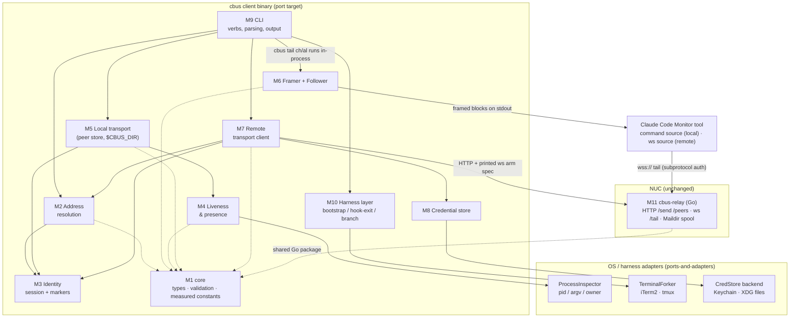
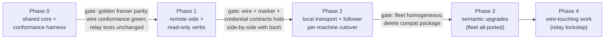

# claudebus — Port Map

> Audience: a developer planning or reviewing the reimplementation of the bash client
> (`bin/cbus`) in a real language. This document is the port plan distilled from the full
> behavioral audit (HEAD `f213e26`, audited 2026-07-12): what the port must preserve, what it
> may delete, and in what order to move. It is a plan, not a bug list — as-is behavior lives in
> the companion documents.
>
> Companion documents:
> - [overview.md](overview.md) — system topology, design pillars, security model
> - [command-reference.md](command-reference.md) — every subcommand, flag, output string, and exit code
> - [protocol.md](protocol.md) — on-disk formats, wire protocol, framing contract
> - [../prior-art-and-cc-internals.md](../prior-art-and-cc-internals.md) — the research that shaped the design
>
> Two ground rules frame everything below:
>
> 1. **The relay stays.** `relay/cmd/cbus-relay` (Go, std-lib-only, tested) is already the
>    real-language side. The port target is `bin/cbus` (914 lines of bash) plus its satellites:
>    `bin/cc-branch.sh`, `install.sh`, and the three `commands/*.md` skills.
> 2. **A mixed-version fleet is guaranteed during transition.** `install.sh` is a copy-install;
>    the NUC runs its own hand-updated copy, and a third node (logos/WSL, tracked as `cbus-dc5`)
>    is planned. The port will coexist with the bash client across machines (over the relay wire)
>    and with *already-armed* bash-era followers on the same machine (shared `$CBUS_DIR` and
>    process table).

---

## 1. Why bash is being outgrown

None of these are defects in the design — they are documented costs of the implementation
medium, recorded during the audit. Stated neutrally:

- **The macOS bash 3.2 floor is a hard constraint.** A nameref-based refactor was rejected
  during review specifically because it "would have broken macOS's bash 3.2"
  (detailed_changelog, commit c73373a discussion). The language version the client must target
  is frozen at 2007.
- **python3 is a load-bearing runtime dependency.** Bash has no JSON, so ~10 embedded python
  one-liners do everything structured: `jget`/`jset` on meta.json, message payload builds, the
  hook-exit stdin parse, the `/peers` render, and the entire tail follower (bin/cbus:515-577).
  python3 is checked before dispatch — even `cbus --help` dies without it (bin/cbus:22).
  Deleting this dependency is the single strongest win of the port.
- **Two framers must agree by hand.** The framed delivery block is produced by embedded python
  locally (bin/cbus:522-551) and by Go on the relay (relay/cmd/cbus-relay/main.go:208-252).
  They diverge today on degenerate inputs (empty text, missing fields, `kind` handling) — a
  documented matrix that only exists because the same logic lives in two languages.
- **Copy-install drift across machines is a standing failure mode.** Default install mode is
  `cp`; after any `bin/cbus` or `commands/` change the NUC copy must be re-installed by hand or
  "NUC-local prune/presence diverges" (detailed_changelog; user memory note). No version stamp
  or skew detection exists. A compiled, versioned binary addresses this directly.
- **Process forensics go through `ps` subprocess spawns.** Liveness is `kill -0` + `ps -ww`
  argv grep + a `ps`-driven ancestry walk per check; `resolve_self` costs O(peers) python
  spawns per invocation. Correct, but every check is a fork-exec of external tools whose output
  formats are being parsed.
- **Credential hygiene requires gymnastics.** The `curl -K -` config-on-stdin pattern and the
  `security -i` stdin-fed Keychain writes (commit c73373a) exist solely to keep secrets out of
  argv when crossing bash→subprocess boundaries. An in-process HTTP client and Keychain API
  make the whole machinery moot.
- **Argument parsing is at its ceiling.** Messages are assembled with `"$*"`, flags must
  precede text, there is no `--` terminator, and two error dialects coexist (`die` vs
  `${1:?}` under `set -u`). These are bash-parser artifacts, not design choices.
- **The planned fleet outgrows the platform assumptions.** The next node is WSL (`cbus-dc5`),
  where bash+`ps`+BSD-idiom assumptions are the weakest and a static cross-compiled binary is
  the strongest.

---

## 2. Module decomposition

The port decomposes the 914-line script into eleven client modules plus the existing relay and
the install surface. Each module carries a **contract class** (defined fully in §5):

- **A** — frozen during transition: byte/format compatibility required.
- **B** — semantic contract: behavior must match, representation is free.
- **C** — free internal: change at will, note observable deltas in release notes.

| Module | Responsibility | Contract class | Key anchors |
|---|---|---|---|
| **M1 core** | Domain types (`Message`, `PeerMeta`, `RemoteMarker`, addresses), name validation `^[A-Za-z0-9._-]+$` minus `.`/`..`, measured constants | A | bin/cbus:24,480-483; main.go:33-37 |
| **M2 address resolution** | `parseTarget` → local/remote (`@` anywhere = remote), bare-alias resolution, host→URL table + env overrides | B | bin/cbus:80-144 |
| **M3 identity** | "Who am I" both transports: `sessionId` scan of meta.json; session-scoped `.remote` markers; split from-default chains | B (storage A) | bin/cbus:91-104,184-191,252-261 |
| **M4 liveness & presence** | Three-clause listener liveness, `peer_dead` + 10-min grace, presence broadcasts (`!peer_dead` targeting), prune | B (observables A during transition) | bin/cbus:37-68,313-385 |
| **M5 local transport** | The `$CBUS_DIR` peer store: join/send/leave/rename/unregister, atomicity idioms, replay semantics | A | bin/cbus:387-483 |
| **M6 framer + follower** | Pure framer (JSON line → framed block) shared with the relay; the never-exiting local follower process | A — highest-value shared code | bin/cbus:503-577; main.go:208-252 |
| **M7 remote transport client** | Front-door probe, `POST /send`, `GET /peers`, remote-tail arm-spec printer | A (wire), B (behavior) | bin/cbus:146-311 |
| **M8 credential store** | Keychain (`cbus-relay-<host>`) / Linux 0600 XDG files; `auth set/status` | A (locations), C (mechanics) | bin/cbus:164-182,739-773 |
| **M9 CLI surface** | Verb dispatch, arg parsing, output rendering | B (verbs + parsed output), C (prose) | bin/cbus:836-914 |
| **M10 CC-harness integration** | Monitor arming contracts, `hook-exit`, `bootstrap` prompt, `branch` + TerminalForker | A | bin/cbus:487-515,675-689,800-834 |
| **M11 relay daemon** | Not ported — the port's wire peer. HTTP + ws + Maildir spool | A (frozen) | relay/cmd/cbus-relay, relay/internal/{wire,spool} |
| **M12 install & deploy** | install.sh, NUC propagation, version stamping | C | install.sh; relay/deploy.sh |

### Component diagram

Dependency rules: M1 depends on nothing; M2/M6 depend only on M1; M4 on ProcessInspector + M1;
M5 on M1+M3+M4; M7 on M1+M2+M3+M8; M9 orchestrates; M10 sits beside M9. No module below M9
prints to stdout except the follower (whose stdout **is** the delivery channel) and the
arm-spec renderer.

### State model — three stores, one of them unusual

| Store | Contents | Port note |
|---|---|---|
| **Durable disk** | `$CBUS_DIR/<ch>/<al>/{meta.json,inbox.jsonl}`, `.remote/` markers, credentials, relay spool, hook wiring | Shared with old code during coexistence — class A layout |
| **In-process** | Follower fd offset/inode/`pend` buffer; relay hub maps; front-door probe result | Must be reconstructible from disk (re-arm; relay drain) |
| **The OS process table** | Listener existence (`kill -0`), listener identity (argv contains inbox path), session ownership (`claude`-named ancestor) | A first-class data store today. It makes crash cleanup zero-code: nothing to clean, liveness reads flip on their own (bin/cbus:495-498) |

A port must treat `ProcessInspector` as a real storage backend with today's read semantics
until no bash-era follower exists anywhere; only then can liveness move to something
structural (pidfd, held lock, registration socket). The semantics to preserve regardless:
(a) listener death is detectable with **no cleanup code**, (b) orphans of crashed sessions
count dead, (c) pid recycling cannot fake liveness.

Two pieces of implicit state must become explicit fields — but keep writing the old signals
while coexisting: first-arm-vs-re-arm is inferred from `listenerPid` ever having been set
(bin/cbus:514), and the 10-minute unarmed grace is meta.json *mtime* (bin/cbus:319).

---

## 3. Unix-primitive inventory

Every OS primitive the client relies on for **correctness**. Columns: what the primitive
guarantees today → what a port should use → what silently breaks if the port gets it subtly
wrong. Anchors against HEAD `f213e26`.

| # | Primitive (today) | Invariant it provides | Portable replacement | Risk if wrong |
|---|---|---|---|---|
| 1 | Bare `mkdir` as the alias-claim lock (bin/cbus:409-418) | `mkdir(2)` is atomic, EEXIST on loss — the only mutual exclusion between concurrent joins picking `main`/`fork-N` | `os.Mkdir` + EEXIST branch (or `open(O_CREAT\|O_EXCL)`); unify the pick and the claim on one object | A stat-then-mkdir port reintroduces the race: two joiners claim one alias, the loser's inbox truncate destroys the winner's queue, every identity lookup misroutes |
| 2 | `mv` = `rename(2)` as the prune reap claim (bin/cbus:366-381) | Exactly one of N concurrent pruners wins; `departed` broadcasts at most once; 3-way post-claim re-verify handles the claim/fresh-join race | Same-parent `rename(2)` (temp is a sibling precisely so EXDEV can't happen); or a transactional store | Copy-then-delete "move" helpers are not atomic: double `departed` events wake every peer twice; half-copied dirs become phantom peers |
| 3 | Dot-prefixed names + bash `*/` glob blindness (bin/cbus:366-369,190) | `.reap.$$.*` temps and the `.remote/` marker tree are structurally invisible to every enumeration | Explicit skip-leading-dot filter on every `ReadDir` (which *does* return dot entries), plus reject leading-dot names at validation | The port sees `.remote` as a channel and half-reaped temps as peers; broadcasts append into them; prune recurses into the marker tree |
| 4 | `>>` O_APPEND single-`printf` inbox appends (bin/cbus:346,483) | Kernel appends each `write(2)` atomically at EOF — concurrent senders interleave line-atomically. This *is* local delivery | O_APPEND + one `write()` per line + an enforced max line size (the bash version has an unguarded size cliff where stdio may split) | Torn/interleaved JSONL lines under concurrency → permanently corrupt lines pass through as raw junk Monitor notifications |
| 5 | In-place `json.dump` meta.json rewrite (bin/cbus:71-78,428-433) | **None — an acknowledged gap.** Survives only because `jget` swallows exceptions: a torn read = "field absent" = transient never-armed flicker, self-healing | Temp file + `rename(2)` over the path — readers see old-or-new, never torn. A straight upgrade; nothing depends on torn reads | A port with *stricter* JSON parsing turns the benign flicker into command failures; note arming must keep refreshing the staleness clock (row 20) |
| 6 | `${CBUS_DIR:?}` guards in `rm -rf` paths (bin/cbus:666,695) | `set -u` makes the delete die rather than expand to `rm -rf /...` | Typed, validated-at-startup config; keep the principle: never build recursive deletes from possibly-empty prefixes | Catastrophic delete on empty config |
| 7 | Follower poll loop: readline → sleep 0.2 s → stat (bin/cbus:557-566) | ≤0.2 s delivery latency with no inotify/kqueue dependency; works on any filesystem | Keep poll as the correctness backstop (0.2 s named constant); optionally layer fs notification for latency | inotify-only ports miss events on odd filesystems and after rename swaps; slower polls break the push-wake UX |
| 8 | Partial-line `pend` buffer (bin/cbus:556-562) | A line is emitted only once it ends with `\n` — a writer caught mid-append never yields a garbled frame | Buffer raw chunks to `\n`; in Go treat `io.EOF` + partial as keep-and-retry | Emitting on every read chunk yields half a JSON line as raw passthrough, then the other half — two junk notifications per race hit |
| 9 | Rotation detection: `st_ino` change OR `st_size < tell()` (bin/cbus:569) | Survives rejoin's rm+recreate (new inode) and truncation; reopen at 0 replays the fresh file | Keep **both** conditions (dev+ino tuple plus size regression) | Delivery silently stops after a rejoin while liveness still reads "listen" — the worst failure class here |
| 10 | Vanished path → keep polling forever (bin/cbus:566-568) | The follower **never exits on its own**; its lifetime is 100% owned by the Monitor kill | Same policy: never self-exit, log-and-continue on all read/stat errors | A listener that exits on transient errors kills delivery invisibly; a success-exit may make the Monitor report completion instead of holding the slot |
| 11 | `'+1'`/`'0'` replay cursor from prior `listenerPid` (bin/cbus:514,553-554) | First-ever arm replays from byte 0 (nothing sent between join and arm is lost); any re-arm seeks EOF (history never redelivered) | Explicit replay enum at cutover keyed off the same null-`listenerPid` signal; durable cursor is a Phase 3 semantic change | Always-replay: duplicated history on every re-arm, models act twice. Never-replay: mail to pre-arm children silently vanishes |
| 12 | `exec` preserving `$$` as the follower pid (bin/cbus:501,515) | The recorded `listenerPid` IS the Monitor-managed process; Monitor stop kills it and liveness flips with zero cleanup code | A single-process binary gets this free: `cbus tail` runs the loop in-process and registers its own pid | Spawning a child records the wrong pid: Monitor kills the parent, the orphan keeps the inbox fd; or kills never propagate and liveness reads alive forever |
| 13 | No traps, no cleanup handlers — lazy death detection (bin/cbus:495-498) | Teardown is forensic: a SIGKILL'd listener leaves a stale `listenerPid` until prune/re-arm — by design; the send gate distinguishes null-pid from dead-pid | Keep lazy detection as the backstop even if adding graceful cleanup | "On shutdown, clear listenerPid" collapses the tri-state send gate (never-armed / armed-live / armed-dead) into two states |
| 14 | `ownerPid` ancestry walk via `ps -o comm=/ppid=` (bin/cbus:44-53) | A tail whose pid survives a session crash reads dead because its `claude`-named ancestor is gone | Linux: pidfd / `/proc`; macOS: libproc or kqueue `NOTE_EXIT`; portable floor: record (pid, start-time) pairs | Name-based matching fails under renamed harness binaries or >16 nesting → orphans read alive forever; the `\|\| $PPID` fallback records a transient shell pid → markers become instant prune-bait |
| 15 | `kill -0` pid probe (bin/cbus:37) | Existence check (single-user: EPERM irrelevant) | `syscall.Kill(pid, 0)` with ESRCH/EPERM handling; pair with a recycling guard | `kill -0` alone is exactly why the argv fingerprint exists — dropping the pairing revives pid-recycling false positives |
| 16 | `$PPID` as identity seed (bin/cbus:46,189,259,478) | Seeds the owner walk; forms deliberately-unroutable `nosession-$PPID` / `<host>-$PPID` fallbacks | `os.Getppid()`. Keep the unroutability convention: a `from` that isn't `channel/alias`-shaped signals "cannot reply" | "Fixing" the fallback into something routable breaks the reply protocol the skills teach the model |
| 17 | Monitor-kill contract (harness side; bin/cbus:495-513) | The Monitor runs its `command` as a managed child and kills that pid on stop; persistent monitors wake idle sessions (push delivery) | Stay a plain foreground child; never daemonize; subprocesses die with the parent (`PR_SET_PDEATHSIG` / kqueue parent-watch) | A detached/double-forked listener breaks stop semantics: stopped monitors leave live listeners; alias takeover refuses forever |
| 18 | Three-clause liveness predicate incl. `ps -ww -o args=` grep (bin/cbus:58-68) | pid alive AND argv contains the inbox path AND owner alive — no-cleanup death, recycling-proof, orphan-aware | Same predicate via `/proc/<pid>/cmdline` (Linux) / libproc (macOS) — mechanism changes, observable semantics don't | Dropping any clause: recycled pids make dead peers immortal; dropping `-ww`-equivalence truncates argv and live listeners read dead → prune reaps armed peers mid-session |
| 19 | Inbox path deliberately kept in listener argv (bin/cbus:509-511,577) | The fingerprint the liveness grep matches — pid identity across process boundaries | Keep the path in the ported tail's argv (e.g. `--inbox <path>`) until the fleet is homogeneous; then swap to (pid, starttime)/pidfd **in lockstep** with the check | The subtlest port regression: everything demos fine single-session, then every armed listener reads "off", send refuses everything without `--force`, prune reaps live peers |
| 20 | meta.json mtime + `find -mmin +10` grace (bin/cbus:316-323) | A joined-never-armed peer is prunable only after 10 min — join's auto-prune can't sweep a sibling mid-setup; arming refreshes the clock | Explicit `lastActivity` field updated on join/arm; dual-write mtime while coexisting (temp+rename gives a fresh mtime free) | Comparing against the meta's content `ts` (join time, never refreshed) changes semantics; skipping the mtime refresh gets fresh joiners swept mid-setup by bash-era prunes |
| 21 | Keychain via `security(1)`, writes piped to `security -i` (bin/cbus:164-182) | Secrets never in any argv; service `cbus-relay-<host>`, account = field; Linux 0600 XDG files | Security.framework / keep shelling to `security(1)`; keep the exact service names and file paths (no re-seed cutover); keep `auth status` masking | Passing secrets through argv regresses the ps-visibility guarantee. Note: a compiled binary gets its own Keychain ACL identity — first read prompts the user once |
| 22 | osascript/iTerm2 + self-deleting `mktemp` launcher (bin/cc-branch.sh:23-68) | Forks a terminal with the parent's PATH, `CLAUDE_CONFIG_DIR`, cwd, and the bootstrap prompt; the tmpfile exists only to dodge nested quoting | Pluggable `TerminalForker` (iTerm2, tmux; later Windows Terminal/WSL); build argv natively; env replication is the essential function | Losing env replication opens a blank session in the wrong profile ("a bare `claude` in a fresh login shell would resolve the wrong config dir") |
| 23 | `date -u`, `hostname -s \|\| hostname`, BSD `find` dialects (bin/cbus:20,319,433) | Portable-across-BSD/GNU invocations; timestamps `YYYY-MM-DDTHH:MM:SSZ` | stdlib time (RFC3339 UTC, second precision, `Z` suffix — receivers see `ts=` in frame headers), `os.Hostname()` + split on first `.` | Timestamp *shape* drift is visible in every frame header |
| 24 | systemd on the NUC / **nothing** on the MBP (relay/cbus-relay.service; absence) | The relay is supervised; the client is deliberately zero-daemon — the only long-lived client processes are Monitor-managed followers | Unchanged. Any client-side daemon (e.g. an auto-reconnect ws bridge) is a deliberate architecture change: launchd + a resident process holding the relay token | Sneaking in a daemon changes the trust story and the "nothing to babysit on the laptop" property |
| 25 | python3 as the JSON/runtime engine, values passed via env (bin/cbus:263-265,480-482) | Safe text transit across the bash↔python boundary; `jget` read-tolerance; exact-bytes message fidelity | Native JSON. Preserve: read-tolerance for legacy metas (or fix via row 5 then strict-parse), exact-bytes text; type fields explicitly (drop `jset`'s digit→int coercion) | Strict decoding of legacy digit-coerced metas (`"alias": 42`) crashes on real state; lossy text handling corrupts messages |
| 26 | curl: `-K -` config-on-stdin, `-fsS`, `-m 0.3` probe (bin/cbus:148-155,225-235) | Credentials off argv; HTTP≥400 → nonzero exit; 300 ms loopback `/healthz` probe with exact-`ok` body picks local vs public front door | net/http in-process (argv secrecy becomes moot; the payload-in-argv gap closes free). Preserve: probe timeout ≈0.3 s, exact-`ok` check, `Bearer` + `CF-Access-Client-Id/Secret` header names | Breaking the probe semantics breaks zero-config front-door selection; new HTTP timeouts need an idempotency story (the relay acks after spooling) |

### Measured harness constants (provenance: measured 2026-07-11/12, not negotiated)

All of these encode point-in-time measurements of the Claude Code harness
(detailed_changelog.md:106-119, 180-187). A harness update silently invalidates them; a port
must carry them as named constants with this provenance attached, and re-measure at Phase 0.

| Constant | Value | Where |
|---|---|---|
| Monitor per-line truncation | 500 chars | bin/cbus:504; main.go:207 |
| Body wrap (both framers, UTF-8-byte-aware, rune-safe) | 440 bytes | bin/cbus:522; main.go:239 |
| Per-notification ceiling / `wsFrameSafe` | ~3000 measured / 2800 cap + `⚠truncated~<N>B` header suffix | main.go:202-204,247-249 |
| Frame markers | `◀ cbus msg …` / `◀ cbus end …` (U+25C0) | bin/cbus:542-549; main.go:241-246 |
| One frame = one write/flush (local) or one OpText frame (relay) → one notification | — | bin/cbus:550-551; main.go:329-330 |
| Follower poll interval | 0.2 s | bin/cbus:564 |
| Never-armed prune grace | 10 min | bin/cbus:319 |
| Loopback probe timeout | 0.3 s | bin/cbus:150 |
| Relay ping / pong grace | 30 s / 90 s | main.go:29-30 |
| ws frame max; `/send` body cap | 1 MiB each; text-only, unfragmented | ws.go:32; main.go:163 |
| Close signal | code-less close / 1006 on abrupt loss = the re-arm trigger | ws.go:283-286; bus-join.md:26-33 |

---

## 4. Bash-only workarounds a port can delete

Behaviors that exist **only** because the implementation is bash. Each with its replacement:

1. **The entire bash↔python shuttle** — env-var value passing into `json.dumps`
   (bin/cbus:263-265, 480-482), `jget`/`jset` interpreter spawns, the startup python check +
   `CBUS_PYTHON`, the O(peers)×spawn `resolve_self` cost. → native JSON + in-process state scan.
2. **`exec` to make `$$` the follower pid** (bin/cbus:515) and the "no trap possible"
   constraint. → the binary IS the process; register own pid.
3. **argv-grep liveness fingerprint** (bin/cbus:58-64, 577) — exists because bash can only ask
   `ps`. → (pid, starttime)/pidfd handles — **but only after fleet homogenization**, in
   lockstep with the listener (§3 row 19, §6 Phase 3).
4. **`ps` ancestry walk for the owner** (bin/cbus:44-53) — same root cause. → pidfd/kqueue or
   explicit session registration (hook-exit is already half of this).
5. **`find -mmin +10` as a clock** (bin/cbus:319) — bash has no time arithmetic on files. →
   explicit timestamp field (dual-written during transition).
6. **curl-config-on-stdin credential smuggling** (bin/cbus:225-235) and its residual gap (the
   message payload is still argv); the `security -i` stdin dance and its quoting fragility. →
   in-process HTTP and a Keychain API.
7. **`CBUS_SITE_<HOST>_URL` name mangling** (bin/cbus:136-137) — bash identifier rules; two
   distinct hosts can collide after mangling. → a config map; keep the env override with the
   exact mangling rule for backward compat only.
8. **The two-word `read -r mode base` protocol** from `relay_base` (bin/cbus:146-155). →
   struct return.
9. **The `${1:?usage…}` second error dialect** and pipefail leaking raw curl exit codes —
   `set -e` artifacts. → one error formatter, typed exit codes.
10. **`${CBUS_DIR:?}` rm -rf guards** — `set -u` artifact. → validated config (keep the
    principle).
11. **`"$*"` message assembly + flags-before-text ordering** (bin/cbus:444-451). → a real flag
    parser with `--` support (documented observable change).
12. ~~cc-branch.sh's self-deleting mktemp launcher~~ — **CORRECTED, NOT deletable** (was
    mischaracterized here as a bash-only workaround). The true rationale: iTerm2's AppleScript
    `do script` command parameter does not parse POSIX-style quoting, so a temp launcher script
    avoids embedding a quoted, multi-arg command directly in the AppleScript string — this is an
    AppleScript/iTerm2 constraint, not a bash one. Live-proven during the Go port: P2.5's `OSAForker`
    built argv natively (no shim) and broke on the same tokenizer; the ruled fix resurrects the
    launcher-shim pattern with this rationale documented. → the ported iTerm2 `TerminalForker`
    backend keeps an equivalent temp-launcher-file mechanism; only the implementation (mktemp +
    self-delete vs. some other temp-file scheme) is free to change, not the underlying need.
13. **`'+1'`/`'0'` vestigial `tail -n` tokens** (bin/cbus:514, 553). → explicit replay enum.
14. **stdout re-encoding with `errors="replace"`** (bin/cbus:517-520) — python-under-bash
    locale defensiveness. → controlled output encoding; keep the never-die-on-mojibake policy.
15. **Glob-blindness as an architecture feature** (§3 row 3) — a bash `*/` accident promoted
    to idiom. → explicit visibility rules (or eventually a real store).
16. **`jset` digit→int coercion** (bin/cbus:76) — bash has no types so jset guesses. →
    schema-typed fields; keep a lenient *decoder* for legacy metas.

**Not on the delete list, despite looking bash-shaped** — these are real design, keep them:
lazy pid-forensic liveness with zero cleanup handlers; the never-armed/armed-live/armed-dead
tri-state send gate; join-truncate + first-arm-replay; one-frame-one-notification batching; the
session-scoped `.remote` marker *model* (even if its invisibility mechanism changes); the
zero-daemon client; the 0.3 s zero-config front-door probe; the unroutable `<host>-$PPID`
from-fallback convention; the never-self-exit follower.

---

## 5. Compatibility contracts during transition

Machines interact **only via the relay wire**, so cutover is independent per host. The hard
coexistence problem is same-machine: a shared `$CBUS_DIR` and process table with bash-era
followers still armed in long-lived sessions — plus rollback safety (reinstalling bash cbus
must fully work against state the port wrote). The transition plan lives in code as an
explicitly versioned **`compat` package**: it dual-writes the legacy liveness signals (argv
fingerprint, meta.json mtime refresh, `listenerPid` field), reads both old and new forms, and
is deleted wholesale in one commit once the fleet is homogeneous.

### Class A — frozen (byte/format compatibility) for as long as ANY old component can observe it

| # | Contract | Why frozen | Horizon |
|---|---|---|---|
| A1 | **Relay wire**: `POST /send` / `GET /peers` / `GET /healthz` shapes; ws subprotocol `bearer.cbus.<token>` offered *and* echoed; RFC6455 subset (text-only, unfragmented, ≤1 MiB, client-masked); 30 s ping / 90 s pong-grace / any-text-counts; displacement last-wins | The relay stays; cross-machine peers are mixed-version by construction | Forever |
| A2 | **Framed delivery block**: `◀ cbus msg from=… to=… ts=…[ kind=…][ ⚠truncated~NB]` header + 440-byte rune-safe body wrap + `◀ cbus end from=…` + one-write batching + 2800 warn threshold | Parsed by models per bus-join.md:47-64; produced by BOTH the local follower and the Go relay — changes need client+relay+skill lockstep | Forever (renegotiable only as a three-way lockstep) |
| A3 | **`$CBUS_DIR` layout + JSON shapes**: meta.json fields (incl. `listenerPid`/`ownerPid`/`sessionId` as bash reads them), inbox.jsonl one-object-per-line, `.remote/<host>/<ch>/<sid>` markers, dot-prefix invisibility | Same-machine coexistence with armed bash followers + rollback safety | Through Phase 2 + rollback horizon |
| A4 | **Liveness observables**: recorded `listenerPid` == the Monitor-managed process; that process's argv contains the inbox path; `ownerPid` = claude-ancestor pid; SIGKILL leaves stale `listenerPid` (no cleanup) | Read across process boundaries by whichever binary version runs `list`/`send`/`prune` on that machine | Through Phase 2; replaced in Phase 3 |
| A5 | **Monitor arming contracts**: `cbus tail <ch>/<al>` blocks forever as a command source; remote arm-spec printed structure (`url` + `protocols: ["bearer.cbus.<token>"]` + description `cbus:<addr>`, persistent); TaskStop-by-description on rename; hook-exit stdin JSON + always-exit-0; bootstrap prompt semantics | Harness-side and model-facing; renegotiable only if the harness changes | Forever |
| A6 | **Credential store locations**: Keychain service `cbus-relay-<host>`, account = field; Linux `~/.config/cbus/<host>/<field>`; three field names | No-reseed cutover | Forever (or a documented migration) |
| A7 | **Maildir spool layout + `unixnano.seq.json` name ordering** | Relay-internal; relevant only if the port ships relay-side tooling | Forever (relay stays) |

### Class B — semantic contracts (behavior must match; representation free)

- Send-gate trichotomy: never-armed always accepted / dead ex-listener refused unless
  `--force` / live accepted. Remote `--force` accepted-and-ignored.
- Join truncates the inbox; first arm replays from 0; any re-arm seeks end.
- Presence event set + `!peer_dead` targeting (the SAME rule send uses — a liveness-only
  broadcast would skip unarmed peers forever) + skip-actor + once-only `departed`.
- Session-scoped remote identity; markers are a from-default, **not** proof of reachability;
  `leave @host` is local-only (queued mail stays on the relay).
- Front-door autodetect: 0.3 s loopback `/healthz` probe → local mode skips CF Access headers.
- Idempotent join per (session, channel); alias auto-pick `main` then lowest free `fork-N`;
  dead-alias reclaim rules.
- Exit-code coarse contract: errors → 1; `whoami` exits 1 on empty (used as a probe);
  `hook-exit` always 0.
- The CLI verb set + argument shapes the skills call: join, tail, send, branch, rename, prune,
  list, auth (+ hook-exit via settings.json). `register`/`peers` have zero programmatic
  callers — keep-or-drop is free.
- The unroutable-`from` convention (`<host>-PID` = "cannot reply").

### Class C — free to change (note observable deltas in release notes)

Everything python; error dialects/prose/stderr channel choices; `list` column widths; the
`'+1'/'0'` sentinels and `.reap.$$` naming (keep the dot prefix); soft failures promoted to
hard errors (unknown host, malformed `ws_url` scheme); silent trailing-arg discards; auth-status
host-validation gap; deprecated surfaces (`register`, `peers`, legacy v1 entries,
machine-global markers — keep the sweeps one release, then drop); explicit HTTP timeouts
(new, safe — but no retry-on-timeout without an idempotency story, since the relay acks after
spooling).

### NUC propagation

Until the Phase 2 version stamp lands, every phase that touches `bin/cbus` or `commands/`
ends with a manual `install.sh` re-run on the NUC (copy-install; per the standing memory note,
skipping it means NUC-local prune/presence diverges). The port's installer should: embed a
version stamp (`-ldflags`), be mode-agnostic (`rm`+`cp` or `install(1)` — the current
copy/link mode-switch is a hazard), verify/offer the SessionEnd hook wiring, and consider a
relay protocol-version warning. `relay/deploy.sh` is a separate path and is unaffected.

---

## 6. Phased migration order

**Phase 0 — shared core + conformance harness.** No deployment, no behavior change. Extract
into a Go package importable by both binaries (e.g. `internal/core`): M1 types with
key-order-agnostic parsing, `validName`, wire structs; the framer moved out of
main.go:208-252 with the degenerate-input matrix as table-driven tests and property tests for
rune-safe 440-byte wrap; the measured constants with provenance comments. Golden-file tests
pin the shared framer against a corpus captured from the bash python `emit()` (byte equality
on all tool-authored shapes). A wire conformance rig runs the actual relay binary (std-lib Go,
CI-trivial) against the client structs. The relay may adopt the shared framer here as a pure
refactor. Re-measure the harness caps (500 / ~3000 / batching) now.

**Phase 1 — remote-side + read-only verbs, installed in parallel with bash.** Port the verbs
that don't mutate local liveness state: `auth set/status` (keep shelling to `security(1)`
initially — defers the Keychain ACL prompt), address resolution (soft failures promoted to
hard errors), the remote client (front-door probe, `send @host`, `list @host`, remote `tail`
spec-printer with byte-identical `.remote` marker JSON), `whoami`, `inbox`, `channels`,
read-only local `list`. Add explicit HTTP timeouts. Verify with side-by-side differential runs
against bash cbus on the same `$CBUS_DIR` and the live relay. Gates: relay wire (A1), marker
compatibility both directions (A3), credential locations (A6), the printed arm-spec structure
(A5), `whoami`'s two line classes + exit-1-on-empty.

**Phase 2 — local transport + follower: full per-machine cutover.** The core of the port.
PeerStore with the atomicity idioms mapped 1:1 (mkdir-EEXIST claim with pick/claim unified;
same-parent rename reap + 3-way re-verify; O_APPEND single-write appends with an enforced max
line size; temp+rename meta writes); liveness in compat mode (argv fingerprint kept on the
tail; three-clause predicate via procfs/libproc; dual-write `lastActivity` + mtime); the
in-process follower (0.2 s poll, buffer-to-`\n`, dev+ino+size rotation check, never-self-exit,
one write per frame, shared framer) plus a dormant-on-foreign-reopen tombstone that closes the
cross-session inbox-leak case without changing live-use behavior; presence byte-identical;
structured `resolve_self`; the real flag parser behind the frozen verb set; the harness layer
(`hook-exit`, embedded `bootstrap` prompt, `branch` orchestration, TerminalForker absorbing
cc-branch.sh). Installer gains the version stamp and hook-wiring check. Rollout order: MBP
first (richest usage, fastest feedback), then the NUC (propagate per the memory note), then
the logos/WSL node starts on the port directly. Gate: the full Class A/B registry of §5,
including rollback safety.

**Phase 3 — post-homogenization semantic upgrades.** Each rides its own release with doc/skill
updates, unblocked by deleting the `compat` package: structural liveness ((pid, starttime) /
pidfd / kqueue; rename explicitly invalidates the listener record to preserve the "old tail is
stale, re-arm" contract); the durable replay cursor (forces the re-arm-backlog decision; fixes
the `--force`-into-dead-gap hole and the rename loss window `cbus-8no` in one motion); the
local double-listener displacement gate + `--steal`; drop the mtime fallback; reject
leading-dot/leading-dash names client-side (the relay regex stays the wire authority);
`list --json` (`cbus-oq9`); drop deprecated surfaces after one release of dual support.

**Phase 4 — wire-touching work (relay + client in lockstep, protocol-versioned).** Explicitly
out of the port's scope: remote presence (`kind` over the relay, `cbus-ijx.5`); the
sleep-window loss fix (reconnect re-drain of `cur/` newer than a cursor, with client-tolerated
duplicates — per-message acks would require a local bridge, i.e. the zero-daemon change);
chunked >2800 delivery (`cbus-mew`); token rotation; spool GC (`cur/` grows forever); an
optional local ws bridge for auto-re-arm on 1006 (launchd + resident-token trust story,
documented against the zero-daemon model).

### Resolved design tensions (transition rulings)

Where the endgame mechanism and the transition constraint pull apart, the rule that held:
**the transition constraint wins during coexistence; the stronger mechanism wins after
homogenization.**

| # | Tension | Ruling |
|---|---|---|
| D1 | argv-fingerprint liveness vs (pid, starttime)/pidfd | Fingerprint verbatim through Phase 2 (via procfs/libproc, not `ps` spawns); structural liveness in Phase 3, with rename explicitly invalidating the listener record |
| D2 | Dot-prefix invisibility vs moving temps/markers out of the data tree | Explicit skip-dot filter from day one; the tree layout stays byte-identical while any bash cbus shares `$CBUS_DIR`; relocation is Phase 3+ and low-value |
| D3 | mtime grace vs explicit `lastActivity` | Dual-write both in Phase 2; ported `peer_dead` prefers the field, falls back to mtime; drop the fallback in Phase 3 |
| D4 | Null-`listenerPid` replay heuristic vs durable cursor | Exact tri-state semantics at cutover (internal enum, same on-disk signal); cursor is a Phase 3 semantic change, landing with D5 since they touch the same state |
| D5 | Local double-listener: fix vs document | Cutover keeps arm behavior bit-identical but adds the dormant-on-foreign-reopen tombstone; the real displacement gate (relay-style, + `--steal` escape hatch) is Phase 3 |
| D6 | Framer degenerate-input tie-breaks | Relay's typed strictness for parsing; local's `?` placeholders for missing routing fields (visibly unroutable, matching the reply convention); empty text → passthrough; `text:null → "None"` never preserved. Only foreign-written lines are affected; tool-authored traffic is byte-identical either way |
| D7 | Sessionless operation: silent mode vs error | Both: keep the mode (joins record `sessionId:""`, sends never fail on identity) and add one stderr warning |
| D8 | Message marshal byte-compatibility with the python emitter vs canonical-Go encoding | Marshal produces canonical-Go bytes (compact, raw UTF-8, Go's default HTML-escaping, struct field order `from,to,ts,text[,kind,event]`); byte-for-byte parity with the python emitter is explicitly not a contract — protocol.md §3.3 already establishes a parse-only law, and the relay has never byte-matched the client's encoding either. Guarded by an m4 cross-parse assertion (frames lifted from the bash `emit()` corpus decode identically whether marshaled by Go or python). Declined alternative: a python-compatible `MarshalJSON` kept only as Phase-3-deletable ballast |

---

## 7. Language recommendation

**Go — recommended.** The decisive argument is structural, not aesthetic:

- **The code the client must stay byte-compatible with already exists in Go, with tests.** The
  framer (main.go:208-252 + reframe_test.go), the wire structs, `validName`, and the ws/spool
  implementations are the side of the system that is *not* changing. Porting the client to Go
  turns "two framers that must agree" — today's python-vs-Go with a documented divergence
  matrix — into one shared package in one module: frame parity becomes a compile-time
  property. The same holds for any future `kind`-over-the-relay work (Phase 4), which then
  touches one codebase.
- **Single static binary, `GOOS/GOARCH` cross-compile** to every planned node (darwin/arm64
  MBP, linux NUC, linux/WSL logos); version stamp via `-ldflags`; no runtime deps — this
  directly answers both the python3 dependency and the copy-install drift problem.
- **Process forensics fit the adapter split**: `syscall.Kill(pid, 0)`; `/proc/<pid>/cmdline`
  on Linux; shelling to `ps` on darwin preserves today's exact semantics (no clean foreign-argv
  sysctl without cgo). Keychain: keep shelling to `security(1)` (exact-compatible, zero deps)
  or take a small cgo dep later. Goroutines fit the follower and any Phase 4 bridge.
- **Costs**: verbosity; JSON field-type strictness needs care around legacy digit-coerced
  metas (`"alias": 42`) — use `json.Number` or a lenient decoder in the compat package.

Alternatives considered:

| Language | Verdict | Reasoning |
|---|---|---|
| **Rust** | Strong runner-up | Same static-binary and cross-compile virtues, stronger invariants for the atomicity-idiom code — but **zero code sharing with the relay** (or a second port of the relay, expanding scope), and slower iteration for a personal tool. Choose only if a relay rewrite ever enters scope; nothing in the audit suggests it does |
| **Python** | Fastest port, wrong endgame | The follower is already python; days not weeks. But it keeps the interpreter dependency the port exists to delete, adds per-command startup latency to a tool invoked many times per session, and single-file distribution to three heterogeneous nodes is clunky. A throwaway stepping stone at best — not worth the double migration |
| **TypeScript (Bun/Deno compiled)** | Plausible, unconvincing | Compiled binaries exist but are large; ws client is first-class; but process-table work and POSIX atomicity idioms are awkward, and there is no code-sharing story with the Go relay. The harness being node-based is irrelevant to the client's runtime |
| **Swift** | No | macOS-native Keychain and process APIs, but the fleet is majority-Linux (NUC, WSL) and the cross-compile/deploy story there is the project's weakest axis |

**Concretely:** Go, with M1/M2/M6 + wire structs extracted into a shared module (under the
relay's existing Go module, or a new `internal/core` both binaries import), the `compat`
package as an explicit, deletable artifact, and the relay untouched at cutover. Rust is the
fallback if a relay rewrite ever enters scope; nothing else meets the constraints without
giving up the port's main prize (a dependency-free single binary) or its main risk-reducer
(shared framer/wire code with the side that isn't changing).

---

## 8. Open questions (not determinable from code)

1. Do the Monitor's 500-char line cap, ~3000-char ceiling, and line-batching still hold in
   current Claude Code builds? All framing constants are measurements, not negotiated —
   re-measure at Phase 0.
2. Does Monitor stop deliver SIGTERM or SIGKILL? The code only assumes death; a port adding
   graceful shutdown needs to know.
3. Is re-arm-skips-backlog a feature or a gap? Phase 3's durable cursor forces the decision;
   it diverges from documented behavior either way.
4. Keychain ACL migration: a compiled binary gets its own ACL identity — first read prompts
   the user unless the port keeps shelling to `security(1)`. Needs a documented one-time step
   if/when switching to Security.framework.
5. Does anything external rely on `CBUS_SITE_<HOST>_URL` mangled names or on parsing
   `cbus list` columns, before those are deprecated or changed?
6. Displacement UX (Phase 3): how does a Monitor report its command being killed by a foreign
   displacement, and is that acceptable in the skill flow?
7. The WSL/logos node (`cbus-dc5`): procfs is fine, but does its filesystem of choice share
   `$CBUS_DIR` semantics (st_ino stability, O_APPEND)? This determines whether the local
   transport ships there or the node stays remote-only.
