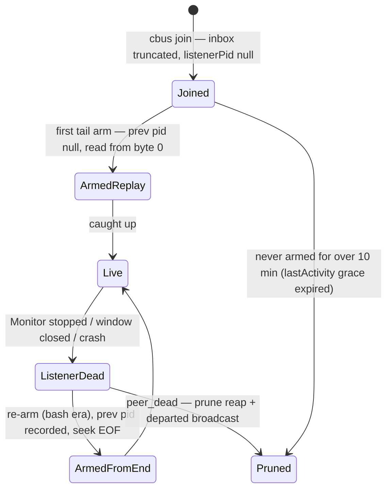
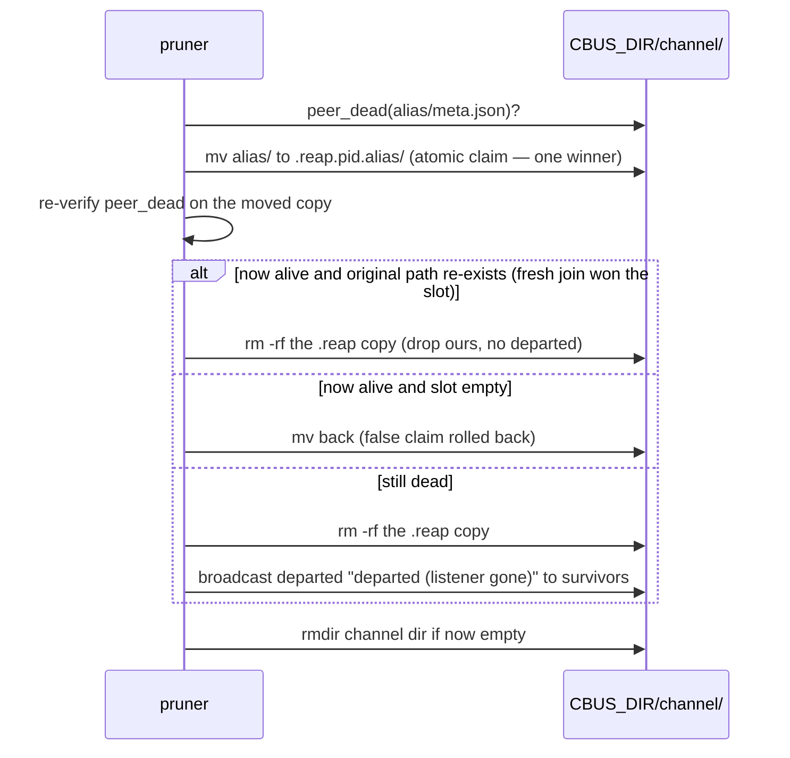

# claudebus — protocol & state specification

This is the wire and on-disk compatibility contract for claudebus, written to be
precise enough to reimplement **either side**: the bash client (`bin/cbus`), the Go
relay (`relay/`), or both. It documents behavior **as-is** at HEAD `f213e26`.

> **STATUS (2026-07-13; re-affirmed 2026-09-22):** the production client is the Go
> port; the bash-era contract below is unchanged and remains authoritative for what
> it still covers: the port was differentially verified against it (27/27). Since
> the last affirmation the Go client has grown a whole native (daemon-mediated)
> delivery path for Claude and Codex; that path is documented in §14-§16 below
> (daemon control plane, harness wire protocols, durable relay transport).
> `bin/cbus:N`
> anchors reference the retired bash implementation, which was deleted at P3
> homogenization (`f78fad0`) and now resolves only in git history
> (`git show f213e26:bin/cbus`), never in the working tree; anchors should be read
> as pinning behavior, not a live file. Port deltas touching this spec: remote HTTP
> calls now time out at 4 s/20 s (§9.2's "no timeout" quirk — fixed); unknown hosts
> and invalid names are hard errors (§12.1's non-fatal quirk — fixed); local sends
> enforce the 1 MiB cap client-side (matching §9.2); a `--` flag terminator exists
> and trailing junk errors on fixed-arity verbs (§1.1's quirks — fixed); the local
> framer is the shared `core.LocalEmit`, so the §4.5 divergence matrix is unified per
> port-map ruling D6 (tool-authored traffic byte-identical; foreign-written-line
> tie-breaks now deliberate). The follower is an in-process Go loop with no re-exec
> and no argv identity (P3 tranche 2, 2026-07-19) — §5.1's "inbox path in argv"
> invariant no longer holds for peers this binary arms. Listener identity is
> structural, `(pid, starttime)` via `procStartTime`; the `TRANSITION(P3T2)` argv
> fallback this once needed is itself deleted (P3 tranche 3, 2026-07-19/20,
> `9a3a075`), so there is no argv-identity branch left at all. Ancestor-owner identity
> (§2.2, §2.4) now checks each ancestor's kernel `comm` FIRST against the
> multi-harness set `claude`/`claude-*`/`codex`/`grok`/`xai-grok-pager`/`opencode`
> (`isHarnessComm`, `marker.go:115-121`), falling back to argv[0]'s basename only
> when `comm` does not match (`ownerFromPid`, `marker.go:76-83`): the bun-compiled
> binary's kernel `comm` is its version string, not `claude`.

Conventions:

- Anchors are `file:line` against the repo working tree at that commit.
- Behavioral oddities are flagged **`quirk — preserve or rethink in port`**; they are
  part of the observable contract today, not bugs this document fixes.
- "Monitor" means Claude Code's Monitor tool, which is the delivery surface for both
  transports (local `command` source, remote `ws:` source).

Related docs: `README.md` (user-facing overview — note several of its claims lag this
spec; where they conflict, this spec follows the code), `docs/history/explorations/prior-art-and-cc-internals.md`
(design rationale and the measured harness constraints).

---

## 1. Common conventions

### 1.1 Names

One validation rule is shared verbatim by client and relay:

```
^[A-Za-z0-9._-]+$    and not literally "." or ".."
```

- Client: `valid_name` (bin/cbus:24; Go: `core.ValidName`). Applied to channels,
  aliases, and relay host names.
- Relay: `validName` (relay/cmd/cbus-relay/main.go:33-37). Applied to `channel` and
  `alias` in `/send` and `/tail`. This is what makes names safe to use directly as
  spool path segments (no traversal). The durable-v1 `/tail` upgrade additionally
  caps `consumer` (the durable identity string) at 128 bytes and runs it through the
  same `ValidStoreName` gate as the store-creation rule below
  (`durable_tail.go:148`).
- **Go client only, store-creation rule** (`ValidStoreName`, `core/name.go:83-86`):
  tighter than the wire `ValidName` above. A channel or alias being *created*
  (join, connect, spawn, formation restore) additionally refuses a leading `.` or
  `-`, or a trailing `.`, on top of every `ValidName` rule. Reading/addressing an
  existing name still only needs `ValidName` to pass.

Properties of the rule (all as-is for the bash-era wire check; the store-creation
rule above narrows what a NEW name can be):

| Property | Detail |
|---|---|
| No length cap | The only de-facto bound is filesystem `NAME_MAX` (~255 B), and only where a directory gets created. |
| All-digit names are legal | Bash-era only: the client's `jset` coerced digit-strings to JSON ints, so `cbus rename 42` stored `"alias": 42` as a number (bin/cbus:76). The Go client always writes string aliases and its readers tolerate either shape (an old int-coerced value still parses), so this is a historical read compatibility note, not a live write path. |
| Leading-dot names pass `ValidName` | `.remote`-style names are accepted by the wire check but invisible to every `*/` glob the client uses (list/channels/prune/broadcast), and `.remote` collides with the marker tree. The Go client's store-creation rule (above) refuses a leading `.` on any NEW name, closing this for names it creates; a name written some other way and only ever read still goes through `ValidName` alone. |
| Leading-hyphen names pass `ValidName` | `-a`, `--active`, `--force` etc. are legal names. Bash era: there was no `--` end-of-options terminator anywhere in the CLI, so channels named `-a`/`--active` could never be used as a `list` filter (bin/cbus:583-587). **The Go client has one**: `--` ends flag parsing and everything after is positional (`flags.go:49-52`, `connection.go:83-85`). The store-creation rule refuses a leading `-` on any NEW name; existing names keep working. |

`/` and `@` are structural separators and can never appear inside a name.

### 1.2 Addresses

**Local** — `<channel>/<alias>`, split at the **first** `/` (`split_target`,
bin/cbus:82-89):

- Both halves are validated, **except** an empty channel half skips validation
  entirely — so `/main` is indistinguishable from bare `main` (bin/cbus:87).
  *quirk — the leading-slash spelling exists by accident.*
- Bare `<alias>`: the channel is resolved from the **sender's own** registrations via
  `find_peer_channel` (bin/cbus:107-114) — first of the sender's channels (alphabetical
  glob order) containing that alias. Ambiguity resolves silently by order.
  `inbox`/`unregister` refuse bare aliases.
- A second `/` makes the alias invalid (`a/b/c` → `bad alias "b/c"`).

**Remote** — `<channel>@<host>[/<alias>]` (`split_remote`, bin/cbus:121-132). A target
is remote **iff it contains `@` anywhere** in `$1` (checked by `send`, `tail`, `list`,
`leave`; `rename` rejects `@` outright, bin/cbus:707-709).

- Channel = everything before the first `@`; the remainder splits at the first `/`
  into host / alias.
- Channel and alias are validated only when present, empty skips (bash-era). **Host
  is the one part validated unconditionally, empty or not**: this holds in the Go
  client's `ParseRemote` too (`internal/client/addr.go:47-69`): unlike channel and
  alias, host has no `!= ""` guard before its `ValidName` check, so `cbus list ch@`
  (empty host) fails as `bad host ""`, a hard error, not a skip. In practice:
  - `send`/`tail` require only a non-empty **alias** (bin/cbus:239, 274). An empty
    channel (`@server/al`) is accepted client-side, produces `channel:""` on the wire,
    and the relay rejects it with 400 — except `tail`, which still writes a
    **degenerate identity marker** at `.remote/<host>/<sessionId>` (a file at the
    channel level, i.e. the legacy-marker shape swept unconditionally by the next
    full prune). *quirk — a port should require a non-empty channel here.*
  - `leave` is the only remote command that requires a channel (bin/cbus:653).
  - `list` legitimately allows an empty channel (`cbus list @server` = whole host); the
    host itself must still be present and valid.
- `cmd_list_remote` reads **only `$1`**; every trailing argument is silently
  discarded, so there is no active-only remote listing by any argument order
  (bin/cbus:296; `cbus active <ch>@<host>` is structurally dead because dispatch
  prepends `--active`, defeating remote detection). *quirk.*

### 1.3 Timestamps

- Client: UTC ISO-8601 `YYYY-MM-DDTHH:MM:SSZ` via `date -u` (bin/cbus:20).
- Relay: RFC 3339 `time.Now().UTC()` when the sender omits `ts`; a client-supplied
  `ts` is stored **verbatim, unvalidated** (main.go:178-180). The bash client never
  sends one, so this is API-level (raw curl) surface only. *quirk — spool ordering is
  by arrival, never by `ts`.*

---

## 2. Local on-disk state (`$CBUS_DIR`)

State root: `$CBUS_DIR`, default `~/.claude-bus` (bin/cbus:16). Created lazily. The
bash-era peer tree (`<channel>/<alias>/{meta.json,inbox.jsonl}`) has no explicit
chmod/umask: any same-user process can read/append any inbox, and there is no
per-peer ACL; this is the documented "trust boundary, not a security boundary"
stance and still holds for that tree. The Go client's own daemon-private state does
chmod explicitly: `.daemon/` 0700, `.daemon/control.sock` 0600, `.peer-locks/`
0700 (lock files 0600 within it), a daemon-created `inbox.jsonl` 0600
(`daemon_reservation.go:34`), and `claude-credentials/` 0700 with 0600 token files
(`claude_credentials.go`). None of that narrows the original peer-tree stance;
it is a second, separate, actually-private area alongside it.

### 2.1 Layout

```
$CBUS_DIR/
├── <channel>/
│   ├── <alias>/
│   │   ├── meta.json          # peer registration record
│   │   ├── inbox.jsonl        # append-only mailbox, one JSON object per line
│   │   └── .cursor            # Go client only: durable per-peer replay offset (cursor.go)
│   ├── .reap.<pid>.<alias>/   # prune temp (dot-prefixed so */ globs never see it)
│   └── .launch-intent-<alias>.json   # Go client only: the resume/apply launch claim marker
├── .remote/
│   └── <host>/
│       └── <channel>/
│           └── <sessionId>    # remote identity marker (one small JSON file)
├── .daemon/                   # Go client only: the native daemon's own private state
│   ├── control.sock           # unix socket, HTTP/1.1 control API (0600)
│   ├── lock                   # daemon singleton lock
│   ├── daemon.log             # daemon-side log (0600)
│   ├── connections/<id>.json  # ConnectionState journal, one per managed connection
│   ├── claude-credentials/    # per-connection Claude messaging tokens (0700 dir, 0600 files)
│   └── remote/<connId>/       # remote peer state for a native cross-machine connection
├── .peer-locks/                # Go client only: per-peer flock files (0700 dir, 0600 files)
├── .ledger/<channel>.jsonl     # Go client only: peer lifecycle ledger, one file per
│                               #   channel, append-only join/leave/rename/spawn/
│                               #   resume/restore/rebind events (ledger.go:28-36)
├── .formations/<name>.json     # Go client only: saved formation envelopes
├── .sock/<nonce>.sock          # Go client only: Codex wrapper compatibility sockets
└── roles/                      # Go client only, NOT dot-prefixed: `spawn --role` fallback
                                 # prompts; a channel literally named "roles" would
                                 # collide with this path (unverified whether anything
                                 # guards against it)
```

The dot-prefix idiom is load-bearing: every enumeration in the client is a `*/` glob
(list, channels, prune, presence broadcast), which skips dot-dirs — so `.remote/` never
appears as a channel and a crash-orphaned `.reap.*` temp is inert, never a phantom peer
(bin/cbus:366-368).

Legacy shapes still recognized:

- **v1 entry**: a `meta.json` directly at the channel level. Rendered by `list` as
  `legacy v1 entry — run: cbus prune`, skipped by `channels`, whole channel dir removed
  by prune when dead (bin/cbus:355-360).
- **Legacy machine-global marker**: a plain FILE where a `.remote/<host>/<channel>/`
  dir should be. Always swept by full prune (unowned by definition, bin/cbus:201-205)
  and deleted on the next remote tail (bin/cbus:279).

### 2.2 `meta.json`

Bash-era: written whole at join via python `json.dump(..., indent=2)`
(bin/cbus:428-433). Field patches (`jset`) rewrite the file **in place,
non-atomically**: a concurrent read mid-write sees truncated JSON, which `jget`
swallows as "field absent" (self-healing on the next read). **The Go client
took the port suggestion**: `writeMeta` (`store.go:74-84`) always writes a
`.meta.tmp.<pid>` sibling then `os.Rename`s it over `meta.json`, atomic on the
same filesystem; there is no in-place rewrite path left. The daemon's own
JSON state (`connections/<id>.json` etc.) goes through `durableJSON`
(`daemon.go:389-414`): `CreateTemp` + `Write` + `Sync` + `Close` + `Rename`,
then the containing directory is itself opened and `Sync`'d after the rename,
fsync included both before AND after the atomic swap, stronger than the plain
client write, since a daemon crash between write and rename must never leave
a torn connection record. A daemon-managed peer's own `meta.json` goes through
this exact same path (`writeDaemonMeta`, `daemon.go:416-422`), not the plain
`writeMeta` above.

| Field | Type | Written | Meaning |
|---|---|---|---|
| `alias` | string | join; rewritten by rename | alias within the channel (digit-only aliases stored as int — quirk §1.1) |
| `channel` | string | join | channel name (redundant with the path) |
| `sessionId` | string, `""` if unset | join | `$CLAUDE_CODE_SESSION_ID` of the joining session, the key `resolve_self` matches on. Go client only: `"reserved"` is a placeholder value (`ReserveAlias`), not a real session, and is a distinct sentinel from `""` unset |
| `cwd` | string | join | `$PWD` at join |
| `listenerPid` | null → int | join = null; set to the arming shell's `$$` at tail arm (bin/cbus:501) | pid of the exec'd follower; never cleared, only overwritten. **Go client, native connect:** set to the daemon's own pid while a managed connection is armed, and to `-1` on disconnect (never null again once a peer has ever connected natively) |
| `ownerPid` | null → int/null | join = null; set at tail arm (bin/cbus:502) | pid of the ancestor session process (empty → null). **Go client, native connect:** always null in meta.json; the observed CLI process pid lives in the connection journal instead, as `consumer.pid`, shown by `cbus connection status` (`connection.go:171-172`), never stamped into meta |
| `host` | string | join | `hostname -s` (fallback `hostname`) |
| `ts` | string | join | join time, UTC ISO-8601; never refreshed as a field |
| `lastActivity` | string, `omitempty` | Go client only | grace-clock timestamp (compat-deletion-plan #3); absent on bash-written metas. Written at join (`store.go:291-295`), native connect (`daemon.go:722`), and tail arm (`follow.go:192`); also refreshed by `touchActivity` when a session's own registration is the anchor or target of `arrange`/`scatter`/`focus` (`layout.go:340`, `store.go:863-883`, skipped for a daemon-managed peer since the daemon owns its grace). **`send` does NOT write it.** Since P3 homogenization this is the ONLY grace-clock input, see the mtime correction below |
| `origin` | string, `omitempty` | Go client; stamped by the **launcher** at reservation | birth record: `fresh` (spawn) / `fork` (branch) / `joined` (plain join); absent = unknown / hand-maintained |
| `model` | string, `omitempty` | Go client; stamped by the **launcher** at reservation | birth record: the model the child was launched on; absent = unknown |
| `listenerStart` | string, `omitempty` | Go client only; set at tail arm alongside `listenerPid` | the structural identity witness, `procStartTime` of the listener pid at arm time; a listener whose current start time no longer matches this value is treated as dead outright (pid recycling guard), replacing the bash-era argv-string check |
| `profile` | string, `omitempty` | Go client only; stamped at join ONLY (`store.go:295`) | the CCS instance directory basename the peer is running under, or `""` for the default `~/.claude`. Native connect does not set this meta field at all (`daemon.go:722`'s `peerMeta` literal has no `Profile:`); a managed peer's profile is instead derived on demand from the connection binding's `ConfigHome` when something needs it (`formation_harness.go`, command-reference.md §10) |
| `harness` | string, `omitempty` | Go client only; stamped at join/connect | `claude` / `codex` / `grok` / `opencode`; empty on legacy templates predating harness identity, in which case `claude` is assumed |
| `connectionId` | string, `omitempty` | Go client only; stamped on native connect | the key into `.daemon/connections/<connectionId>.json`; present iff this peer is daemon-managed |

**Bash era: the file's mtime was protocol state.** The 10-minute never-armed grace
(§6.2) was `find <meta> -mmin +10`, and `jset` at arm time refreshed mtime, so any
tooling touching meta.json reset the grace clock. **The Go client dropped the mtime
fallback entirely at P3 homogenization** (`compat-deletion-plan.md` item 3,
2026-07-18): `unarmedGraceElapsed` (`liveness.go:158-171`) judges the same
10-minute window purely from the `lastActivity` field above; a meta with no
parseable `lastActivity` reads as already past grace (pre-port relics become
prunable on sight, they never get a mtime-based reprieve). Touching the file with
no `lastActivity` bump no longer resets anything.

**Birth records (Go client).** `spawn` / `branch` stamp `origin` and `model` into the
peer's meta **before the child boots** — the launcher knows how a session was born; the
session cannot reliably know its own origin. `ReserveAlias` (store.go) lays down a
placeholder meta (`sessionId: "reserved"`, null pids) carrying the two fields; the
child's `join` reclaims the reservation and inherits them. Both fields are `omitempty`:
a meta written by bash `cbus`, or any pre-birth-record join, omits the keys entirely and
stays **byte-identical** for bash's tolerant reader (the A3 freeze, port-map §5) — an
absent field reads as unknown / hand-maintained, never inferred. `formation save` reads
these fields directly, which is how a spawn-born peer records its origin/model with no
hand-edit.

**The join stamp map** (`birthForJoin`, store.go) resolves origin/model against whatever
meta already sits at the alias:

- placeholder `sessionId: "reserved"` → carry its stamped origin/model through the
  reclaim (a blank stays blank);
- `sessionId` == this session's own → resume-rejoin, **preserve** the existing
  origin/model;
- any other sid, or unreadable → `origin=joined`, model unknown (a takeover never
  inherits the stranger's `fork`).

A **reservation is never laid down for a resume** — `formation apply`'s `resume` mode
skips `ReserveAlias`, because a placeholder would win over the resumed session's own sid
in `birthForJoin` and clobber its preserved origin. The `template` and `fork` restore
modes do reserve, stamping `fresh` / `fork` respectively.

### 2.3 `inbox.jsonl`

One JSON object per line, appended with a single `printf '%s\n' >>` (O_APPEND,
bin/cbus:483, 346). Created **empty** at join (`: > inbox.jsonl`, bin/cbus:427) — the
truncate-at-join is what makes first-arm replay exact. An explicit-alias rejoin over a
dead peer does `rm -rf` + recreate, **destroying the dead peer's queued inbox**
(bin/cbus:423-427; *quirk: same for rename's name reclaim*). **Go client:** a
daemon-managed peer refuses both an explicit-alias rejoin and a rename outright
(`"<ch>/<al>" is daemon-managed — ...`, `store.go:264,404,585,597`) rather than
destroying a managed inbox this way; join also unconditionally deletes any
`.cursor` sidecar for the alias (`store.go:289`), since a join starts a new
delivery epoch and a stale cursor keyed to a reused inode would silently skip
messages sent before the first arm.

Message line format: see §3.

Append atomicity was assumed, not enforced, in the bash client: one `printf` of a
chat-sized line landed as one write with no locking. **The Go client added a
per-peer flock**: `LocalSend` (`send.go:23-37`) takes the same `lockPeer(ch, al)`
held across store writes for the whole gate-check-then-append, so a concurrent
send and a concurrent prune/rename on the same peer serialize instead of racing.
Every send, local or relay-stored, is capped at `core.MaxMessageBytes` (1 MiB,
`message.go:100`), closing the bash-era "very large message" gap the original
port note flagged. *quirk (bash era, closed): a bare `printf` append with no
lock or size cap.*

### 2.4 Remote identity markers

`$CBUS_DIR/.remote/<host>/<channel>/<sessionId>` — JSON file
`{"alias": "...", "ownerPid": <int>, "ts": "..."}` (bin/cbus:281-284).

- `<sessionId>` = `$CLAUDE_CODE_SESSION_ID`, falling back to `nosession-$PPID`
  (bin/cbus:189).
- `ownerPid` = `find_owner_pid` output, or `$PPID` when no `claude` ancestor exists
  (which makes the marker sweep-bait for the next prune — the Bash-tool shell pid is
  transient). *quirk.*
- Written/overwritten by `cbus tail <ch>@<host>/<al>` (arming claims the alias as THIS
  session's default `from`). Read by remote `send` for its `from` default. Removed by
  `cbus leave <ch>@<host>` (this session's marker only — **no relay call is made;
  queued mail stays on the relay**). Swept by bare `cbus prune` when `ownerPid` is dead.
- Session-scoping is the impersonation defense: markers are keyed by sessionId, so two
  sessions can hold different aliases on the same remote channel, and a session never
  inherits another's alias.
- A marker is a **from-default, not proof of reachability** — `cbus list @<host>`
  (relay `/peers`) is the truth source.
- **Go client, native remote connect**: `cbus connect ch@host ...` writes into this
  same `.remote/<host>/<channel>/` directory too, keyed by `<threadId>` instead of
  `<sessionId>`, with an extended shape:
  `{"alias","ownerPid","ts","connectionId"}` (`writeRemoteIdentity`,
  `daemon_relay.go:98-136`; dir created 0700, file 0600 via `durableJSON`'s
  `os.CreateTemp` default). The daemon rewrites the marker any time the alias,
  owner pid or connection id changes while the connection stays online (checked
  against the existing file, a no-op write when nothing changed): a legacy
  marker is written once at arm and never touched again, but a native one tracks
  the live connection for as long as it holds it.

### 2.5 Credential store

Per host, three fields: `token`, `cf-id`, `cf-secret`.

| Platform | Location |
|---|---|
| macOS | Keychain generic passwords, service `cbus-relay-<host>`, account = field name. Writes go through `security -i` with the command on stdin so the secret never hits argv (bin/cbus:173-177). |
| Linux | Files `${XDG_CONFIG_HOME:-~/.config}/cbus/<host>/<field>`, created under `umask 077` (dir 0700, files 0600). |

`cbus auth set` strips **all** whitespace from values and supports `V='-'` = read
whole stdin — at most one stdin-fed credential per invocation, since each `-` drains
stdin (bin/cbus:750-752). Bash era: auth headers were rendered as a curl config
piped to `curl -K -` so credentials never entered any argv (bin/cbus:225-235); the
message payload itself WAS in curl's argv, only credentials were protected. **The
Go client uses `net/http` directly** (`remote.go`) and sets auth headers in
process, so no credential or payload ever touches an argv on this path at all.

Bash era: `cbus auth status` did **not** validate its host argument (the only
unvalidated path into `auth_get`; on Linux a `../` host path-traverses the
credential dir, read-only, 4-char mask). **The Go client validates the host**
like every other command: `auth status ../x` refuses with a bad-host error, rc 1.

**Go client, native relay dial:** the daemon reads the stored relay token fresh
on every dial, never caching it across reconnects (`relayToken`,
`daemon_relay.go:215-236`, called from `dialDurableRelay` each time a relay
connection is established); the token is capped at 4096 bytes and rejected if it
contains CR, LF, space, comma or tab. The token is never written to the
connection journal or any log line: it exists in memory for the dial and in the
credential store, nowhere else.

### 2.6 Atomicity primitives

Bash era: there was no flock and no lockfile anywhere. **The Go client and relay
both added real locking**: the client takes a per-peer `flock` in `.peer-locks/`
around every store mutation (`peerlock.go`, §2's layout above) and a singleton
`.daemon/lock` guards one daemon per store; the relay serializes each
channel/alias's durable-tail state behind an in-process `sync.Mutex`
(`hub.tailGate`, `durable_tail.go:23-33`). The three bash-era "known non-atomic
spots" below are all closed in the Go client: `writeMeta` is temp+rename
(§2.2), join's explicit-alias reclaim path takes the peer lock before its
rm+recreate, and `LocalSend` holds the same peer lock across its gate check and
append (§2.3). Bash-era correctness otherwise still rested on:

| Primitive | Used for | Anchor |
|---|---|---|
| bare `mkdir` (atomic EEXIST) | auto-alias claim at join; loser retries `pick_alias`, up to 50 tries, no sleep | bin/cbus:409-418 |
| `rename(2)` (atomic same-fs) | prune reap claim (`mv` peer dir → `.reap.$$.<alias>`), plus post-mv re-verify with rollback | bin/cbus:369-381 |
| dot-prefixed temp names | glob-invisibility of half-reaped dirs | bin/cbus:366-369 |
| O_APPEND single-`printf` writes | inbox appends (send, presence) | bin/cbus:346, 483 |
| `exec`-inherited `$$` + inbox path in argv | listener identity survives, pid recycling guarded | bin/cbus:495-515 |
| `2>/dev/null \|\| continue` on presence appends | a peer dir vanishing mid-broadcast can't abort under `set -e` | bin/cbus:344-346 |
| `${CBUS_DIR:?}` in `rm -rf` paths | unset CBUS_DIR can never expand to `rm -rf /...` | bin/cbus:666, 695 |

Known non-atomic spots, bash era (all three closed in the Go client, above):
`jset`/join meta writes (no temp+rename); explicit-alias join is
check-then-rm-then-mkdir (TOCTOU); local send's final append is unguarded (a
concurrent prune between gate and append kills the command with a raw bash error).

---

## 3. Message formats

### 3.1 Local inbox line (client-written)

```json
{"from": "<ch/alias or fallback>", "to": "<channel>/<alias>", "ts": "<UTC ISO-8601>", "text": "<verbatim text>"}
```

The spacing above is illustrative python `json.dumps` (bin/cbus:480-482) output,
which the bash client actually wrote. **The Go client writes the same fields via
`json.Marshal`** (`send.go:77`), which is fully compact (no spaces after `:`/`,`)
and HTML-escapes `<`, `>` and `&` as `<`/`>`/`&` by Go's own
default. `core.Message`'s field order (`internal/core/message.go:22-30`)
happens to marshal `from,to,ts,text` too, but that is a property of one
struct's declaration order, not a wire guarantee any future change is bound
to: **a reader must parse the JSON, never byte-match a line against an
example.**

`from` resolution (local send), first match wins:

1. explicit `--from X`, **unvalidated free text** (any bytes, any length). **Go
   client:** an explicitly EMPTY `--from` is now a hard error
   (`--from: value must not be empty`, `main.go:169,208`), not silently treated
   as unset;
2. sender's own registration in the **target** channel;
3. sender's first registration anywhere (alphabetical glob order);
4. `$CBUS_ALIAS` env (undocumented elsewhere; unvalidated in the bash client).
   **Go client** (`send.go:68-73`): `CBUS_ALIAS` alone still resolves to the bare
   alias string (no channel prefix) exactly as before; but when `$CBUS_CHANNEL`
   is ALSO set and both pass `core.ValidStoreName`, `from` becomes
   `$CBUS_CHANNEL/$CBUS_ALIAS` instead, a routable address rather than a bare,
   ambiguous alias;
5. `<hostname -s>-$PPID` — **unroutable** fallback (no inbox exists; receivers must
   not reply to it).

Remote send `from`: explicit `--from` → this session's identity marker
(`<ch>@<host>/<alias>`) → `hostname-$PPID`. Remote never consults local registrations
or `CBUS_ALIAS`. *quirk — the two fallback chains differ deliberately.*

### 3.2 Presence events

Same shape plus two fields (bin/cbus:341-343):

```json
{"from": "<ch>/<subject>", "to": "<ch>/<peer>", "ts": "<shared ts>",
 "kind": "presence", "event": "join|leave|rename|departed|compact-pre|compact-post",
 "text": "<human text>"}
```

See §8 for semantics. Note `event` is stored but **never rendered** by the framer —
only `kind=` reaches the frame header; the event type is inferable only from the text.
*quirk.*

**Go client additions to the presence shape** (all additive, no bash-era field
removed): a daemon-originated presence line carries an `eventId` formatted
`cbus-presence-<connectionId>-<sequence>` (`daemon_presence.go:202`), used for
de-duplication across a fanout; a message delivered through the native relay
path into a local inbox carries a `relayId` field tying it back to its spool
identity for the same reason (`daemon_relay.go:549,592-597`); and a native
payload appends operator guidance text to certain presence events (the actual
event text still renders as the `text` field above). **Durable presence
crosses the relay**: connection-lifecycle `join`/`departed`/`leave` are
generated by the daemon and cross machines over the durable ws
(`durable_presence.go`); `rename` does not, and stays local-only. The exact
key order the legacy in-process fanout writes differs cosmetically from the
durable path's own struct order; both are valid JSON and neither order is
part of the contract (§3.1's parse-don't-byte-match rule applies here too).

### 3.3 Relay stored line (spool file content)

The relay re-marshals accepted sends into the **same event shape** as local inbox
lines (main.go:181-187):

```json
{"from":"...","text":"...","to":"<channel>/<alias>","ts":"..."}
```

plus a trailing `\n`. Key order is Go-map **alphabetical** (`from,text,to,ts`) versus
the client's insertion order — **consumers must parse JSON, never pattern-match key
order**. `sendReq` still decodes only `{channel,alias,from,text,ts}`, but as of
cbus-ijx.5 the relay's server-side presence fan-out writes presence events as ordinary
spool lines carrying `kind`/`event`, and `reframe` renders ` kind=<k>` in the header —
so **relay-generated presence (join/departed) now crosses the relay**. Origination is
connection-lifecycle, not a client command: `join` fires on ws attach, `departed` on
detach after a grace window. Client-originated `leave`/`rename` over the wire (which
would need `kind` on the inbound `sendReq`) stay Phase 2.

Empty `from` defaults to `"unknown"` on the relay (main.go:175-177) — a different
"unroutable sender" spelling than the client's `hostname-PID`. *quirk.*

---

## 4. Delivery framing (the `◀ cbus` frame)

### 4.1 Monitor constraints (measured, not negotiated)

The frame format exists because of three **measured** Claude Code Monitor behaviors
(2026-07-11/12; detailed_changelog.md):

| Constraint | Value | Consequence |
|---|---|---|
| Single stdout/ws line truncated at | **500 chars** | body lines wrapped at 440 bytes |
| Lines written together (≲200 ms) batch into | **one notification** | whole frame emitted as one write / one ws frame |
| Per-notification ceiling (shared, local + remote) | **~3000 chars** | relay warns past `wsFrameSafe = 2800` |

For ws frames the 500-char cap is **per line, not per frame**. If the harness changes,
all three numbers are suspect — a port should centralize them as named constants with
measurement provenance.

### 4.2 Frame grammar

Each well-formed message is delivered as one multi-line block:

```
◀ cbus msg from=<from> to=<to> ts=<ts>[ kind=<kind>][ ⚠truncated~<N>B]
<body line 1>
<body line ...>
◀ cbus end from=<from>
```

- `◀` is U+25C0 (3 bytes UTF-8). Header template overhead is 26 bytes + field lengths.
- Body = message `text` split on its own `\n`, then each segment hard-wrapped at
  **≤440 UTF-8 bytes** per line. Wrapping is byte-aware and never splits a
  codepoint (client `wrap()` bin/cbus:522-531; relay `wrapBytes` main.go:208-221).
  Empty text segments are preserved as empty lines.
- ` kind=<kind>` appears on **both paths** (presence events): the local follower
  always, and the relay since cbus-ijx.5 (server-side join/departed fan-out).
- ` ⚠truncated~<N>B` appears **only on the relay path** (§4.4).
- The framed block is **load-bearing wire format**: receivers are instructed to parse
  `from=` out of the header to construct replies (commands/bus-join.md). Frame markers
  are in-band and unescaped — a body line beginning with `◀ cbus ` is not escaped by
  either framer. *quirk — spoofable framing, consistent with the trust-boundary
  stance; a port should decide deliberately.*

The **header and end-marker lines are exempt from the 440-byte wrap** on both sides —
only body segments are wrapped. A long `from`/`to`/`ts` (all reachable: `--from` is
unvalidated, names have no length cap) can push the header past the Monitor's 500-char
cap, truncating its tail — on the relay path the `⚠truncated` suffix is the first
casualty. A `from` containing a real newline (JSON-escaped in transit, decoded at
frame time) injects extra physical lines, i.e. forged header/end markers. *quirk —
frame-time sanitization is the defense-in-depth floor for a port.*

### 4.3 Local framer (the tail follower, bin/cbus:515-577)

**Historical (bash/python follower).** The numbered mechanics below describe the
retired python process. **The Go client's local follower calls `core.LocalEmit`**
(`internal/core/frame.go:150-186`), the in-process counterpart to the relay's
`core.Reframe` (§4.4): both now share one package, and a doc comment on
`LocalEmit` itself states the exact parity: on the "golden" domain (every field
present as a string, non-empty text, no `kind`) `bash emit() bytes == LocalEmit(line)
== Reframe(line)+"\n"` verbatim; `LocalEmit` differs from `Reframe` in exactly two
byte-visible ways, keeping `kind=` in the header (relay now does too, since
`cbus-ijx.5`, so this is no longer a real divergence) and appending the stdout
line terminator `Reframe` has no reason to add. See the corrected §4.5 matrix
below for degenerate-input behavior. Per completed inbox line, historically:

1. `rstrip("\n")`; if the result is empty the line is **silently dropped** — not
   framed, not passed through (bin/cbus:532-535). Whitespace-only lines survive and
   pass through raw. *quirk — the passthrough contract has a blank-line hole.*
2. Frame **iff** the line parses as a JSON dict containing a `"text"` **key** (any
   value — `str()`-coerced, so `text: null` renders body `None`, a Python-repr leak).
   Missing `from`/`to` render as `?`; missing `ts` as empty.
3. Anything else passes through **raw and unwrapped** — such a line CAN exceed 500
   chars and be cut by the Monitor.
4. The whole frame is emitted as ONE buffered `write` + `flush` so the Monitor batches
   it into a single notification.
5. There is **no over-size warning on the local path**: a frame past ~3000 chars is
   silently cut by the Monitor — header and early body arrive, the tail of the body
   and the `◀ cbus end` marker are lost. (A missing end marker is a detectable
   truncation signal; the fix — chunked delivery + local warning — is tracked as
   cbus-mew.) *quirk.*

stdout is reconfigured to UTF-8 with `errors="replace"`, and the inbox is opened the
same way — mojibake never kills the follower.

### 4.4 Relay framer (`reframe`, main.go:227-252)

Applied server-side to each stored spool line before ws delivery, so a long message
survives the Monitor's per-line cap as one multi-line ws text frame:

1. Typed unmarshal into `{From, To, TS, Text string}`. **Non-JSON payloads, payloads
   with any non-string field, or `Text == ""` pass through byte-identical** — an
   all-or-nothing gate, unlike the local coercing gate (§4.5).
2. Same header/body/end shape as §4.2, body wrapped at 440 bytes; renders
   ` kind=<k>` in the header when the stored line carries one (§3.3) — same
   position as the local framer.
3. If the framed total exceeds `wsFrameSafe = 2800` bytes, the header gains
   ` ⚠truncated~<N>B` where **N = `len(m.Text)` in bytes** (original unwrapped text,
   not frame size). The warning rides the header, which is delivered first, so it
   survives the ~3000 harness cut. Nothing is truncated server-side — the Monitor does
   the cutting.
4. Threshold math *quirk*: the total is computed **before the header exists** (a
   placeholder line contributes 1 byte), so the warning actually fires iff the emitted
   block exceeds `2799 + len(header)` — a silent window of `len(header) − 1` bytes
   (~75-90 B typically) above 2800. Bug-compatible ports must reproduce the
   header-less total; intent-faithful ports should count the header.

Tests: `relay/cmd/cbus-relay/reframe_test.go` pins short/long/unicode/newline/
passthrough/oversize behavior and enforces the <500-byte per-line invariant — but only
for well-formed `from` values; long/multiline `from` is untested.

### 4.5 Framer divergence matrix (degenerate inputs)

Every tool-authored line populates all four fields as strings, so these fire only on
foreign-written lines (hand-appended inbox lines, hand-placed spool files). The
bash/python columns below are historical; **the Go client's `LocalEmit` and
`Reframe` now share the same strict gate** (`internal/core/frame.go`), so most
rows that used to diverge are now identical:

| Input line | bash `emit()` (historical) | bash relay `reframe()` (historical) | Go `LocalEmit`/`Reframe` today |
|---|---|---|---|
| `text:""` (key present, empty) | framed (one empty body line) | passthrough (raw JSON) | **both passthrough**: `LocalEmit` adopted the relay's strict gate (`err != nil \|\| m.Text == nil \|\| *m.Text == ""`) |
| `text` key missing | passthrough | passthrough | both passthrough (unchanged outcome) |
| `from`/`to` missing, text ok | framed, `from=? to=?` | framed, `from= to=` (empty) | **still diverges, deliberately**: `LocalEmit` unmarshals into `*string` fields so nil (missing) renders `?`, distinct from present-but-empty; `Reframe` unmarshals into plain `string` fields where missing and empty both read `""`. This is the one difference the shared-package refactor kept on purpose |
| `text:123` (non-string) | framed, body `123` (coerced) | passthrough (unmarshal error) | both passthrough: `LocalEmit`'s `Text *string` field fails the same unmarshal `text:123` fails against `Reframe`'s `Text string` |
| `text:null` | framed, body `None` (Python repr) | passthrough | both passthrough: `m.Text == nil` after unmarshaling `null` into a `*string` |
| `from:123`, text ok | framed, `from=123` | passthrough (any non-string field aborts) | both passthrough: `LocalEmit`'s `From *string` fails to unmarshal a JSON number the same way `Reframe`'s `From string` does |
| non-dict JSON | passthrough | passthrough | both passthrough (unchanged) |
| `kind` present, text ok | framed, header `+ kind=<v>` | framed, header `+ kind=<v>` (identical to local since `cbus-ijx.5`) | both framed, both render `kind=<v>` (unchanged, already unified pre-Go-port) |

Net effect: the Go port closed every historical local/relay divergence except the
deliberate missing-vs-empty `from`/`to` distinction, which `LocalEmit` needs to
keep rendering `?` for a genuinely absent field.

*quirk — a port unifying the framers must pick each tie-break deliberately; the
`text:null → "None"` body is an artifact nobody would spec.*

---

## 5. Local listener protocol (tail follower)

### 5.1 Arm sequence (`cmd_tail`, bin/cbus:487-577)

`cbus tail <ch>/<al>` is a Monitor **event source, never a Bash command** — it `exec`s
a follower that never exits, so a Bash invocation blocks the session forever.

1. Resolve target (bare alias → own channel). The inbox file must exist
   (`join first`); **meta.json is NOT required** — a meta-less dir yields a fully
   functional listener that no metadata records (invisible to list/send/prune; only
   `unregister` or manual `rm -rf` removes it). *quirk.*
2. Record `listenerPid = $$` and `ownerPid = find_owner_pid` into meta (best-effort,
   `|| true`).
3. Bash era: `exec` the python follower **with the inbox path in argv**; see the
   top-of-document status block for how the Go client replaced this (in-process
   loop, structural `(pid, starttime)` identity, no argv fingerprint at all).

Bash era: there was **no collision or ownership check at arm time**: no "already
listening" refusal (unlike join/rename, which refuse names taken by a live
listener) and no sessionId comparison; arming the same address twice left two live
followers delivering every message twice, the sharpest local/remote asymmetry
against the relay transport's *displaces* policy (§10.5). **The Go client closed
this.** `ArmLocalTail` (`follow.go:41-110`) refuses a daemon-managed peer outright
(`"<ch>/<al>" is daemon-managed — use cbus connect; tail cannot replace its
delivery sink, even with --steal`, `follow.go:72`, no `--steal` override exists
for this case), and refuses a second legacy tail on an already-armed alias unless
`--steal` (`"<ch>/<al>" is already being tailed (listener pid <p>) — use --steal
to take over"`, `follow.go:110`); a displaced follower detects the takeover via
the same `(pid, starttime)` structural identity check the rest of liveness uses,
and exits with a dormancy marker rather than silently double-delivering:
`◀ cbus tail ended: displaced by another listener — it holds the tail now;
re-arm with --steal to take it back` (`identity_follow.go:147-157`). The old
stale-follower-survives-deletion hazard is closed the same way: a reopen whose
identity no longer matches goes dormant instead of shadow-receiving a new peer's
traffic.

### 5.2 Replay semantics



- **First arm** (meta never recorded a `listenerPid`): read from byte 0 — replays the
  whole inbox. Combined with join's truncate, this guarantees nothing sent between
  join and first arm is lost; `cbus send` accepts joined-but-unarmed peers for exactly
  this reason.
- **Re-arm, bash era**: seek to EOF; messages appended while the listener was dead
  were **never replayed**, which made `send --force` into a dead-listener inbox
  best-effort at best (`cbus-8no`).
- **Re-arm, Go client**: a durable per-peer `.cursor` sidecar (`internal/client/cursor.go`,
  D4) replaces the tri-state byte-0-or-EOF decision with an exact recorded read offset.
  Every re-arm resumes from precisely where the last one left off, including messages
  queued via `--force` into what used to be a dead gap: `cbus-8no` is closed. The
  cursor lives beside the peer, never in meta.json (meta is whole-struct
  read-modify-written elsewhere, which would race a cursor field against every other
  field) and is local-only: the wire, the relay and remote tail are untouched, remote
  replay is still the relay's own affair (§10). `cbus --help` documents this replay
  behavior for the shipped client.
- The `'+1'` / `'0'` start tokens are vestigial `tail -n` spellings; the follower only
  tests `== "0"`. A port should use an honest enum.
- Post-rename re-arm intentionally follows from the end (rename preserves meta).

### 5.3 Follower loop (hand-rolled `tail -F`, bin/cbus:552-577)

- Reads lines; on empty read, sleeps **0.2 s**, then `os.stat`s the path.
- Partial lines accumulate in a `pend` buffer, emitted only once terminated by `\n` —
  a mid-line concurrent append never yields a garbled frame. `pend` resets on reopen.
- Reopen when `st_ino` changed OR file shrank; reopen reads from offset 0 (full replay
  of the fresh file — this is how a rejoin's truncate is survived).
- Path vanished (`stat` OSError) → keep polling forever with the old fd open.
- **One self-termination path exists** (contradicting "never exits on its own"): if
  the file vanishes between a successful `stat` and the reopen `open()`, the follower
  is left with a closed file object and the next `readline()` raises an uncaught
  `ValueError` — process exits nonzero, Monitor reports it, liveness flips to off.
  *quirk — a port's reopen must retry-until-success.*

### 5.4 Remote "tail" is not a process

`cbus tail <ch>@<host>/<al>` runs nothing persistent. It (a) writes/overwrites this
session's identity marker, and (b) **prints** a Monitor `ws:` arm spec:

```
url:         wss://<site>/tail?channel=<ch>&alias=<al>
protocols:   ["bearer.cbus.<token>"]
description: cbus:<ch>@<host>/<al>   (persistent: true)
```

The relay token appears in cleartext by design — it IS the auth (the Monitor `ws:`
source supports only `{url, protocols}`, no custom headers). Alias collisions are not
pre-checked: the relay's single-active-tail rule makes them self-evident (§10.5).

---

## 6. Liveness & staleness

### 6.1 Local predicates (pure pid forensics — no heartbeat)

**`meta_listener_alive`** (bin/cbus:55-68) — the "listen" predicate; all three must hold:

1. `listenerPid` recorded and alive (`kill -0`);
2. **pid-recycling guard**: `ps -ww -p <pid> -o args=` contains the peer's inbox path
   as a fixed string;
3. if `ownerPid` is recorded, that pid is alive too (crash-orphan guard).

**`find_owner_pid`** (bin/cbus:44-53): walk `$PPID` upward, max 16 hops, stop at pid 1;
first ancestor whose `comm` basename matches `claude` or `claude-*` is the owner. No
match → no ownerPid → liveness degrades gracefully to pid+argv only. This is
bash-era; see the top-of-document status block for the Go client's multi-harness
`isHarnessComm` replacement.

**Go client: `MetaListenerAlive`** (`liveness.go:94-105`) replaces the pid-recycling
guard with a **structural identity witness**: `listenerIdentityHolds`
(`liveness.go:118-137`) rejects a zombie process outright (exited but unreaped,
which would otherwise byte-match a stale `kill -0` check), requires a recorded
`listenerStart`, and compares it to the CURRENT `procStartTime` of that pid: any
mismatch, including "no witness recorded" or "probe cannot answer," reads dead.
There is no argv-grep fallback left; the old `TRANSITION(P3T2)` shim that once
provided one is itself deleted.

**Go client: `PeerDead`** (`liveness.go:146-158`) is the prune/broadcast/send-gate
predicate: **a daemon-managed peer (`ConnectionID != ""`) reads NOT dead
unconditionally**, regardless of listener state: a managed peer's inbox survives
listener outages and is removed only by an explicit `leave`/`unregister` (a mere
`connection disconnect` retains it). A legacy (non-managed) armed-ever peer is
dead iff `!MetaListenerAlive`; a never-armed peer falls to the `lastActivity`
grace window (§2.2), not mtime.

Bash era, `peer_dead` (bin/cbus:316-323): never-armed dead only past mtime
**10 minutes** (`find -mmin +10`); armed-ever dead iff `!meta_listener_alive`.
Where each is used: the listener-alive predicate → send gate, list listen/off
column, channels live count, alias-takeover refusals; `peer_dead`/`PeerDead` →
prune reaping and the presence-broadcast recipient filter (deliberately the same
rule as the send path, so joined-but-unarmed peers still receive presence). For a
native peer, "listen" in `cbus list` means **the daemon holds the connection**,
not that any particular CLI process is alive: the daemon itself is the thing
being asked about, and a peer that never connects natively never has this
question apply to it at all.

### 6.2 The send gate

`cbus send` to a local peer:

| Target state | Behavior |
|---|---|
| joined, never armed | accepted unconditionally (first arm replays) |
| listener alive | accepted |
| armed-then-died | refused: `not listening; use --force to queue anyway`; with `--force`, warns and queues **best-effort**. Bash era, this could be lost forever (re-arm sought EOF); **Go client**, the durable `.cursor` (§5.2) delivers it on the next re-arm, so `--force` here is no longer a gamble |
| native, disconnected (`ListenerPid == -1`) | same row as armed-then-died: `MetaListenerAlive` reads a `-1` pid as not alive, so the gate refuses identically, `--force` queues the same way |
| native, daemon process itself down | same row again: the daemon's own pid is what `listenerPid` names while armed, so a dead daemon reads as a dead listener through the identical `pidAlive` check, no separate code path |

`--force` on remote targets is **accepted and ignored** — the spool always queues
(bin/cbus:244). *quirk — surface parity, no remote effect.*

### 6.3 Relay liveness

Connection-presence + keepalive, not pids: a peer is `connected` while its ws tail is
attached; `lastSeen` is hub memory (attach/detach/pong/text/delivery), **not
persisted** — zero time `0001-01-01T00:00:00Z` after a relay restart until reconnect.
Sends do not update presence. Detection floor for silent death is **~90–120 s**
(§10.3), during which `/peers` reports `connected:true` and `lastSeen` keeps
refreshing on traffic to the corpse. *quirk — presence is delivery-attempt evidence,
not receipt evidence.*

---

## 7. Prune GC

### 7.1 Channel prune (`prune_channel`, bin/cbus:352-385)

Triggered automatically by every `cbus join` (its own channel only) and manually by
`cbus prune [channel]`. Per dead peer, the atomic **reap dance**:



The claim-then-verify makes `departed` fire **at most once** across concurrent
reapers, and removal-before-broadcast means the reaped peer can never receive its own
event. Legacy v1 entries: whole channel dir removed when dead.

**Go client** (`PruneChannel`, `store.go:664-`): the reap dance now runs entirely
under the same per-peer `flock` sends and joins take (§2.6); an unreadable
`meta.json` aborts that peer's reap early rather than being read as evidence it
is reclaimable ("unreadable metadata is not evidence that an inbox is
reclaimable"); and since `PeerDead` (§6.1) reads any daemon-managed peer as
never dead, **a native peer is never reaped by prune at all**: it is removed
only through `leave`/`unregister`, not this path (a mere `connection
disconnect` keeps the registration and inbox, §6.1 and §7.3). Remote
`/prune` is a separate relay-side endpoint, covered in §9.

### 7.2 Remote marker sweep

Runs **only** on a bare `cbus prune` (no channel argument) via `prune_remote_markers`
(bin/cbus:640-645): per-session markers removed when their `ownerPid` is dead; legacy
file-markers always removed; empty dirs rmdir'd. **No other path ever sweeps
markers** — not join's auto-prune, not remote ops, not `hook-exit`. `cbus prune <ch>`
never touches `.remote/`. *quirk — docs elsewhere overstate this.*

### 7.3 Other removal paths

| Command | Effect |
|---|---|
| `cbus leave [ch]` | for each of this session's registrations: broadcast `leave`, then `rm -rf` the peer dir |
| `cbus leave <ch>@<host>` | delete this session's marker only; **relay untouched** — queued mail keeps accumulating and is inherited by whoever next arms that alias |
| `cbus unregister <ch>/<al>` | unconditional `rm -rf` of any peer (no liveness/ownership check), broadcast `departed` ("unregistered") |
| `cbus hook-exit` | SessionEnd hook: reads `{session_id}` from **stdin JSON** (env fallback), runs `leave` for that session silenced and never-failing (always exit 0). Local channels only; graceful exits only, hard kills rely on the prune `departed` backstop. **Go client: preserves a daemon-managed registration** (`leaveSession(ch, preserveManaged=true)`, `harness.go`), only a legacy peer is actually removed here. Wiring is manual per host (`~/.claude/settings.json` SessionEnd → `cbus hook-exit`; `install.sh` no longer exists to do it, retired and deleted, §14 of `command-reference.md`) |
| `cbus connection disconnect <ch>/<al>` (Go client only) | detaches a native connection but **keeps the registration and inbox**; the peer reads `off` until reconnected. Distinct from every row above, none of which have a "keep everything, just stop delivering" mode |
| `cbus close <ch>/<al>` (Go client only) | SIGTERMs the peer's owning process (a legacy peer only; refuses a daemon-managed one outright, `"daemon-managed peer — use cbus connection disconnect ..."`) and sweeps its terminal surface; registrations are untouched here, the graceful exit path (hook-exit) or the prune backstop removes them |

---

## 8. Presence protocol

`broadcast_presence <channel> <from> <event> <text> [skip]` (bin/cbus:332-348) appends
a presence line (§3.2) to the inbox of every **non-dead** (`!peer_dead`) peer in the
channel except `skip` (default: the subject). Using `peer_dead` — the same rule as the
send gate — is deliberate: a joined-but-unarmed peer still receives presence, replayed
at its first arm. One shared `ts` per broadcast. Appends are `|| continue`-guarded
against concurrently vanishing peers.

| Event | Fired by | `from` (subject) | `skip` | text |
|---|---|---|---|---|
| `join` | `cbus join` | new alias | =from | `joined <ch> as <alias>` |
| `leave` | `cbus leave` / `hook-exit` (broadcast **before** removal) | leaving alias | =from | `left <ch>` |
| `rename` | `cbus rename` (after the `mv`, so `from=` is the NEW alias) | new alias | =from | `renamed <old> -> <new>` |
| `departed` | rename's dead-name reclaim | reclaimed (dead) alias | **old alias** (the actor, else it self-echoes) | `departed (name reclaimed)` |
| `departed` | prune reap (after the atomic claim) | reaped alias | =from | `departed (listener gone)` |
| `departed` | `cbus unregister` | removed alias | =from | `unregistered` |
| `compact-pre` | `cbus hook-compact pre` (PreCompact hook) | own alias | =from | `about to compact[ (manual\|auto)], in-context state will be lost` |
| `compact-post` | `cbus hook-compact post` (PostCompact hook) | own alias | =from | `compacted[ (manual\|auto)], in-context state was reset` |
| `join` (Go client, native) | daemon observes the managed CLI session transition to `online` | own alias | =from | `CLI session connected (or resumed)` (`daemon_presence.go:179`) |
| `departed` (Go client, native) | daemon observes the managed CLI session exit | own alias | =from | `CLI session exited; durable inbox and alias retained for resume` (`daemon_presence.go:186`) |
| `leave` (Go client, native) | `cbus connection disconnect` (explicit, while the consumer was online) | own alias | =from | `disconnected; durable inbox and alias retained for resume` (`daemon_presence.go:97`) |

**Go client additions**: a Codex peer also fires `compact-post` from its own
observed compaction path, not just Claude's PreCompact/PostCompact hooks. Every
daemon-fired event above carries the `eventId` de-dup key from §3.2 and is
subject to the daemon's own fanout epoch bookkeeping, so a peer that misses a
daemon restart mid-broadcast does not receive a duplicate on the daemon's next
attempt.

Receiver rendering (local frame): `◀ cbus msg from=<ch>/<al> to=<ch>/<you> ts=<iso>
kind=presence` + text + end marker.

Properties to preserve or consciously rethink:

- **Compaction presence (D-zig-1, local-only)**: `cbus hook-compact pre|post`,
  wired via Claude Code's PreCompact/PostCompact hooks (manual per host, see
  command-reference §7), broadcasts `compact-pre`/`compact-post` exactly like
  any other presence event above — registration is untouched, so the
  compacting session keeps listening throughout. **Local channels only**: the
  frozen `POST /send` contract (§3.3) carries no `kind` field and the relay
  rebuilds stored lines from `{from,text,to,ts}`, so a relayed notice would
  arrive as plain chat, not presence; the honest fix is a wire change plus a
  relay redeploy, deferred rather than faked. The `trigger` text is rendered
  from an **allowlist** (`manual`/`auto` only) rather than passed through, so
  an arbitrary hook payload can't write text into every peer's inbox, and an
  absent/unrecognized trigger just drops the parenthetical. PostCompact's
  `compact_summary` (unbounded conversation content) is never carried.
- **Relay presence, legacy `/tail` (cbus-ijx.5)**: the relay renders `kind` and
  GENERATES join/departed from the ws lifecycle (attach → join; detach + grace
  → departed, grace tunable via `-presence-grace`, default in `main.go:526`),
  fanned to connected peers via the spool. Semantics differ from local: it is
  connection-presence, not registration, so `/peers` is the state truth source and the
  pushed events are edge notifications. Header text is honest to that (`connected as
  <alias>` / `departed (connection lost)`).
- **Relay presence, durable `/tail/durable-v1` (Go client)**: a different, CLIENT-
  driven model, not relay-generated from ws lifecycle: the daemon itself decides
  when to send `join`/`departed`/`leave` (§8's native rows, above) and the relay's
  job is to accept, journal and fan those frames out durably
  (`acceptDurablePresence`, `durable_presence.go`), never to infer them from
  attach/detach on its own. A durable consumer never gets the legacy
  auto-generated variant. The relay itself is now in the root module
  (`claudebus`, importing `internal/core`/`internal/wire` directly), not a
  separate zero-dependency module as originally built.
- `departed`/`leave` events carry an unroutable `from` (the subject's dir is gone) —
  receivers must treat presence `from=` as informational, not a reply target.
- Presence lines persist in inboxes like any message: they replay on first arm
  (intended — roster catch-up) and can be stale by then.
- One `cbus join` can emit `departed` (auto-prune reaps) and then `join` — two frames
  from one command.
- Explicit-alias join's dead-peer reclaim broadcasts **nothing** (asymmetric with
  rename's reclaim, which broadcasts `departed`). *quirk.*

---

## 9. Relay HTTP API

### 9.1 Daemon

Std-lib-only Go binary (`relay/cmd/cbus-relay`, `go 1.26`, zero deps). Flags:
`-listen` (default `127.0.0.1:8090` — loopback; the CF tunnel fronts it, no TLS in the
binary), `-spool` (default `spool`), `-token-file` (default `token`). Production unit:
`ExecStart=… -listen 127.0.0.1:8090 -spool <dest>/spool -token-file
<dest>/token` (templated per site by deploy.sh), `Restart=on-failure`/5 s.

Token: env `CBUS_RELAY_TOKEN` (trimmed) wins; else the token file; fatal if empty or
if it contains any of `=` `,` `/` or space — it must be **subprotocol-safe**
(main.go:396-409). The token is loaded **once at startup** — rotation requires a
restart, invalidates every armed ws spec (which bakes the token), and surfaces as an
HTTP 401 handshake refusal, *not* a 1006 close — a failure shape the documented
re-arm doctrine doesn't cover. *quirk — a port should support old+new token grace or
SIGHUP reload.* `ReadHeaderTimeout: 5s`; no other server timeouts.

Routes: `/send`, `/tail`, `/tail/durable-v1`, `/peers`, `/prune`, `/healthz`
(`main.go:548-553`); the last two are Go-client additions, covered in §9.7 and
§9.8 below. The relay is one flat namespace keyed `channel/alias`: "host"
exists only client-side as *which relay to talk to*.

### 9.2 `POST /send`

| Aspect | Contract |
|---|---|
| Method | POST only → else `405`, body `POST only` |
| Auth | `Authorization: Bearer <token>`, constant-time compare → else `401 unauthorized` |
| Body | JSON, hard cap **1 MiB** (`http.MaxBytesReader`) → decode failure `400 bad json: <err>` |
| Request | `{"channel","alias","from","text","ts"}` — channel/alias must pass `validName` (`400 bad channel/alias`); text required non-empty (`400 empty text`); from optional (default `"unknown"`); ts optional (default server RFC3339, client value stored verbatim) |
| Effect | spool `Write` (§11) → `hub.poke` (wakes a connected tail) → respond |
| Success | `200`, `Content-Type: application/json`, body `{"ok":true,"id":"<spool filename>"}\n` |
| Spool failure | `500 spool: <err>` |

Semantics to know when porting the client:

- **No existence check**: sending to a never-seen `channel/alias` silently creates
  spool dirs and queues forever (no TTL).
- **Ack-after-write ambiguity**: the 200 is written after the spool write (and the
  poke may have already delivered the message live). A transport failure after the
  write leaves the client with `relay send failed` for a message that IS queued —
  and there is no idempotency key (server-minted id, server ts), so a retry is a new
  message. *quirk — auto-retrying ports must add an idempotency key first.*
- Bash era: the client's send/list curls had **no timeout** (only the 0.3 s healthz
  probe was bounded), so a black-holed request wedged the Bash tool call. **The Go
  client sets explicit timeouts**: 4 s to establish a connection (including TLS),
  20 s total per request (`connectTimeout`/`totalTimeout`, `remote.go:23-24`),
  applied to every remote HTTP call through `newHTTPClient`.

### 9.3 `GET /peers`

Bearer auth (401 otherwise); no method check. Response: a JSON object keyed
`"<channel>/<alias>"`:

```json
{"dev/server": {"connected": true, "lastSeen": "2026-07-12T...", "queued": 0}, ...}
```

Built as: one entry per **spool dir** (queued = `len(new/)`), union one entry per
**connected hub key** not already present (`connected:true, queued:0`). Consequences:

- A peer that armed a tail but was never sent mail **vanishes from `/peers` entirely
  on disconnect** (no spool dir, no hub entry) — absent, not `off`. First message ever
  spooled makes it permanent. *quirk — absence vs off keys on "ever received mail".*
- `lastSeen` is process memory: zero time after restart; refreshed by attach, detach,
  pong/text frames, and each delivery — including deliveries into a not-yet-detected
  dead connection (§10.7).
- No query parameters exist — the channel filter in `cbus list <ch>@<host>` is purely
  client-side, and there is no connected/active filter at all.
- Spool dirs are never deleted, so `/peers` output grows monotonically.

### 9.4 `GET /healthz`

Unauthenticated, responds `ok\n`. Load-bearing for the client's local-vs-public front
door probe and deploy's post-deploy check.

### 9.5 `GET /tail` (HTTP entry to the ws protocol)

Check order matters and is observable:

1. `channel`/`alias` query params `validName` → else `400 bad channel/alias`
   (**before auth** — an unauthenticated probe can distinguish bad-name from bad-token);
2. subprotocol token (§10.1) → else plain HTTP `401 unauthorized` (a failed handshake,
   not a ws close);
3. `validTailUpgrade` (non-GET, missing upgrade headers, bad version/key) → else
   `400 valid WebSocket GET required` (`main.go:333-335`). This was, at `f213e26`,
   a pre-hijack failure the handler logged and returned from without writing,
   leaving the client an implicit `200 OK` empty body; the shipped Go relay
   checks explicitly and refuses with a real 400 before ever attempting the
   hijack.

On success: 101 with the matched subprotocol echoed; per-connection
`WriteTimeout = 10s`; the connection is hijacked into the ws protocol (§10).

### 9.6 Auth model

Two independent mechanisms in the relay itself:

| Surface | Mechanism |
|---|---|
| `/send`, `/peers` | `Authorization: Bearer <token>` header, constant-time compare |
| `/tail` | `Sec-WebSocket-Protocol: bearer.cbus.<token>` — every offered subprotocol is comma-split, trimmed, and the part after the `bearer.cbus.` prefix constant-time compared; the matched protocol string is echoed in the 101 (RFC 6455 requirement) |

The subprotocol pattern exists because the Monitor `ws:` source cannot send custom
headers; a header (unlike a `?token=` query param) also stays out of edge access logs.

Everything above the relay's own bearer check (any front door, service-token
headers, per-path bypass) is deployment, not wire contract: see
[Deploying a relay](../security.md#deploying-a-relay) for the requirement and the
current risk if the token leaks. The relay itself never sees or checks any
front-door headers.

### 9.7 `POST /prune` (Go client addition)

Bearer auth, `POST` only, optional `?channel=` (must pass `validName`, else
`400 bad channel`) scoping the sweep to one channel. Per peer key: kept if it
has any queued mail (`len(new/) > 0`) or a live tail attached; otherwise
removed if it also has no unfinished presence recipient
(`hasUnfinishedPresenceRecipient`) (`handlePrune`, `main.go:470-519`).
Removal takes that key's `tailGate` mutex (§10.5) and calls `store.Remove`,
which deletes the whole peer dir, `tmp`/`new`/`cur` alike, not just `cur/`.
Response: `{"pruned":["<channel>/<alias>", ...]}` (`core.PruneResponse`),
sorted, of the keys actually removed. This is the client-facing counterpart
to the "spool dirs are never deleted" limitation noted throughout §9 and §11
below: the relay itself never GCs on its own, an operator (or the local
`cbus prune`'s remote form) has to ask for it.

### 9.8 `GET /tail/durable-v1` (Go client addition, durable ack transport)

A second, parallel upgrade path to §9.5's legacy `/tail`, sharing the same
`ws.Upgrade`/handshake mechanics but adding an application-level consumer
identity and stop-and-wait acknowledgment on top. Pre-hijack failures on
**both** endpoints refuse the same way: `400 valid WebSocket GET required`
(`main.go:334`, `durable_tail.go:158`), as §9.5 now describes.
`validTailUpgrade` and this endpoint arrived in the same commit (`7b223c3`,
v0.12.0), so durable-v1 never lacked the check; only the legacy `/tail`,
which predates that commit, had the window where an unchecked pre-hijack
request got the implicit 200.

**Legacy-vs-durable consumer conflict.** Both endpoints share one hub keyed
by `channel/alias`, and `attachTailWithGate`/`upgradeOwnedTail`
(`durable_tail.go:40-90`) enforce a single active tail per key: attaching
when a different tail already holds the key, where either side is durable
or the durable consumer strings differ, refuses `409 Conflict` with `alias
has an active different consumer; disconnect it before replacing this
subscription` (`durable_tail.go:44-46,80-82`). Two legacy attaches on the
same key still displace each other as §10.5 describes (last writer wins,
no conflict); the 409 fires only when durability or consumer identity would
otherwise be silently overwritten.

**Ownership record.** Every successful upgrade, legacy or durable alike,
writes an ownership record under `.durable-owners/<sha256(key)>.json`
(`recordTailOwner`, `durable_owner.go:18-36`, called from the shared
`upgradeOwnedTail`): a legacy `/tail` connection gets one too, not just
durable-v1 subscribers.

---

## 10. WS tail protocol

Hand-rolled RFC 6455 subset (`relay/internal/wire/ws.go`): no fragmentation, no
extensions, no compression, no binary frames.

### 10.1 Handshake

Server requires: GET; `Upgrade: websocket` (case-insensitive) and `Connection`
containing the token `upgrade`; `Sec-WebSocket-Version: 13` exactly;
`Sec-WebSocket-Key` decoding to exactly 16 bytes. Response:
`HTTP/1.1 101 Switching Protocols`, `Sec-WebSocket-Accept: base64(SHA1(key + GUID))`,
plus `Sec-WebSocket-Protocol: <echo>` when a subprotocol was selected.

The in-repo debug client (`wire.Dial`, used by the `wstail` tool) is TCP-only, no
TLS, so it works only against loopback. **The daemon itself uses a different,
newer entry point**: `wire.DialContext` (`internal/wire/ws.go:117-145`; the
legacy `Dial` sits just above it at `:107`. The package moved here from
`relay/internal/wire`, which is now a thin re-export shim so the daemon and
relay share one implementation.) `DialContext` parses the URL scheme
and, for `wss`, wraps the connection in real TLS (`tls.Client`,
`MinVersion: tls.VersionTLS12`) before the handshake: this is what lets a
native remote connection reach the public front door over the CF tunnel
without going through loopback at all. A `Dial`-side port offering a
subprotocol must verify the server echoed it exactly.

### 10.2 Frame layer

| Rule | Value |
|---|---|
| Opcodes | `OpText 0x1`, `OpClose 0x8`, `OpPing 0x9`, `OpPong 0xA` — no binary (0x2), no continuation (0x0) |
| Fragmentation | rejected (`!fin` or opcode 0 → connection error); RSV bits rejected |
| Masking | direction enforced: client→server MUST mask, server→client MUST NOT |
| Max frame | Was **1 MiB, read-side only, at `f213e26`** (`WriteFrame` had no size check, so a `/send` body near the 1 MiB cap could reframe into an OpText frame larger than what a contract-enforcing reader accepted, dropped after `MarkDelivered`, a deterministic loss). **`maxFrame` is 2 MiB today** (`internal/wire/ws.go:35`), the source comment quoted verbatim: `Allows the 1 MiB bus message plus a protocol envelope.` Not independently measured end to end in this session; the size relationship strongly implies the hazard is closed, but no test exercising a near-cap message through the durable-v1 path was run to confirm it. |
| Control frames | payload ≤ 125 B (read-side) |
| Close | best-effort **empty close frame (no status code, no reason)**, then TCP close |

### 10.3 Keepalive

Constants: `pingEvery = 30s`, `pongGrace = 90s` (main.go:29-30).

- Server sends `OpPing` (nil payload) every 30 s.
- Client pings are echoed back as `OpPong` **with the payload** (RFC requirement).
- `OpPong` **or any client `OpText` frame** refreshes `lastPong` and hub `lastSeen` —
  any chatter counts as liveness (deliberate leniency for the Monitor's ws client).
- Pong staleness is evaluated only at ping ticks: timeout when
  `since(lastPong) > 90s` at a 30 s tick → detection lands **90–120 s** after the last
  frame. The reader goroutine's per-frame read deadline is `pongGrace + pingEvery` =
  120 s.

**Durable-v1 has no equivalent pong-staleness sweep.** Its reader
(`durable_tail.go:181`) sets the same 120 s per-frame read deadline
(`pongGrace + pingEvery`) but there is no separate 30 s-tick liveness check
layered on top: a durable connection's only liveness signal is that read
deadline firing. A durable detach also does not trigger the legacy
relay-generated `departed`-after-grace path (§8): durable presence is
daemon-originated instead (§8's native rows). The only `departed` the relay
itself enqueues on this path is a one-time legacy-to-durable handoff at
attach, settling a pending legacy presence before switching to
consumer-reported presence (`attachTailWithGate`, `durable_tail.go:53-60`),
not an ongoing substitute for detach detection.

### 10.4 Delivery loop

```mermaid
sequenceDiagram
    participant M as Monitor (ws client)
    participant R as relay /tail handler
    participant H as hub
    participant S as spool (Maildir)

    M->>R: GET /tail?channel=C&amp;alias=A + subprotocol bearer.cbus.token
    R->>H: attach("C/A") — displaces any existing tail (close old.done)
    R-->>M: 101 + echoed subprotocol
    loop drain
        R->>S: ListNew() — filename order
        loop each queued message
            R->>R: check t.done (displaced? bail)
            R->>S: Read(new/name)
            R->>R: reframe → one OpText frame
            R->>M: OpText (framed block)
            R->>S: MarkDelivered (new/ → cur/)
            R->>H: touch (lastSeen)
        end
        Note over R: park: notify / done / readerDone / 30s ping tick
    end
    Note over R,M: POST /send → spool Write → hub.poke → notify wakes the loop
```

Wake-up semantics a port must replicate exactly: each tail's `notify` is a
**1-buffered channel**; `poke` is a non-blocking send under the hub mutex. The token
is *level*, not *edge* — it means "queue may be non-empty", carries no message
identity; the loop always re-lists the whole `new/` directory. Capacity 1 +
non-blocking producer + consumer-always-rescans = no lost wakeups, no producer
blocking, safe coalescing. Spool write happens **before** poke — signal-then-write
would reopen the race. The 30 s ping tick doubles as a re-list backstop, so a broken
port degrades to ≤30 s push latency rather than losing messages — which silently
defeats the instant-wake premise without failing tests.

Error handling in the loop: `Read`/`MarkDelivered` hitting `fs.ErrNotExist` →
`continue` (a displacing tail already handled it — benign); a ws write error → log
"(message stays queued)" and return — the unmarked message redelivers on the next
attach.

### 10.5 Displacement (single active tail per key)

`hub.attach` under the mutex: `close(old.done)` for any existing tail, then replace
the map entry — the map points at the displacer **before** the old connection tears
down. The old drain loop observes `done` per-message (mid-drain) or in its idle
select, and returns. `hub.detach` deletes the map entry **only if it still points at
the same `*tail`** (pointer compare) — an unconditional delete would unregister the
live displacer, degrade push to the 30 s backstop, and make the orphan undisplaceable.
*port-critical: keep compare-and-delete keyed on connection identity.* The `seen`
refresh in detach is unconditional — a dying displaced connection bumps `lastSeen`.

Handover guarantees: **at-least-once, no interleaved drains — not exactly-once.** A
displacement landing between the old tail's `done` check and its `MarkDelivered` lets
both tails deliver that one message; the loser's mark hits `ErrNotExist` and is
tolerated. (README's "no duplicate delivery on handover" overstates.)

### 10.6 Close semantics (what the client observes)

The relay never sends a numbered close code. Two observable buckets:

| Bucket | Paths | Client-side code |
|---|---|---|
| Close frame received (empty, no status) | displacement, pong timeout, client-gone, spool errors — any loop return where the deferred `Close()`'s frame lands on a healthy socket | **1005** "no status received" |
| No close frame | laptop sleep, network loss, CF tunnel drop, relay process death/restart, write-failure exits | **1006** "abnormal closure" |

The documented re-arm doctrine keys on `[WebSocket closed: 1006]` "(or similar)";
whether the Monitor distinguishes 1005 from 1006 is unobservable from this repo.
*quirk — a port that skips the close frame merges the buckets into 1006; one that adds
codes changes what the doctrine keys off. Either is a behavior change — choose
deliberately.*

### 10.7 Delivery guarantees & loss windows

End-to-end the remote path is **at-least-once with two duplication points and one
silent loss window**:

| Window | Mechanism | Outcome |
|---|---|---|
| HTTP ingress retry | ack written after spool write; transport failure after the write is indistinguishable from rejection; no idempotency key | manual/automatic retry duplicates |
| Delivery replay | write error leaves the message in `new/` | redelivered on next attach (duplicate possible) |
| **Sleep window (silent loss)** | after a silent client death the relay is blind for ~90–120 s; `WriteFrame` into the black-holed connection *succeeds* (kernel/CF buffer), `MarkDelivered` moves the message to `cur/`, and **nothing ever reads `cur/` back** | every message sent in the undetected window is deterministically lost; `/peers` shows `connected:true` with a fresh `lastSeen` throughout |

The "the relay replays queued mail — nothing is lost" doctrine is therefore true only
for mail spooled while **no** tail is attached. *quirk — the port's most consequential
correctness decision; options: app-level acks (requires a local bridge process — the
Monitor ws source cannot be scripted to send frames), cursor-based re-drain of `cur/`
with client dedup, or shrinking the window (mitigation only).*

Local-path guarantees for contrast: the inbox file is the durable log; loss modes are
the re-arm-seeks-EOF rule (§5.2) and prune's inbox destruction on reclaim (§2.3) —
plus the send-gate race where a >10-min-old never-armed peer accepts mail yet is
prunable (send-then-prune can discard it silently).

**The sleep window above is specific to the legacy path. §9.8's durable-v1
transport closes it** with an explicit stop-and-wait acknowledgment instead of
the fire-and-hope `WriteFrame`: `markDelivered` (`durable_tail.go:106-114`)
takes the same per-key `tailGate` mutex the upgrade path uses and refuses to
mark a message delivered if the subscription was displaced in the meantime
(`"subscription displaced before acknowledgment"`), so a black-holed
connection can never silently advance a message to `cur/` on its behalf.
Two separate dedup mechanisms sit on either side of the wire, not one:
**relay-side spool ingest** (`WriteNamed`, §11) treats a write of a name
that already exists in `new/`/`cur/` as idempotent when the bytes match,
refusing only a genuine collision; its callers are ordinary `Store.Write`
for `/send` and the durable presence fanout replay
(`durable_presence.go:113`). **Client-side delivery dedup** is a different
check entirely: the daemon scans its own inbox for an existing line whose
`relayId` already matches the incoming frame's spool id, and if the bytes
agree, skips re-appending it (refusing only if the same id names different
bytes, `"relay ID repeated with different message bytes"`,
`daemon_relay.go:592-599`). Together the two mean a retried durable
delivery cannot become a duplicate on either the relay's spool or the
client's inbox. The HTTP-ingress-retry and delivery-replay duplication
points above are unaffected either way; only the silent sleep-window LOSS
is what durable-v1 addresses.

---

## 11. Maildir spool

`relay/internal/spool/spool.go` — per-peer Maildir under the spool root:

```
<root>/<channel>/<alias>/
  tmp/   in-flight writes (invisible)
  new/   queued, undelivered
  cur/   delivered
```



```mermaid
stateDiagram-v2
    [*] --> tmp: WriteNamed, CreateTemp, Write, Sync (fsync)
    tmp --> new: os.Link (atomic same-fs), message is queued
    tmp --> [*]: tmp file always removed after Link, success or failure
    new --> cur: MarkDelivered (rename) after ack (durable-v1) or WriteFrame (legacy)
    cur --> cur: retained forever, nothing reads cur/ back; prune (§9.7) can delete the whole peer dir
```

Bash-era description below, corrected in place: this was written against an
earlier version of `spool.go` that used `os.Rename` and no fsync; the shipped
Go relay (`relay/internal/spool/spool.go`) does neither.

| Aspect | Contract |
|---|---|
| Filename | `fmt.Sprintf("%d.%06d.%x.json", time.Now().UnixNano(), seq.Add(1), random)` (`spool.go:81`): wall-clock nanos plus a **process-lifetime** atomic counter plus 8 random bytes. Names still sort lexicographically = enqueue order. The `id` in the `/send` response is this filename. |
| Write | `WriteNamed` (`spool.go:87-123`): `CreateTemp` in `tmp/`, `Write`, then `f.Sync()` (an actual fsync, contrary to the bash-era "no fsync" note below), close, then **`os.Link`** (not `Rename`) the tmp file into `new/`, then remove the tmp file. Idempotent by name: if `new/` or `cur/` already holds that exact name, matching bytes is treated as success (a safe retry), differing bytes refuses ("spool id already names different bytes"), which is what makes a durable-v1 retry (§9.8, §10.7) safe rather than a duplicate. |
| ListNew | reads `new/`, regular files only, `sort.Strings`; missing dir → empty list, no error (and **no dir creation**, only `Write`/`WriteNamed` creates peer dirs). |
| MarkDelivered | rename `new/<name>` → `cur/<name>`; on durable-v1 this only happens after the gated ack described in §10.7. |
| Peers | walks `<root>/*/*`, returns queued counts (= `len(new/)`). |
| Prune | `Store.Remove(channel, alias)` (`spool.go:267-`): renames the whole peer dir aside, re-verifies `new/` is still empty (mail that raced in aborts the removal and restores the dir), then `RemoveAll`s it, `tmp`/`new`/`cur` together, not just `cur/`. Called from `POST /prune` (§9.7). |
| Ordering caveats | a backwards clock step can reorder across the step; `seq` resets per process (the random suffix, not just UnixNano, is what makes a name unique across a restart). |

Native additions living under the spool root, siblings of the per-peer
`<channel>/<alias>/` dirs: `.durable-owners/<sha256(key)>.json`, the
ownership record §9.8 writes on every tail upgrade; `.durable-events/`, the
durable presence journal (§8) `acceptDurablePresence` reads and writes.
Presence fanout to a specific durable recipient uses its own spool id,
`<base-id-minus-.json>.recipient.<sha256(consumer)hex>.json`
(`presenceRecipientSpoolID`, `durable_owner.go:56-61`), distinct from the
plain message id a legacy recipient shares.

**There is still no retention or GC by default**: `/prune` (§9.7) exists but
is never called automatically:

- `cur/` of any live or pending peer grows forever regardless: `/prune` only
  removes a peer wholesale, and skips any peer with queued mail or a live
  tail entirely (`n > 0 || connected[key]`, `main.go:502-504`), so it can
  never selectively clear just the delivered history of a peer still in
  use; `tmp/` orphans from a crash between `Write` and the final
  `os.Remove` are not separately swept;
- peer/channel dirs accumulate in `/peers` (and `cbus list @host`) until
  pruned;
- `cbus leave <ch>@<host>` never contacts the relay, so mail keeps queueing for a
  departed alias, and **whoever next arms that alias inherits the backlog** —
  including a different session or machine.

`spool.go`'s own header comment (`spool.go:9-11`) flags a compatibility
constraint worth preserving in a port: an external reader (an operator
dashboard) reads the `{new,cur}` directory mtimes, read-only, as a
peer-activity signal; the layout and those mtimes are a compatibility
surface a port must keep, restructuring it blinds that reader.

---

## 12. Client endpoint resolution & credentials

### 12.1 Host → URL

- Built-in table: **none** — the `server` built-in was removed; hosts resolve solely
  via the `CBUS_SITE_<HOST>_URL` override below (this records the since-retired
  port-verified default).
- Env override/extension: `CBUS_SITE_<HOST>_URL`, where `<HOST>` is the host
  uppercased, every non-`[A-Z0-9]` mapped to `_`, then **one** trailing `_` stripped
  (`my-nas` → `CBUS_SITE_MY_NAS_URL`; distinct hosts can collide on one var). *quirk.*
- Unknown host, bash era: the `die` fired inside a command substitution, so it was a
  **non-fatal stderr message**: the command continued with `mode=public base=""` and
  terminated later on missing credentials (two stacked errors) or, with credentials
  stored, `tail` **exited 0 with a scheme-less broken arm spec and still wrote the
  identity marker**. **The Go client hard-fails immediately**: `SiteURL` returns a
  real `UnknownHostError` (`endpoint.go:55-70`) the moment the host is unresolvable,
  quoted verbatim: `unknown relay host "<h>" (set CBUS_SITE_<H>_URL)`. Nothing runs
  after it, no scheme-less arm spec, no identity marker written on a bad host.

### 12.2 Front-door probe

`relay_base` (bin/cbus:148-155): GET `${CBUS_RELAY_LOCAL_URL:-http://127.0.0.1:8090}/healthz`
with `curl -m 0.3`; body exactly `ok` → mode `local` (loopback URL, **no front-door
headers**); else mode `public` (site URL + front-door credentials in the HTTP legs). This bash-era
probe ran fresh on every remote operation (~0.3 s latency cost off-relay).
Trust-by-port: anything answering `ok` on loopback:8090 is believed. *quirk.*

**Go client** (`ResolveFrontDoor`, `endpoint.go:86-95`): the same local-vs-public
logic, but for a **native** connection the daemon resolves it once at connect time
and reuses that result for the connection's lifetime, rather than re-probing per
operation. The probe (`probeLocalOK`, `endpoint.go:97-115`) additionally refuses to
follow HTTP redirects (`CheckRedirect: return http.ErrUseLastResponse`) so a 3xx
response off-loopback can never be chased to an "ok"-serving host and wrongly
select local mode.

`ws_url` string-swaps `https://`→`wss://`, `http://`→`ws://`; **any other scheme
yields an empty string** with no error. *quirk.*

### 12.3 Credential requirements per operation

In `public` mode, the client sends the `cf-id`/`cf-secret` credentials as the
literal header pair `CF-Access-Client-Id`/`CF-Access-Client-Secret`
(`RemoteEndpoint`, `remote.go:74-75`), alongside the relay's own
`Authorization: Bearer <token>`. See
[Deploying a relay](../security.md#deploying-a-relay) for what a front door
in front of the relay needs to do with that header pair.

| Operation | token | cf-id + cf-secret |
|---|---|---|
| `cbus tail <ch>@<host>/<al>` (arm spec) | required | never (ws leg is subprotocol-only) |
| `cbus send <ch>@<host>/<al>` | required | public mode only |
| `cbus list [<ch>]@<host>` | required | public mode only |
| `cbus prune [<ch>]@<host>` (Go client) | required | public mode only |
| `cbus connect <ch>@<host> ...` (Go client, native) | required | never; the daemon's
  durable-v1 dial is token-only regardless of mode, no front-door headers on that leg |

Missing credentials die with pointer messages to `cbus auth set <host> --… -`.
Bash era: failure surfaces differed by command; remote send/tail wrapped errors in
`cbus: …`, `list @host` failures surfaced as curl stderr plus a python
`JSONDecodeError` traceback, exit 1 (python's, never curl's code, since the
renderer was the rightmost pipeline command). **The Go client's `list` failures are
now a single formatted error**: `relay list failed (<mode> <base>): status <N>` for
a bad HTTP status, or `relay list failed (<mode> <base>): <err>` for a transport
error (`remote.go:163,167`), no traceback, one dialect.

---

## 13. Constants & invariants — port compatibility checklist

Every number below is load-bearing; the starred ones encode **measured** harness
behavior and silently mis-frame if the harness changes.

| Constant | Value | Where | Meaning |
|---|---|---|---|
| Monitor line cap * | 500 chars | measured; bin/cbus:504, main.go:207 | any single stdout/ws line is truncated past this |
| Monitor batch window * | ~200 ms | measured | lines written together become one notification |
| Monitor notification ceiling * | ~3000 chars | measured; main.go:202-204 | shared by local and remote paths |
| Body wrap | 440 bytes | bin/cbus:522, main.go:239 | UTF-8-byte-aware, never splits a codepoint |
| `wsFrameSafe` | 2800 bytes | main.go:204 | relay ⚠truncated threshold (header-less total — §4.4) |
| Follower poll | 0.2 s | bin/cbus:564 | inbox idle poll interval |
| Unarmed-peer grace | 10 min, still; keyed on **`lastActivity`** in the Go client, not mtime (§2.2) | bin/cbus:319; Go: `liveness.go:158-171` | grace window before a never-armed peer is prunable |
| Loopback probe timeout | 0.3 s | bin/cbus:150 | front-door autodetect |
| Remote HTTP connect / total timeout (Go client) | 4 s / 20 s | `remote.go:23-24` | bounds every remote HTTP call (§9.2) |
| `pingEvery` | 30 s | main.go:29 | server ping cadence + drain backstop |
| `pongGrace` | 90 s | main.go:30 | staleness threshold (detection 90–120 s) |
| Reader deadline | 120 s | main.go:283 | pongGrace + pingEvery |
| Conn WriteTimeout | 10 s | main.go:271 | bounds each ws write incl. teardown close |
| `/send` body cap | 1 MiB | main.go:163 | MaxBytesReader |
| ws `maxFrame` | **2 MiB today** (was 1 MiB, read-side only, at `f213e26`) | `internal/wire/ws.go:35` | allows the 1 MiB bus message plus a protocol envelope, per the source comment verbatim (§10.2) |
| durable-v1 consumer length | 128 bytes | `durable_tail.go:148` | max length of the `consumer` identity string |
| Control-frame payload | 125 B | ws.go:260-262 | read-side only |
| ReadHeaderTimeout | 5 s | main.go:419 | only HTTP server timeout |
| Owner walk depth | 16 hops | bin/cbus:46 | claude-ancestor search |
| Alias claim retries | 50 | bin/cbus:417 | mkdir race loop, no backoff |

Invariants a port must preserve (or change with eyes open):

1. **Bash era: join truncates the inbox; first arm replays from byte 0; re-arm seeks
   EOF.** The first/re distinction keyed on whether meta ever recorded a
   `listenerPid`. **Go client: replay is cursor-based** (§5.2): a durable per-peer
   `.cursor` sidecar records an exact read offset, and every re-arm resumes from it;
   there is no EOF-seeking branch left.
2. **Bash era: the listener's process identity carried the inbox path** (argv) and
   the recorded pid WAS the Monitor-managed process. **Go client: identity is
   structural** (§6.1): `(pid, starttime)` via `procStartTime`, no argv fingerprint
   anywhere; the whole liveness scheme now hangs on that tuple instead.
3. **Presence targets `!peer_dead`, the same rule as the send gate** — anything else
   reintroduces "unarmed peers miss presence forever". Holds for the Go client's
   `PeerDead` too, with the addition that a daemon-managed peer always reads
   not-dead (§6.1).
4. **Frame constants and the one-write-per-frame batching** — fragmenting a frame
   across Monitor notifications breaks the receive contract the skills teach.
5. **Bash era: relay stored lines were byte-compatible with local inbox lines**
   (modulo key order and the missing `kind`). **Go client: relay-generated and
   daemon-generated presence lines also carry `kind` and, for durable/native
   presence, an `eventId`** (§3.2, §8) that a translation layer must preserve for
   de-duplication, not just pass through.
6. **hub: mutex-held close-then-replace attach; per-message `done` check;
   pointer-compared detach; ErrNotExist-tolerant read/mark; 1-buffered level-triggered
   notify with write-before-signal.** These six together make displacement safe over
   the Maildir spool.
7. **Token stays subprotocol-safe** (no `=` `,` `/` space) and rides in the ws
   subprotocol, never a query param.
8. **Bash era: spool write was tmp→rename.** **Go client: spool write is
   tmp→`os.Link`** (§11), not rename, kept idempotent by delivery id; MarkDelivered
   is still the only new/→cur transition, `ListNew` order is still filename order.
9. **`cbus tail` is two different verbs**: local = blocking Monitor event source;
   remote = instant print-the-spec command with a marker side effect. A port should
   consider separating them.
10. **Bash era: errors funneled to exit 1 across two dialects**, `cbus: …` from `die`
    and raw bash `${1:?usage…}` with script path + line number. **Go client: one
    dialect, `cbus: …`, everywhere**: the bash dialect no longer exists to unify
    against.

---

## 14. Native contract: daemon control plane

Everything below in §14-16 is Go-client-only surface with no bash-era
counterpart; the doc has no earlier section to correct against, so these
are written fresh as contract, not narrative.

### 14.1 Control API

Transport: HTTP/1.1 over a unix socket at `$CBUS_DIR/.daemon/control.sock`
(mode 0600), one daemon per store, singleton-enforced by an flock on
`$CBUS_DIR/.daemon/lock` (`RunDaemon`, `daemon.go:164-206`). Every request
carrying a non-empty `Origin` header refuses `403 browser requests are not
supported`: this is local process IPC only (`daemon.go:244-246`).

Routes (`(*busDaemon).handler`, `daemon.go:241-328`):

| Route | Request | Response |
|---|---|---|
| `GET /health` | none | `{"running":true,"pid":<pid>,"start":"<procStartTime>","protocol":<n>,"version":"<v>"}`; `DaemonProtocolVersion` is `3` (`daemon.go:110,248-250`) |
| `POST /stop` | optional `{"pid":<n>,"start":"<s>"}`, ≤4096 bytes | if both fields are set and either mismatches this daemon's own pid/start: `409 daemon instance changed; nothing stopped`; else `{"stopping":true}`, then the context is cancelled (`daemon.go:252-269`) |
| `POST /connect` | `connectWireRequest{ConnectRequest, ClaudeToken}`, ≤64 KiB | the new connection's full snapshot (`daemon.go:271-282`) |
| `GET /connections` | none | `statusSnapshots()` for every managed connection (`daemon.go:283-284`) |
| `POST /disconnect` | `{"target":"<ch>/<al>"}`, ≤4096 bytes | `{"disconnected":true}` (`daemon.go:285-297`) |
| `POST /reconcile` | `{"target":"<ch>/<al>"}`, ≤4096 bytes | the reconciled connection's snapshot (`daemon.go:298-311`) |
| `POST /abandon` | `AbandonRequest`, ≤4096 bytes | the connection's snapshot (`daemon.go:312-323`) |
| anything else | (none) | `404` (`daemon.go:324-325`) |

`ReadHeaderTimeout: 5s` (`daemon.go:208`) is the only server-level timeout
(§13 tabulates the relay's own, separate, HTTP server); each route's own
`MaxBytesReader` cap above is the only body-size limit, and there is no
separate body-read deadline.

### 14.2 Connection journal

One file per managed connection, `$CBUS_DIR/.daemon/connections/<id>.json`
(§2's layout), written through `durableJSON` (§2.2: temp write, fsync,
rename, then a directory fsync). `ConnectionState` itself
(`daemon.go:39-66`) is fully `json`-tagged: `id`, `harness`, `channel`,
`alias`, `threadId`, `config`, `claude`, `recordedVersion`, `state`,
`error`, `listenerError`, `accepted`, `lastQueueId`, `dev`, `ino`, `offset`,
`pending`, `lastAccepted`, `abandoned`, `resolutions`, `rolloutPath`,
`consumer`, `presenceSequence`, `presenceOutbox`, `relay`, `relayStatus`,
`compaction`.

**Compatibility hazard**: several of its embedded struct types carry NO
`json` tags at all, so Go's default (the exact exported field name) is what
actually lands on disk:

- `CodexQueueConfig` (`codexqueue.go:19-28`): `Binary`, `Home`, `Cwd`,
  `SQLiteHome`, `UserHome`, `BindingSource`, `RuntimeVersion`,
  `RuntimePID`, `RuntimeStartToken`.
- `ClaudeConnectBinding` (`claudeconnect_identity.go:20-30`): `SessionID`,
  `UserHome`, `ConfigHome`, `Cwd`, `TranscriptPath`, `TranscriptDev`,
  `TranscriptIno`, `TranscriptSize`, `TranscriptOffset`, `Endpoint`.
- `claudeEndpoint` (`claude_endpoint.go:8-13`): `Socket`, `PID`,
  `StartToken`, `Dev`, `Ino`.

A reader or a port must know this going in: the on-disk keys for these
three types are their Go field names verbatim (`"Binary"`, `"SessionID"`,
`"PID"`, capitalized, not camelCased), not the lowerCamelCase convention
the rest of the journal uses. Renaming any of these fields silently changes
the on-disk shape with no compiler warning, since nothing declares this
part of the wire contract explicitly.

### 14.3 Managed peer lifecycle addenda

Most of this lifecycle is already documented where it naturally belongs:
meta.json's native field values (§2.2), the native remote marker (§2.4),
and `PeerDead`'s managed-peer exemption (§6.1). Two pieces worth stating
together, precisely:

**meta.json across the connection lifecycle.** Connect:
`listenerPid: null, ownerPid: null` (`daemon.go:722`'s `peerMeta` literal).
Arm (the daemon registers itself as the live listener):
`listenerPid: <daemon's own pid>`, `listenerStart: <daemon's own
procStartTime>`, `ownerPid: null` (`daemon.go:796-798`). Disconnect:
`listenerPid: -1`, `listenerStart: ""` (cleared, not merely left stale),
`ownerPid: null` (`daemon.go:836`). `ownerPid` is never anything but null
across this whole lifecycle; the observed CLI process pid lives in the
connection journal as `consumer.pid` instead (§2.2).

**Epoch fence, exact text.** `rearmLoaded` refuses to re-arm a connection
whose journaled `(dev, ino)` no longer matches the inbox file on disk, or
whose recorded `offset` exceeds the file's current size:
`"inbox changed or truncated; refusing to rearm an unknown epoch"`
(`daemon_scheduler.go:42-43`); the same check guards delivery with
`"inbox changed or truncated; refusing to replay an unknown epoch"`
(`daemon.go:865-868`). The refusal is stored as `listenerError` in the
connection state, visible via `cbus connection status ... --json`.

### 14.4 Claude credential store

Directory `$CBUS_DIR/.daemon/claude-credentials/` (0700, §2's layout). One
file per binding, named `<bindingUUID>.token` (0600), created `O_EXCL` so
an existing reference is never silently overwritten
(`storeClaudeCredential`, `claude_credentials.go:21-33`). A stored token is
capped at `claudeCredentialMaxBytes = 4096` bytes (`claude_credentials.go:16`).

**The token crosses the control socket exactly once**, on `/connect`:
`connectWireRequest{ConnectRequest, ClaudeToken}`'s `claudeToken` field
(`json:"claudeToken,omitempty"`, `daemon_connect_request.go:9`). It never
appears in any other route's request or response. `connectWireRequest`
itself overrides `String()`/`GoString()` to `"cbus connect request
(capability redacted)"` (`daemon_connect_request.go:12-13`), so an
accidental `%v`/`%#v` log of the whole request struct cannot print the raw
token; and the connection journal never holds the token at all, only a
`credentialRef` string (`ClaudeConnectionConfig`, `claude_queue.go:9`),
distinct from `ConnectionState` (§14.2), which has no token field either.

## 15. Native contract: harness wire protocols

### 15.1 Claude messaging socket

Frames exchanged over the per-session unix socket captured at connect
(`claude_socket.go`), both capped against `claudeMaxLine = 1 MiB`
(`claude_socket.go:34`):

- **Auth** (client → Claude, sent first):
  `{"type":"auth","token":"<token>"}` (`claude_socket.go:61`).
- **Message** (client → Claude):
  `{"type":"user","session_id":"<sid>","uuid":"<uuid>","message":{"role":"user","content":"<text>"}}`
  (`claude_socket.go:62-64`). Both the raw token/payload and each frame's
  full marshaled-plus-newline length are checked before send; oversize
  refuses `"Claude socket envelope exceeds the byte limit"`
  (`claude_socket.go:58-59,66-67`).
- **Receipt rule**: no socket-level ack; the client tails the session's own
  transcript instead (`claude_socket.go:140-168`). A complete
  (newline-terminated; a trailing partial line is never a row) transcript
  row counts as a receipt when its `sessionId` equals the bound session
  AND either:
  - `type` is `"user"` and `uuid` equals the message UUID (the ordinary
    case), or
  - the session was busy when the message arrived and Claude persisted it
    as a `queued_command` attachment instead of a user row: `type` is
    `"attachment"`, `isSidechain` is present and `false` (this requirement
    applies only to this attachment case), and
    `attachment.{type,source_uuid,commandMode,isMeta,origin.kind}` equal
    `"queued_command"`, the message UUID, `"prompt"`, `true`, `"peer"`
    respectively (`claude_socket.go:145-166`).
  - The Go fields matching `sessionId`/`type`/`uuid`/`isSidechain` are
    untagged except `isSidechain` and `attachment.source_uuid`, so
    `encoding/json` matches the rest case-insensitively against the
    transcript's own camelCase keys; none of them is `session_id`. A bare
    queue/dequeue record, matching neither shape, is not receipt evidence
    on its own.

### 15.2 Codex queue sidecar

Launch: `codex app-server --stdio` (plus `-c sqlite_home="<json-quoted
path>"` when a non-default SQLite home is pinned) (`codexQueueArgs`,
`codexqueue.go:91-99`). Environment is allowlisted, not inherited wholesale:
only `PATH`, `TMPDIR`/`TMP`/`TEMP`, `SYSTEMROOT`/`WINDIR`/`COMSPEC`/`PATHEXT`,
`LANG`/`LANGUAGE`/`LC_ALL`/`LC_CTYPE` pass through from the daemon's own
environment; `CODEX_HOME`, `HOME`/`USERPROFILE`, `CODEX_SQLITE_HOME` are set
explicitly from the connection's own config; `CODEX_INTERNAL_APP_SERVER_REMOTE_CONTROL_DISABLED=1`
is always forced, so a queue-only sidecar can never adopt persisted remote-
control state (`codexQueueConfigEnv`, `codexqueue.go:102-135`, the forced
setting itself at `:135`).

Wire protocol: newline-delimited JSON-RPC-shaped requests over stdio,
`{"id":<n>,"method":"<m>","params":<p>}` (`codexQueue.write`/`call`,
`codexqueue.go:217-268`). **The method allowlist is enforced client-side
before any request is written**: only `initialize`, `thread/read`,
`thread/queue/list`, `thread/queue/add`, `thread/items/list` are permitted;
anything else refuses locally with `codex queue method "<m>" is not
permitted` and never reaches the subprocess (`codexqueue.go:253-257`). No
method in this set can start or resume a recipient thread; that boundary is
the allowlist itself, not a convention the caller has to honor.

## 16. Native contract: durable relay transport

### 16.1 durable-v1 WS protocol

Shares §10's handshake and frame-layer mechanics; layered on top:

- **Ready handshake** (relay → daemon): immediately after the ws upgrade,
  the relay sends one text frame,
  `{"type":"ready","protocol":"cbus-relay-durable/v1"}`, before anything
  else. The daemon reads it with a 5s deadline and aborts the connection if
  it is missing, malformed, or names a different protocol string
  (`"relay lacks durable-v1 ready handshake; upgrade the relay before
  connecting"`, `daemon_relay.go:262-269`).
- **Message** (relay → daemon): `{"type":"message","spoolId":"<name>","message":<raw stored JSON, unmodified>}`
  (`durable_tail.go:225-230`).
- **Ack** (daemon → relay): `{"type":"ack","spoolId":"<id>"}`. Accepted only
  when it also carries no `eventId`/`event`/`text`/`ts` (a presence-shaped
  ack is rejected outright) and its `spoolId` matches the one currently
  outstanding (`durable_tail.go:271-273`); a valid ack is what
  `markDelivered` (§10.7) gates the `new/`→`cur/` transition on.
- **Presence** (daemon → relay): `{"type":"presence","eventId":"<id>","event":"<join|departed|leave>","text":"<t>","ts":"<RFC3339>"}`,
  no `spoolId` (`writeRelayFrame(conn, relayFrame{Type: "presence", ...})`,
  `daemon_relay.go:494`; the relay refuses a presence frame that carries a
  `spoolId`, `durable_tail.go:281-283`), the shape §16.2's
  `acceptDurablePresence` validates.
- **Presence-ack** (relay → daemon): `{"type":"presence-ack","eventId":"<id>"}`,
  the relay's acknowledgment of an accepted presence frame
  (`durable_tail.go:288-289`).
- Ack and presence share one wire type, `durableClientFrame`
  (`durable_tail.go:131-138`, `{"type","spoolId","eventId","event","text","ts"}`,
  all but `type` optional), which is why an ack carrying stray presence
  fields is rejected: the decoder cannot tell which frame kind was meant.
- **Strict decode is one-sided**: only the **relay**, decoding a client
  frame, is strict: `json.NewDecoder(...).DisallowUnknownFields()` plus a
  second `Decode` that must hit `io.EOF`, refusing any trailing bytes or
  unknown field (`durable_tail.go:261-266`). **The daemon, decoding relay
  frames, is not**: `json.Unmarshal` into `relayFrame`/the ready struct
  tolerates unknown fields (`daemon_relay.go:265,453`), and correctness
  instead comes from validating the fields that matter afterward: the
  ready frame's `type`/`protocol` (above), and a message frame's `to`
  (must equal this connection's own `channel/alias`), non-empty `from` and
  `text`, and a `kind` that is empty or exactly `"presence"`
  (`appendRelay`, `daemon_relay.go:529-538`).
- Limits: consumer identity ≤128 bytes (§1.1/§13); presence `eventId`
  ≤256 bytes with no CR/LF/NUL; presence `text` ≤16 KiB (§16.2).

### 16.2 Durable presence journal

Mostly covered already: the journal's role in fanout (§3.2/§8), the
relay's presence-origination split (§8), and the spool-level file ids it
uses (§11). The validation gate itself, as contract
(`acceptDurablePresence`, `durable_presence.go:35-43`):

- `eventId`: required, ≤256 bytes, no CR/LF/NUL.
- `text`: required, ≤16 KiB.
- `event`: **exact three-value allowlist**, `"join"`, `"departed"`, or
  `"leave"`; anything else refuses `"invalid durable presence event"`.
- `ts`: must parse as RFC3339, else refuses `"invalid durable presence
  timestamp"`.

On-disk paths: `.durable-events/` (the journal itself) and
`.durable-owners/<sha256(key)hex>.json` (per-key ownership records, §9.8),
both siblings of the per-peer Maildir tree under the spool root (§11's
layout).
