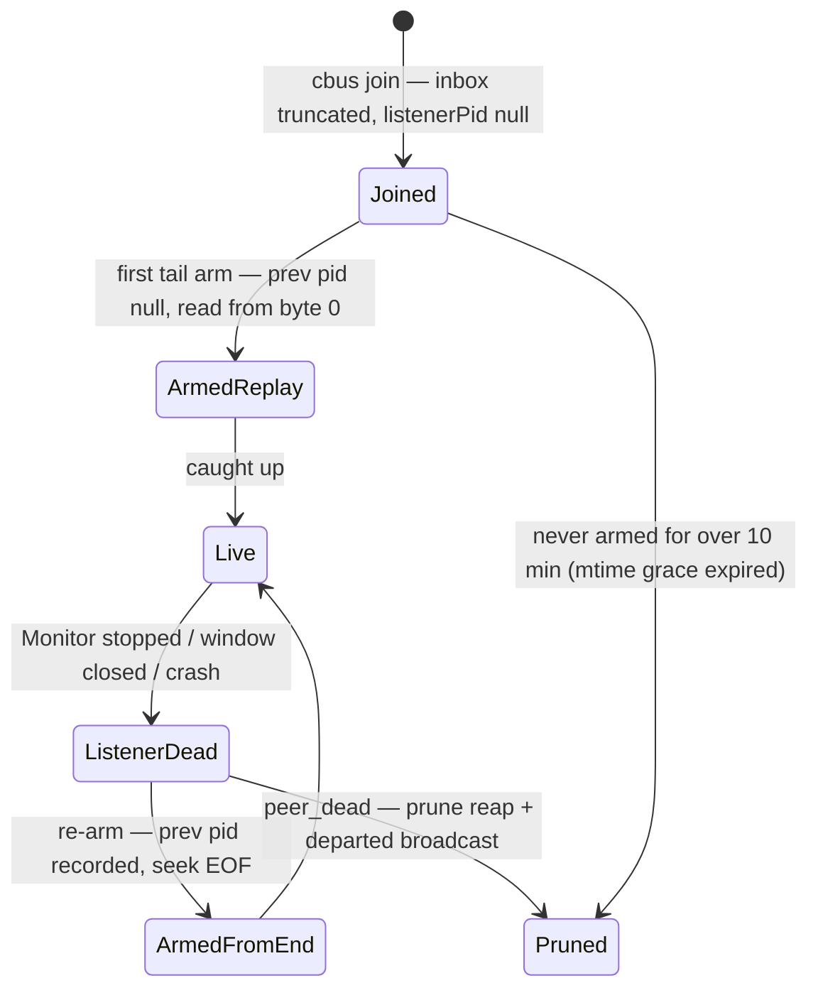
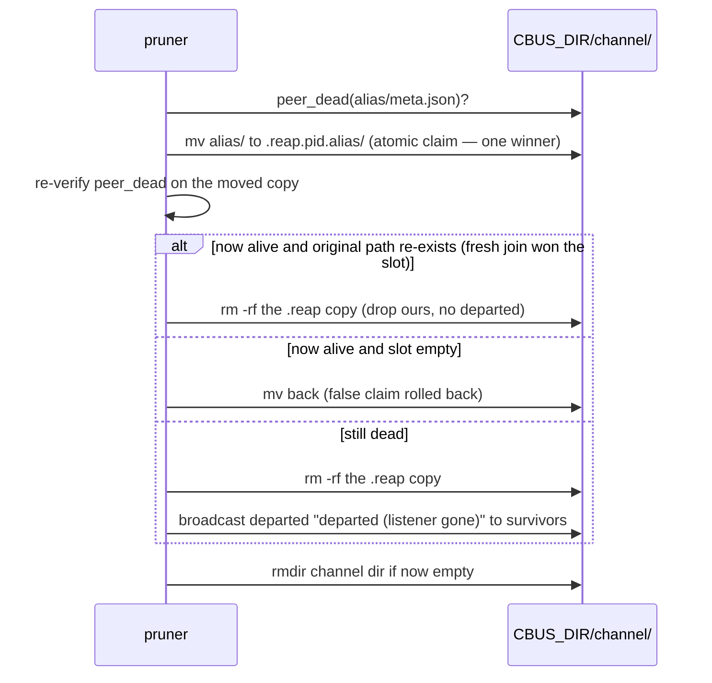
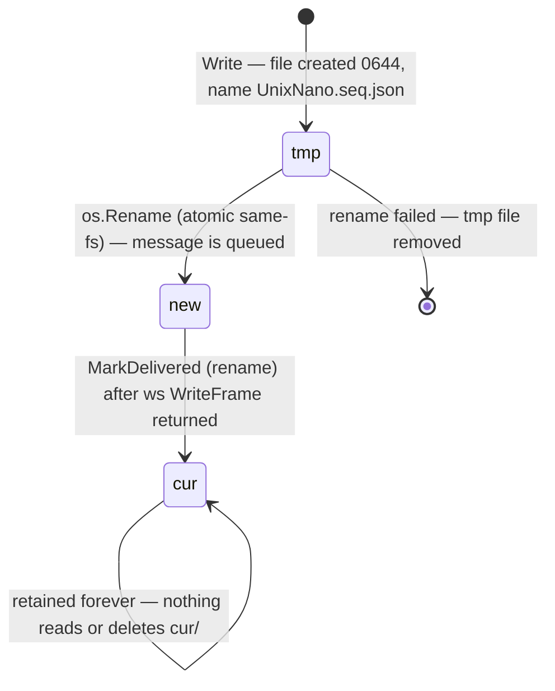

# claudebus — protocol & state specification

This is the wire and on-disk compatibility contract for claudebus, written to be
precise enough to reimplement **either side**: the bash client (`bin/cbus`), the Go
relay (`relay/`), or both. It documents behavior **as-is** at HEAD `f213e26`.

> **STATUS (2026-07-13):** the production client is the Go port; the contracts below
> are unchanged and remain authoritative — the port was differentially verified
> against them (27/27). `bin/cbus:N` anchors reference the retired bash
> implementation (in-repo until P3). Port deltas touching this spec: remote HTTP
> calls now time out at 4 s/20 s (§9.2's "no timeout" quirk — fixed); unknown hosts
> and invalid names are hard errors (§12.1's non-fatal quirk — fixed); local sends
> enforce the 1 MiB cap client-side (matching §9.2); a `--` flag terminator exists
> and trailing junk errors on fixed-arity verbs (§1.1's quirks — fixed); the local
> framer is the shared `core.LocalEmit`, so the §4.5 divergence matrix is unified per
> port-map ruling D6 (tool-authored traffic byte-identical; foreign-written-line
> tie-breaks now deliberate). The follower is an in-process Go loop re-exec'd with
> `--inbox <path>` in argv — §5.1's "inbox path in argv" invariant still holds.

Conventions:

- Anchors are `file:line` against the repo working tree at that commit.
- Behavioral oddities are flagged **`quirk — preserve or rethink in port`**; they are
  part of the observable contract today, not bugs this document fixes.
- "Monitor" means Claude Code's Monitor tool, which is the delivery surface for both
  transports (local `command` source, remote `ws:` source).

Related docs: `README.md` (user-facing overview — note several of its claims lag this
spec; where they conflict, this spec follows the code), `docs/prior-art-and-cc-internals.md`
(design rationale and the measured harness constraints).

---

## 1. Common conventions

### 1.1 Names

One validation rule is shared verbatim by client and relay:

```
^[A-Za-z0-9._-]+$    and not literally "." or ".."
```

- Client: `valid_name` (bin/cbus:24). Applied to channels, aliases, and relay host names.
- Relay: `validName` (relay/cmd/cbus-relay/main.go:33-37). Applied to `channel` and
  `alias` in `/send` and `/tail`. This is what makes names safe to use directly as
  spool path segments (no traversal).

Properties of the rule (all as-is):

| Property | Detail |
|---|---|
| No length cap | The only de-facto bound is filesystem `NAME_MAX` (~255 B), and only where a directory gets created. |
| All-digit names are legal | But the client's `jset` coerces digit-strings to JSON ints, so `cbus rename 42` stores `"alias": 42` as a number (bin/cbus:76). *quirk — preserve or rethink in port.* |
| Leading-dot names pass | `.remote`-style names are accepted but invisible to every `*/` glob the client uses (list/channels/prune/broadcast), and `.remote` collides with the marker tree. *quirk — a port should reject leading dots.* |
| Leading-hyphen names pass | `-a`, `--active`, `--force` etc. are legal names. There is no `--` end-of-options terminator anywhere in the CLI, so channels named `-a`/`--active` can never be used as a `list` filter (bin/cbus:583-587). *quirk.* |

`/` and `@` are structural separators and can never appear inside a name.

### 1.2 Addresses

**Local** — `<channel>/<alias>`, split at the **first** `/` (`split_target`,
bin/cbus:82-89):

- Both halves are validated, **except** an empty channel half skips validation
  entirely — so `/main` is indistinguishable from bare `main` (bin/cbus:87).
  *quirk — the leading-slash spelling exists by accident.*
- Bare `<alias>`: the channel is resolved from the **sender's own** registrations via
  `find_peer_channel` (bin/cbus:107-114) — first of the sender's channels (alphabetical
  glob order) containing that alias. Ambiguity resolves silently by order.
  `inbox`/`unregister` refuse bare aliases.
- A second `/` makes the alias invalid (`a/b/c` → `bad alias "b/c"`).

**Remote** — `<channel>@<host>[/<alias>]` (`split_remote`, bin/cbus:121-132). A target
is remote **iff it contains `@` anywhere** in `$1` (checked by `send`, `tail`, `list`,
`leave`; `rename` rejects `@` outright, bin/cbus:707-709).

- Channel = everything before the first `@`; the remainder splits at the first `/`
  into host / alias.
- Each **present** part is validated; empty parts are skipped. In practice:
  - `send`/`tail` require only a non-empty **alias** (bin/cbus:239, 274). An empty
    channel (`@nuc/al`) is accepted client-side, produces `channel:""` on the wire,
    and the relay rejects it with 400 — except `tail`, which still writes a
    **degenerate identity marker** at `.remote/<host>/<sessionId>` (a file at the
    channel level, i.e. the legacy-marker shape swept unconditionally by the next
    full prune). *quirk — a port should require a non-empty channel here.*
  - `leave` is the only remote command that requires a channel (bin/cbus:653).
  - `list` legitimately allows an empty channel (`cbus list @nuc` = whole host).
- `cmd_list_remote` reads **only `$1`**; every trailing argument is silently
  discarded, so there is no active-only remote listing by any argument order
  (bin/cbus:296; `cbus active <ch>@<host>` is structurally dead because dispatch
  prepends `--active`, defeating remote detection). *quirk.*

### 1.3 Timestamps

- Client: UTC ISO-8601 `YYYY-MM-DDTHH:MM:SSZ` via `date -u` (bin/cbus:20).
- Relay: RFC 3339 `time.Now().UTC()` when the sender omits `ts`; a client-supplied
  `ts` is stored **verbatim, unvalidated** (main.go:178-180). The bash client never
  sends one, so this is API-level (raw curl) surface only. *quirk — spool ordering is
  by arrival, never by `ts`.*

---

## 2. Local on-disk state (`$CBUS_DIR`)

State root: `$CBUS_DIR`, default `~/.claude-bus` (bin/cbus:16). Created lazily. No
explicit chmod/umask on bus files — any same-user process can read/append any inbox.
There is no per-peer ACL; this is the documented "trust boundary, not a security
boundary" stance.

### 2.1 Layout

```
$CBUS_DIR/
├── <channel>/
│   ├── <alias>/
│   │   ├── meta.json          # peer registration record
│   │   └── inbox.jsonl        # append-only mailbox, one JSON object per line
│   └── .reap.<pid>.<alias>/   # prune temp — dot-prefixed so */ globs never see it
└── .remote/
    └── <host>/
        └── <channel>/
            └── <sessionId>    # remote identity marker (one small JSON file)
```

The dot-prefix idiom is load-bearing: every enumeration in the client is a `*/` glob
(list, channels, prune, presence broadcast), which skips dot-dirs — so `.remote/` never
appears as a channel and a crash-orphaned `.reap.*` temp is inert, never a phantom peer
(bin/cbus:366-368).

Legacy shapes still recognized:

- **v1 entry**: a `meta.json` directly at the channel level. Rendered by `list` as
  `legacy v1 entry — run: cbus prune`, skipped by `channels`, whole channel dir removed
  by prune when dead (bin/cbus:355-360).
- **Legacy machine-global marker**: a plain FILE where a `.remote/<host>/<channel>/`
  dir should be. Always swept by full prune (unowned by definition, bin/cbus:201-205)
  and deleted on the next remote tail (bin/cbus:279).

### 2.2 `meta.json`

Written whole at join via python `json.dump(..., indent=2)` (bin/cbus:428-433). Field
patches (`jset`) rewrite the file **in place, non-atomically** — a concurrent read
mid-write sees truncated JSON, which `jget` swallows as "field absent" (self-healing on
the next read; *quirk — a port should write-temp-then-rename*).

| Field | Type | Written | Meaning |
|---|---|---|---|
| `alias` | string | join; rewritten by rename | alias within the channel (digit-only aliases stored as int — quirk §1.1) |
| `channel` | string | join | channel name (redundant with the path) |
| `sessionId` | string, `""` if unset | join | `$CLAUDE_CODE_SESSION_ID` of the joining session — the key `resolve_self` matches on |
| `cwd` | string | join | `$PWD` at join |
| `listenerPid` | null → int | join = null; set to the arming shell's `$$` at tail arm (bin/cbus:501) | pid of the exec'd follower; never cleared, only overwritten |
| `ownerPid` | null → int/null | join = null; set at tail arm (bin/cbus:502) | pid of the ancestor `claude` process (empty → null) |
| `host` | string | join | `hostname -s` (fallback `hostname`) |
| `ts` | string | join | join time, UTC ISO-8601; never refreshed as a field |

**The file's mtime is protocol state**: the 10-minute never-armed grace (§6.2) is
`find <meta> -mmin +10`, and the `jset` at arm time refreshes mtime. Any tooling that
touches meta.json resets the grace clock. *quirk.*

### 2.3 `inbox.jsonl`

One JSON object per line, appended with a single `printf '%s\n' >>` (O_APPEND,
bin/cbus:483, 346). Created **empty** at join (`: > inbox.jsonl`, bin/cbus:427) — the
truncate-at-join is what makes first-arm replay exact. An explicit-alias rejoin over a
dead peer does `rm -rf` + recreate, **destroying the dead peer's queued inbox**
(bin/cbus:423-427; *quirk — same for rename's name reclaim*).

Message line format: see §3.

Append atomicity is assumed, not enforced: one `printf` of a chat-sized line lands as
one write; there is no locking. *quirk — a port should lock or use a daemon for very
large messages.*

### 2.4 Remote identity markers

`$CBUS_DIR/.remote/<host>/<channel>/<sessionId>` — JSON file
`{"alias": "...", "ownerPid": <int>, "ts": "..."}` (bin/cbus:281-284).

- `<sessionId>` = `$CLAUDE_CODE_SESSION_ID`, falling back to `nosession-$PPID`
  (bin/cbus:189).
- `ownerPid` = `find_owner_pid` output, or `$PPID` when no `claude` ancestor exists
  (which makes the marker sweep-bait for the next prune — the Bash-tool shell pid is
  transient). *quirk.*
- Written/overwritten by `cbus tail <ch>@<host>/<al>` (arming claims the alias as THIS
  session's default `from`). Read by remote `send` for its `from` default. Removed by
  `cbus leave <ch>@<host>` (this session's marker only — **no relay call is made;
  queued mail stays on the relay**). Swept by bare `cbus prune` when `ownerPid` is dead.
- Session-scoping is the impersonation defense: markers are keyed by sessionId, so two
  sessions can hold different aliases on the same remote channel, and a session never
  inherits another's alias.
- A marker is a **from-default, not proof of reachability** — `cbus list @<host>`
  (relay `/peers`) is the truth source.

### 2.5 Credential store

Per host, three fields: `token`, `cf-id`, `cf-secret`.

| Platform | Location |
|---|---|
| macOS | Keychain generic passwords, service `cbus-relay-<host>`, account = field name. Writes go through `security -i` with the command on stdin so the secret never hits argv (bin/cbus:173-177). |
| Linux | Files `${XDG_CONFIG_HOME:-~/.config}/cbus/<host>/<field>`, created under `umask 077` (dir 0700, files 0600). |

`cbus auth set` strips **all** whitespace from values and supports `V='-'` = read
whole stdin — at most one stdin-fed credential per invocation, since each `-` drains
stdin (bin/cbus:750-752). At use time, auth headers are rendered as a curl config
piped to `curl -K -` so credentials never enter any argv (bin/cbus:225-235). The
message payload itself IS in curl's argv — only credentials are protected. *quirk.*

`cbus auth status` does **not** validate its host argument (the only unvalidated path
into `auth_get`; on Linux a `../` host path-traverses the credential dir, read-only,
4-char mask). *quirk — a port should validate like `auth set`.*

### 2.6 Atomicity primitives

There is no flock and no lockfile anywhere. Correctness rests on:

| Primitive | Used for | Anchor |
|---|---|---|
| bare `mkdir` (atomic EEXIST) | auto-alias claim at join; loser retries `pick_alias`, up to 50 tries, no sleep | bin/cbus:409-418 |
| `rename(2)` (atomic same-fs) | prune reap claim (`mv` peer dir → `.reap.$$.<alias>`), plus post-mv re-verify with rollback | bin/cbus:369-381 |
| dot-prefixed temp names | glob-invisibility of half-reaped dirs | bin/cbus:366-369 |
| O_APPEND single-`printf` writes | inbox appends (send, presence) | bin/cbus:346, 483 |
| `exec`-inherited `$$` + inbox path in argv | listener identity survives, pid recycling guarded | bin/cbus:495-515 |
| `2>/dev/null \|\| continue` on presence appends | a peer dir vanishing mid-broadcast can't abort under `set -e` | bin/cbus:344-346 |
| `${CBUS_DIR:?}` in `rm -rf` paths | unset CBUS_DIR can never expand to `rm -rf /...` | bin/cbus:666, 695 |

Known non-atomic spots (as-is): `jset`/join meta writes (no temp+rename); explicit-alias
join is check-then-rm-then-mkdir (TOCTOU); local send's final append is unguarded (a
concurrent prune between gate and append kills the command with a raw bash error).

---

## 3. Message formats

### 3.1 Local inbox line (client-written)

```json
{"from": "<ch/alias or fallback>", "to": "<channel>/<alias>", "ts": "<UTC ISO-8601>", "text": "<verbatim text>"}
```

Built via env→python `json.dumps` (bin/cbus:480-482), so arbitrary quotes, newlines,
and unicode in the text survive intact. Key order is insertion order
(`from,to,ts,text`).

`from` resolution (local send), first match wins:

1. explicit `--from X` — **unvalidated free text** (any bytes, any length);
2. sender's own registration in the **target** channel;
3. sender's first registration anywhere (alphabetical glob order);
4. `$CBUS_ALIAS` env (undocumented elsewhere; unvalidated);
5. `<hostname -s>-$PPID` — **unroutable** fallback (no inbox exists; receivers must
   not reply to it).

Remote send `from`: explicit `--from` → this session's identity marker
(`<ch>@<host>/<alias>`) → `hostname-$PPID`. Remote never consults local registrations
or `CBUS_ALIAS`. *quirk — the two fallback chains differ deliberately.*

### 3.2 Presence events

Same shape plus two fields (bin/cbus:341-343):

```json
{"from": "<ch>/<subject>", "to": "<ch>/<peer>", "ts": "<shared ts>",
 "kind": "presence", "event": "join|leave|rename|departed", "text": "<human text>"}
```

See §8 for semantics. Note `event` is stored but **never rendered** by the framer —
only `kind=` reaches the frame header; the event type is inferable only from the text.
*quirk.*

### 3.3 Relay stored line (spool file content)

The relay re-marshals accepted sends into the **same event shape** as local inbox
lines (main.go:181-187):

```json
{"from":"...","text":"...","to":"<channel>/<alias>","ts":"..."}
```

plus a trailing `\n`. Key order is Go-map **alphabetical** (`from,text,to,ts`) versus
the client's insertion order — **consumers must parse JSON, never pattern-match key
order**. `sendReq` still decodes only `{channel,alias,from,text,ts}`, but as of
cbus-ijx.5 the relay's server-side presence fan-out writes presence events as ordinary
spool lines carrying `kind`/`event`, and `reframe` renders ` kind=<k>` in the header —
so **relay-generated presence (join/departed) now crosses the relay**. Origination is
connection-lifecycle, not a client command: `join` fires on ws attach, `departed` on
detach after a grace window. Client-originated `leave`/`rename` over the wire (which
would need `kind` on the inbound `sendReq`) stay Phase 2.

Empty `from` defaults to `"unknown"` on the relay (main.go:175-177) — a different
"unroutable sender" spelling than the client's `hostname-PID`. *quirk.*

---

## 4. Delivery framing (the `◀ cbus` frame)

### 4.1 Monitor constraints (measured, not negotiated)

The frame format exists because of three **measured** Claude Code Monitor behaviors
(2026-07-11/12; detailed_changelog.md):

| Constraint | Value | Consequence |
|---|---|---|
| Single stdout/ws line truncated at | **500 chars** | body lines wrapped at 440 bytes |
| Lines written together (≲200 ms) batch into | **one notification** | whole frame emitted as one write / one ws frame |
| Per-notification ceiling (shared, local + remote) | **~3000 chars** | relay warns past `wsFrameSafe = 2800` |

For ws frames the 500-char cap is **per line, not per frame**. If the harness changes,
all three numbers are suspect — a port should centralize them as named constants with
measurement provenance.

### 4.2 Frame grammar

Each well-formed message is delivered as one multi-line block:

```
◀ cbus msg from=<from> to=<to> ts=<ts>[ kind=<kind>][ ⚠truncated~<N>B]
<body line 1>
<body line ...>
◀ cbus end from=<from>
```

- `◀` is U+25C0 (3 bytes UTF-8). Header template overhead is 26 bytes + field lengths.
- Body = message `text` split on its own `\n`, then each segment hard-wrapped at
  **≤440 UTF-8 bytes** per line. Wrapping is byte-aware and never splits a
  codepoint (client `wrap()` bin/cbus:522-531; relay `wrapBytes` main.go:208-221).
  Empty text segments are preserved as empty lines.
- ` kind=<kind>` appears on **both paths** (presence events): the local follower
  always, and the relay since cbus-ijx.5 (server-side join/departed fan-out).
- ` ⚠truncated~<N>B` appears **only on the relay path** (§4.4).
- The framed block is **load-bearing wire format**: receivers are instructed to parse
  `from=` out of the header to construct replies (commands/bus-join.md). Frame markers
  are in-band and unescaped — a body line beginning with `◀ cbus ` is not escaped by
  either framer. *quirk — spoofable framing, consistent with the trust-boundary
  stance; a port should decide deliberately.*

The **header and end-marker lines are exempt from the 440-byte wrap** on both sides —
only body segments are wrapped. A long `from`/`to`/`ts` (all reachable: `--from` is
unvalidated, names have no length cap) can push the header past the Monitor's 500-char
cap, truncating its tail — on the relay path the `⚠truncated` suffix is the first
casualty. A `from` containing a real newline (JSON-escaped in transit, decoded at
frame time) injects extra physical lines, i.e. forged header/end markers. *quirk —
frame-time sanitization is the defense-in-depth floor for a port.*

### 4.3 Local framer (the tail follower, bin/cbus:515-577)

Per completed inbox line:

1. `rstrip("\n")`; if the result is empty the line is **silently dropped** — not
   framed, not passed through (bin/cbus:532-535). Whitespace-only lines survive and
   pass through raw. *quirk — the passthrough contract has a blank-line hole.*
2. Frame **iff** the line parses as a JSON dict containing a `"text"` **key** (any
   value — `str()`-coerced, so `text: null` renders body `None`, a Python-repr leak).
   Missing `from`/`to` render as `?`; missing `ts` as empty.
3. Anything else passes through **raw and unwrapped** — such a line CAN exceed 500
   chars and be cut by the Monitor.
4. The whole frame is emitted as ONE buffered `write` + `flush` so the Monitor batches
   it into a single notification.
5. There is **no over-size warning on the local path**: a frame past ~3000 chars is
   silently cut by the Monitor — header and early body arrive, the tail of the body
   and the `◀ cbus end` marker are lost. (A missing end marker is a detectable
   truncation signal; the fix — chunked delivery + local warning — is tracked as
   cbus-mew.) *quirk.*

stdout is reconfigured to UTF-8 with `errors="replace"`, and the inbox is opened the
same way — mojibake never kills the follower.

### 4.4 Relay framer (`reframe`, main.go:227-252)

Applied server-side to each stored spool line before ws delivery, so a long message
survives the Monitor's per-line cap as one multi-line ws text frame:

1. Typed unmarshal into `{From, To, TS, Text string}`. **Non-JSON payloads, payloads
   with any non-string field, or `Text == ""` pass through byte-identical** — an
   all-or-nothing gate, unlike the local coercing gate (§4.5).
2. Same header/body/end shape as §4.2, body wrapped at 440 bytes, no `kind` slot.
3. If the framed total exceeds `wsFrameSafe = 2800` bytes, the header gains
   ` ⚠truncated~<N>B` where **N = `len(m.Text)` in bytes** (original unwrapped text,
   not frame size). The warning rides the header, which is delivered first, so it
   survives the ~3000 harness cut. Nothing is truncated server-side — the Monitor does
   the cutting.
4. Threshold math *quirk*: the total is computed **before the header exists** (a
   placeholder line contributes 1 byte), so the warning actually fires iff the emitted
   block exceeds `2799 + len(header)` — a silent window of `len(header) − 1` bytes
   (~75-90 B typically) above 2800. Bug-compatible ports must reproduce the
   header-less total; intent-faithful ports should count the header.

Tests: `relay/cmd/cbus-relay/reframe_test.go` pins short/long/unicode/newline/
passthrough/oversize behavior and enforces the <500-byte per-line invariant — but only
for well-formed `from` values; long/multiline `from` is untested.

### 4.5 Framer divergence matrix (degenerate inputs)

Every tool-authored line populates all four fields as strings, so these fire only on
foreign-written lines (hand-appended inbox lines, hand-placed spool files):

| Input line | Local `emit()` | Relay `reframe()` |
|---|---|---|
| `text:""` (key present, empty) | **framed** (one empty body line) | **passthrough** (raw JSON) |
| `text` key missing | passthrough | passthrough (different gate, same outcome) |
| `from`/`to` missing, text ok | framed, `from=? to=?` | framed, `from= to=` (empty) |
| `text:123` (non-string) | framed, body `123` (coerced) | **passthrough** (unmarshal error) |
| `text:null` | framed, body `None` (Python repr) | **passthrough** |
| `from:123`, text ok | framed, `from=123` | **passthrough** (any non-string field aborts) |
| non-dict JSON | passthrough | passthrough |
| `kind` present, text ok | framed, header `+ kind=<v>` | framed, **kind dropped** |

*quirk — a port unifying the framers must pick each tie-break deliberately; the
`text:null → "None"` body is an artifact nobody would spec.*

---

## 5. Local listener protocol (tail follower)

### 5.1 Arm sequence (`cmd_tail`, bin/cbus:487-577)

`cbus tail <ch>/<al>` is a Monitor **event source, never a Bash command** — it `exec`s
a follower that never exits, so a Bash invocation blocks the session forever.

1. Resolve target (bare alias → own channel). The inbox file must exist
   (`join first`); **meta.json is NOT required** — a meta-less dir yields a fully
   functional listener that no metadata records (invisible to list/send/prune; only
   `unregister` or manual `rm -rf` removes it). *quirk.*
2. Record `listenerPid = $$` and `ownerPid = find_owner_pid` into meta (best-effort,
   `|| true`).
3. `exec` the python follower **with the inbox path in argv**. `exec` means the
   follower inherits `$$` — the recorded pid IS the Monitor-managed process, so when
   the Monitor stops, liveness flips to "off" with no trap needed; and the argv
   fingerprint is what the liveness check greps for (§6.1). **A port must keep the
   inbox path (or equivalent) visible in the listener's process identity, or change
   the liveness check in lockstep.**

There is **no collision or ownership check at arm time** — no "already listening"
refusal (unlike join/rename, which refuse names taken by a live listener) and no
sessionId comparison. Arming the same address twice leaves two live followers
delivering every message twice, with metadata pinned to the newest pid only; the relay
transport, by contrast, *displaces* (§10.5). *quirk — the sharpest local/remote
asymmetry; a port must pick one policy.* A stale follower also survives its peer dir's
deletion: it polls the dead path, and if any session later rejoins the same address it
reopens the new inode and shadow-receives the new peer's traffic. *quirk — kill this
in a port.*

### 5.2 Replay semantics



- **First arm** (meta never recorded a `listenerPid`): read from byte 0 — replays the
  whole inbox. Combined with join's truncate, this guarantees nothing sent between
  join and first arm is lost; `cbus send` accepts joined-but-unarmed peers for exactly
  this reason.
- **Re-arm** (any previous pid recorded, alive or dead): seek to EOF — messages
  appended while the listener was dead are **never replayed**. This is why
  `send --force` into a dead-listener inbox is best-effort. *quirk — the remote path
  has the opposite semantics (spool replays); tracked asymmetry.*
- The `'+1'` / `'0'` start tokens are vestigial `tail -n` spellings; the follower only
  tests `== "0"`. A port should use an honest enum.
- Post-rename re-arm intentionally follows from the end (rename preserves meta).

### 5.3 Follower loop (hand-rolled `tail -F`, bin/cbus:552-577)

- Reads lines; on empty read, sleeps **0.2 s**, then `os.stat`s the path.
- Partial lines accumulate in a `pend` buffer, emitted only once terminated by `\n` —
  a mid-line concurrent append never yields a garbled frame. `pend` resets on reopen.
- Reopen when `st_ino` changed OR file shrank; reopen reads from offset 0 (full replay
  of the fresh file — this is how a rejoin's truncate is survived).
- Path vanished (`stat` OSError) → keep polling forever with the old fd open.
- **One self-termination path exists** (contradicting "never exits on its own"): if
  the file vanishes between a successful `stat` and the reopen `open()`, the follower
  is left with a closed file object and the next `readline()` raises an uncaught
  `ValueError` — process exits nonzero, Monitor reports it, liveness flips to off.
  *quirk — a port's reopen must retry-until-success.*

### 5.4 Remote "tail" is not a process

`cbus tail <ch>@<host>/<al>` runs nothing persistent. It (a) writes/overwrites this
session's identity marker, and (b) **prints** a Monitor `ws:` arm spec:

```
url:         wss://<site>/tail?channel=<ch>&alias=<al>
protocols:   ["bearer.cbus.<token>"]
description: cbus:<ch>@<host>/<al>   (persistent: true)
```

The relay token appears in cleartext by design — it IS the auth (the Monitor `ws:`
source supports only `{url, protocols}`, no custom headers). Alias collisions are not
pre-checked: the relay's single-active-tail rule makes them self-evident (§10.5).

---

## 6. Liveness & staleness

### 6.1 Local predicates (pure pid forensics — no heartbeat)

**`meta_listener_alive`** (bin/cbus:55-68) — the "listen" predicate; all three must hold:

1. `listenerPid` recorded and alive (`kill -0`);
2. **pid-recycling guard**: `ps -ww -p <pid> -o args=` contains the peer's inbox path
   as a fixed string;
3. if `ownerPid` is recorded, that pid is alive too (crash-orphan guard).

**`find_owner_pid`** (bin/cbus:44-53): walk `$PPID` upward, max 16 hops, stop at pid 1;
first ancestor whose `comm` basename matches `claude` or `claude-*` is the owner. No
match → no ownerPid → liveness degrades gracefully to pid+argv only. *quirk — the
comm-name heuristic breaks under renamed binaries / exotic launchers; the semantics to
preserve are: (a) listener death detectable without cleanup code, (b) crash-orphaned
listeners count as dead, (c) pid recycling cannot fake liveness.*

**`peer_dead`** (bin/cbus:316-323) — the prune/broadcast/send-gate predicate:

- never-armed (`listenerPid` null): dead only if meta.json **mtime > 10 minutes**
  (`find -mmin +10`) — the grace window that stops join's auto-prune from sweeping a
  sibling mid-setup;
- armed-ever: dead iff `!meta_listener_alive`.

Where each is used: `meta_listener_alive` → send gate, list listen/off column,
channels live count, alias-takeover refusals. `peer_dead` → prune reaping and the
presence-broadcast recipient filter (deliberately the same rule as the send path, so
joined-but-unarmed peers still receive presence).

### 6.2 The send gate

`cbus send` to a local peer:

| Target state | Behavior |
|---|---|
| joined, never armed | accepted unconditionally (first arm replays) |
| listener alive | accepted |
| armed-then-died | refused: `not listening; use --force to queue anyway`; with `--force`, warns and queues **best-effort** (re-arm seeks EOF — may never deliver) |

`--force` on remote targets is **accepted and ignored** — the spool always queues
(bin/cbus:244). *quirk — surface parity, no remote effect.*

### 6.3 Relay liveness

Connection-presence + keepalive, not pids: a peer is `connected` while its ws tail is
attached; `lastSeen` is hub memory (attach/detach/pong/text/delivery), **not
persisted** — zero time `0001-01-01T00:00:00Z` after a relay restart until reconnect.
Sends do not update presence. Detection floor for silent death is **~90–120 s**
(§10.3), during which `/peers` reports `connected:true` and `lastSeen` keeps
refreshing on traffic to the corpse. *quirk — presence is delivery-attempt evidence,
not receipt evidence.*

---

## 7. Prune GC

### 7.1 Channel prune (`prune_channel`, bin/cbus:352-385)

Triggered automatically by every `cbus join` (its own channel only) and manually by
`cbus prune [channel]`. Per dead peer, the atomic **reap dance**:



The claim-then-verify makes `departed` fire **at most once** across concurrent
reapers, and removal-before-broadcast means the reaped peer can never receive its own
event. Legacy v1 entries: whole channel dir removed when dead.

### 7.2 Remote marker sweep

Runs **only** on a bare `cbus prune` (no channel argument) via `prune_remote_markers`
(bin/cbus:640-645): per-session markers removed when their `ownerPid` is dead; legacy
file-markers always removed; empty dirs rmdir'd. **No other path ever sweeps
markers** — not join's auto-prune, not remote ops, not `hook-exit`. `cbus prune <ch>`
never touches `.remote/`. *quirk — docs elsewhere overstate this.*

### 7.3 Other removal paths

| Command | Effect |
|---|---|
| `cbus leave [ch]` | for each of this session's registrations: broadcast `leave`, then `rm -rf` the peer dir |
| `cbus leave <ch>@<host>` | delete this session's marker only; **relay untouched** — queued mail keeps accumulating and is inherited by whoever next arms that alias |
| `cbus unregister <ch>/<al>` | unconditional `rm -rf` of any peer (no liveness/ownership check), broadcast `departed` ("unregistered") |
| `cbus hook-exit` | SessionEnd hook: reads `{session_id}` from **stdin JSON** (env fallback), runs `leave` for that session silenced and never-failing (always exit 0). Local channels only; graceful exits only — hard kills rely on the prune `departed` backstop. Wiring is manual per host (`~/.claude/settings.json` SessionEnd → `cbus hook-exit`; install.sh does not do it). |

---

## 8. Presence protocol

`broadcast_presence <channel> <from> <event> <text> [skip]` (bin/cbus:332-348) appends
a presence line (§3.2) to the inbox of every **non-dead** (`!peer_dead`) peer in the
channel except `skip` (default: the subject). Using `peer_dead` — the same rule as the
send gate — is deliberate: a joined-but-unarmed peer still receives presence, replayed
at its first arm. One shared `ts` per broadcast. Appends are `|| continue`-guarded
against concurrently vanishing peers.

| Event | Fired by | `from` (subject) | `skip` | text |
|---|---|---|---|---|
| `join` | `cbus join` | new alias | =from | `joined <ch> as <alias>` |
| `leave` | `cbus leave` / `hook-exit` (broadcast **before** removal) | leaving alias | =from | `left <ch>` |
| `rename` | `cbus rename` (after the `mv`, so `from=` is the NEW alias) | new alias | =from | `renamed <old> -> <new>` |
| `departed` | rename's dead-name reclaim | reclaimed (dead) alias | **old alias** (the actor, else it self-echoes) | `departed (name reclaimed)` |
| `departed` | prune reap (after the atomic claim) | reaped alias | =from | `departed (listener gone)` |
| `departed` | `cbus unregister` | removed alias | =from | `unregistered` |

Receiver rendering (local frame): `◀ cbus msg from=<ch>/<al> to=<ch>/<you> ts=<iso>
kind=presence` + text + end marker.

Properties to preserve or consciously rethink:

- **Relay presence (cbus-ijx.5)**: the relay now renders `kind` and GENERATES
  join/departed from the ws lifecycle (attach → join; detach + ~90s grace → departed),
  fanned to connected peers via the spool. Semantics differ from local: it is
  connection-presence, not registration, so `/peers` is the state truth source and the
  pushed events are edge notifications. Header text is honest to that (`connected as
  <alias>` / `departed (connection lost)`). Client-originated `leave`/`rename` and
  durable offline catch-up are Phase 2.
- `departed`/`leave` events carry an unroutable `from` (the subject's dir is gone) —
  receivers must treat presence `from=` as informational, not a reply target.
- Presence lines persist in inboxes like any message: they replay on first arm
  (intended — roster catch-up) and can be stale by then.
- One `cbus join` can emit `departed` (auto-prune reaps) and then `join` — two frames
  from one command.
- Explicit-alias join's dead-peer reclaim broadcasts **nothing** (asymmetric with
  rename's reclaim, which broadcasts `departed`). *quirk.*

---

## 9. Relay HTTP API

### 9.1 Daemon

Std-lib-only Go binary (`relay/cmd/cbus-relay`, `go 1.26`, zero deps). Flags:
`-listen` (default `127.0.0.1:8090` — loopback; the CF tunnel fronts it, no TLS in the
binary), `-spool` (default `spool`), `-token-file` (default `token`). Production unit:
`ExecStart=… -listen 127.0.0.1:8090 -spool /home/relay/cbus-relay/spool -token-file
/home/relay/cbus-relay/token`, `Restart=on-failure`/5 s.

Token: env `CBUS_RELAY_TOKEN` (trimmed) wins; else the token file; fatal if empty or
if it contains any of `=` `,` `/` or space — it must be **subprotocol-safe**
(main.go:396-409). The token is loaded **once at startup** — rotation requires a
restart, invalidates every armed ws spec (which bakes the token), and surfaces as an
HTTP 401 handshake refusal, *not* a 1006 close — a failure shape the documented
re-arm doctrine doesn't cover. *quirk — a port should support old+new token grace or
SIGHUP reload.* `ReadHeaderTimeout: 5s`; no other server timeouts.

Routes: `/send`, `/tail`, `/peers`, `/healthz`. The relay is one flat namespace keyed
`channel/alias` — "host" exists only client-side as *which relay to talk to*.

### 9.2 `POST /send`

| Aspect | Contract |
|---|---|
| Method | POST only → else `405`, body `POST only` |
| Auth | `Authorization: Bearer <token>`, constant-time compare → else `401 unauthorized` |
| Body | JSON, hard cap **1 MiB** (`http.MaxBytesReader`) → decode failure `400 bad json: <err>` |
| Request | `{"channel","alias","from","text","ts"}` — channel/alias must pass `validName` (`400 bad channel/alias`); text required non-empty (`400 empty text`); from optional (default `"unknown"`); ts optional (default server RFC3339, client value stored verbatim) |
| Effect | spool `Write` (§11) → `hub.poke` (wakes a connected tail) → respond |
| Success | `200`, `Content-Type: application/json`, body `{"ok":true,"id":"<spool filename>"}\n` |
| Spool failure | `500 spool: <err>` |

Semantics to know when porting the client:

- **No existence check**: sending to a never-seen `channel/alias` silently creates
  spool dirs and queues forever (no TTL).
- **Ack-after-write ambiguity**: the 200 is written after the spool write (and the
  poke may have already delivered the message live). A transport failure after the
  write leaves the client with `relay send failed` for a message that IS queued —
  and there is no idempotency key (server-minted id, server ts), so a retry is a new
  message. *quirk — auto-retrying ports must add an idempotency key first.*
- The bash client's send/list curls have **no timeout** (only the 0.3 s healthz probe
  is bounded) — a black-holed request wedges the Bash tool call. *quirk — a port
  should set explicit connect/total timeouts, paired with the idempotency story.*

### 9.3 `GET /peers`

Bearer auth (401 otherwise); no method check. Response: a JSON object keyed
`"<channel>/<alias>"`:

```json
{"dev/nuc": {"connected": true, "lastSeen": "2026-07-12T...", "queued": 0}, ...}
```

Built as: one entry per **spool dir** (queued = `len(new/)`), union one entry per
**connected hub key** not already present (`connected:true, queued:0`). Consequences:

- A peer that armed a tail but was never sent mail **vanishes from `/peers` entirely
  on disconnect** (no spool dir, no hub entry) — absent, not `off`. First message ever
  spooled makes it permanent. *quirk — absence vs off keys on "ever received mail".*
- `lastSeen` is process memory: zero time after restart; refreshed by attach, detach,
  pong/text frames, and each delivery — including deliveries into a not-yet-detected
  dead connection (§10.7).
- No query parameters exist — the channel filter in `cbus list <ch>@<host>` is purely
  client-side, and there is no connected/active filter at all.
- Spool dirs are never deleted, so `/peers` output grows monotonically.

### 9.4 `GET /healthz`

Unauthenticated, responds `ok\n`. Load-bearing for the client's local-vs-public front
door probe and deploy's post-deploy check.

### 9.5 `GET /tail` (HTTP entry to the ws protocol)

Check order matters and is observable:

1. `channel`/`alias` query params `validName` → else `400 bad channel/alias`
   (**before auth** — an unauthenticated probe can distinguish bad-name from bad-token);
2. subprotocol token (§10.1) → else plain HTTP `401 unauthorized` (a failed handshake,
   not a ws close);
3. `wire.Upgrade` — on any pre-hijack failure (non-GET, missing upgrade headers, bad
   version/key) the handler logs and returns without writing: the client sees an
   implicit **`200 OK` empty body**. *quirk — any stock ws library in a port will
   return 400/426 here instead; nothing in-repo depends on the 200.*

On success: 101 with the matched subprotocol echoed; per-connection
`WriteTimeout = 10s`; the connection is hijacked into the ws protocol (§10).

### 9.6 Auth model & CF Access topology

Two independent mechanisms in the relay:

| Surface | Mechanism |
|---|---|
| `/send`, `/peers` | `Authorization: Bearer <token>` header, constant-time compare |
| `/tail` | `Sec-WebSocket-Protocol: bearer.cbus.<token>` — every offered subprotocol is comma-split, trimmed, and the part after the `bearer.cbus.` prefix constant-time compared; the matched protocol string is echoed in the 101 (RFC 6455 requirement) |

The subprotocol pattern exists because the Monitor `ws:` source cannot send custom
headers; a header (unlike a `?token=` query param) also stays out of edge access logs.

Edge topology (infrastructure outside this repo; per README): the public front door
`https://bus.example.com` is a Cloudflare tunnel. `POST /send` and `GET /peers` require
**CF Access service-token headers** (`CF-Access-Client-Id`/`-Secret`) at the edge *plus*
the relay bearer at origin. `GET /tail` has a **path-scoped CF Access bypass** — the
subprotocol token is the sole auth on that path. The deliberate asymmetry: compromising
the tail path only allows eavesdropping a channel; the write path (which injects
instructions into live sessions) keeps the stronger double guard. The relay never sees
or checks CF headers.

---

## 10. WS tail protocol

Hand-rolled RFC 6455 subset (`relay/internal/wire/ws.go`): no fragmentation, no
extensions, no compression, no binary frames.

### 10.1 Handshake

Server requires: GET; `Upgrade: websocket` (case-insensitive) and `Connection`
containing the token `upgrade`; `Sec-WebSocket-Version: 13` exactly;
`Sec-WebSocket-Key` decoding to exactly 16 bytes. Response:
`HTTP/1.1 101 Switching Protocols`, `Sec-WebSocket-Accept: base64(SHA1(key + GUID))`,
plus `Sec-WebSocket-Protocol: <echo>` when a subprotocol was selected.

The in-repo client (`wire.Dial`, used by the `wstail` debug tool) is TCP-only — no
TLS — so it works only against loopback; the real remote consumer is the Monitor
`ws:` source through the CF tunnel. A `Dial`-side port offering a subprotocol must
verify the server echoed it exactly.

### 10.2 Frame layer

| Rule | Value |
|---|---|
| Opcodes | `OpText 0x1`, `OpClose 0x8`, `OpPing 0x9`, `OpPong 0xA` — no binary (0x2), no continuation (0x0) |
| Fragmentation | rejected (`!fin` or opcode 0 → connection error); RSV bits rejected |
| Masking | direction enforced: client→server MUST mask, server→client MUST NOT |
| Max frame | **1 MiB — read-side only.** `WriteFrame` has no size check, so the relay can emit frames its own reader would reject: a `/send` body near the 1 MiB cap reframes into an OpText frame larger than 1 MiB, which a contract-enforcing client (including `wstail`) drops the connection on — after `MarkDelivered`, so the message is deterministically lost. *quirk — a port must pick a side; lowering the ingress cap is the only fix without a poison-pill hazard.* |
| Control frames | payload ≤ 125 B (read-side) |
| Close | best-effort **empty close frame (no status code, no reason)**, then TCP close |

### 10.3 Keepalive

Constants: `pingEvery = 30s`, `pongGrace = 90s` (main.go:29-30).

- Server sends `OpPing` (nil payload) every 30 s.
- Client pings are echoed back as `OpPong` **with the payload** (RFC requirement).
- `OpPong` **or any client `OpText` frame** refreshes `lastPong` and hub `lastSeen` —
  any chatter counts as liveness (deliberate leniency for the Monitor's ws client).
- Pong staleness is evaluated only at ping ticks: timeout when
  `since(lastPong) > 90s` at a 30 s tick → detection lands **90–120 s** after the last
  frame. The reader goroutine's per-frame read deadline is `pongGrace + pingEvery` =
  120 s.

### 10.4 Delivery loop

```mermaid
sequenceDiagram
    participant M as Monitor (ws client)
    participant R as relay /tail handler
    participant H as hub
    participant S as spool (Maildir)

    M->>R: GET /tail?channel=C&amp;alias=A + subprotocol bearer.cbus.token
    R->>H: attach("C/A") — displaces any existing tail (close old.done)
    R-->>M: 101 + echoed subprotocol
    loop drain
        R->>S: ListNew() — filename order
        loop each queued message
            R->>R: check t.done (displaced? bail)
            R->>S: Read(new/name)
            R->>R: reframe → one OpText frame
            R->>M: OpText (framed block)
            R->>S: MarkDelivered (new/ → cur/)
            R->>H: touch (lastSeen)
        end
        Note over R: park: notify / done / readerDone / 30s ping tick
    end
    Note over R,M: POST /send → spool Write → hub.poke → notify wakes the loop
```

Wake-up semantics a port must replicate exactly: each tail's `notify` is a
**1-buffered channel**; `poke` is a non-blocking send under the hub mutex. The token
is *level*, not *edge* — it means "queue may be non-empty", carries no message
identity; the loop always re-lists the whole `new/` directory. Capacity 1 +
non-blocking producer + consumer-always-rescans = no lost wakeups, no producer
blocking, safe coalescing. Spool write happens **before** poke — signal-then-write
would reopen the race. The 30 s ping tick doubles as a re-list backstop, so a broken
port degrades to ≤30 s push latency rather than losing messages — which silently
defeats the instant-wake premise without failing tests.

Error handling in the loop: `Read`/`MarkDelivered` hitting `fs.ErrNotExist` →
`continue` (a displacing tail already handled it — benign); a ws write error → log
"(message stays queued)" and return — the unmarked message redelivers on the next
attach.

### 10.5 Displacement (single active tail per key)

`hub.attach` under the mutex: `close(old.done)` for any existing tail, then replace
the map entry — the map points at the displacer **before** the old connection tears
down. The old drain loop observes `done` per-message (mid-drain) or in its idle
select, and returns. `hub.detach` deletes the map entry **only if it still points at
the same `*tail`** (pointer compare) — an unconditional delete would unregister the
live displacer, degrade push to the 30 s backstop, and make the orphan undisplaceable.
*port-critical: keep compare-and-delete keyed on connection identity.* The `seen`
refresh in detach is unconditional — a dying displaced connection bumps `lastSeen`.

Handover guarantees: **at-least-once, no interleaved drains — not exactly-once.** A
displacement landing between the old tail's `done` check and its `MarkDelivered` lets
both tails deliver that one message; the loser's mark hits `ErrNotExist` and is
tolerated. (README's "no duplicate delivery on handover" overstates.)

### 10.6 Close semantics (what the client observes)

The relay never sends a numbered close code. Two observable buckets:

| Bucket | Paths | Client-side code |
|---|---|---|
| Close frame received (empty, no status) | displacement, pong timeout, client-gone, spool errors — any loop return where the deferred `Close()`'s frame lands on a healthy socket | **1005** "no status received" |
| No close frame | laptop sleep, network loss, CF tunnel drop, relay process death/restart, write-failure exits | **1006** "abnormal closure" |

The documented re-arm doctrine keys on `[WebSocket closed: 1006]` "(or similar)";
whether the Monitor distinguishes 1005 from 1006 is unobservable from this repo.
*quirk — a port that skips the close frame merges the buckets into 1006; one that adds
codes changes what the doctrine keys off. Either is a behavior change — choose
deliberately.*

### 10.7 Delivery guarantees & loss windows

End-to-end the remote path is **at-least-once with two duplication points and one
silent loss window**:

| Window | Mechanism | Outcome |
|---|---|---|
| HTTP ingress retry | ack written after spool write; transport failure after the write is indistinguishable from rejection; no idempotency key | manual/automatic retry duplicates |
| Delivery replay | write error leaves the message in `new/` | redelivered on next attach (duplicate possible) |
| **Sleep window (silent loss)** | after a silent client death the relay is blind for ~90–120 s; `WriteFrame` into the black-holed connection *succeeds* (kernel/CF buffer), `MarkDelivered` moves the message to `cur/`, and **nothing ever reads `cur/` back** | every message sent in the undetected window is deterministically lost; `/peers` shows `connected:true` with a fresh `lastSeen` throughout |

The "the relay replays queued mail — nothing is lost" doctrine is therefore true only
for mail spooled while **no** tail is attached. *quirk — the port's most consequential
correctness decision; options: app-level acks (requires a local bridge process — the
Monitor ws source cannot be scripted to send frames), cursor-based re-drain of `cur/`
with client dedup, or shrinking the window (mitigation only).*

Local-path guarantees for contrast: the inbox file is the durable log; loss modes are
the re-arm-seeks-EOF rule (§5.2) and prune's inbox destruction on reclaim (§2.3) —
plus the send-gate race where a >10-min-old never-armed peer accepts mail yet is
prunable (send-then-prune can discard it silently).

---

## 11. Maildir spool

`relay/internal/spool/spool.go` — per-peer Maildir under the spool root:

```
<root>/<channel>/<alias>/
  tmp/   in-flight writes (invisible)
  new/   queued, undelivered
  cur/   delivered
```



| Aspect | Contract |
|---|---|
| Filename | `fmt.Sprintf("%d.%06d.json", time.Now().UnixNano(), seq.Add(1))` — wall-clock nanos + a **process-lifetime** atomic counter. Names sort lexicographically = enqueue order. The `id` in the `/send` response is this filename. |
| Write | to `tmp/` then `os.Rename` into `new/` — crash-safe by construction (invisible / queued / delivered, never torn). **No fsync** — process-crash-safe, not power-loss-safe (deliberate). |
| ListNew | reads `new/`, regular files only, `sort.Strings`; missing dir → empty list, no error (and **no dir creation** — only `Write` creates peer dirs). |
| MarkDelivered | rename `new/<name>` → `cur/<name>`. |
| Peers | walks `<root>/*/*`, returns queued counts (= `len(new/)`). |
| Ordering caveats | a backwards clock step can reorder across the step; `seq` resets per process (uniqueness across restart rests on UnixNano alone). |

**There is no retention or GC anywhere** — verified both by code absence (the only
`os.Remove` in the package is failed-rename cleanup) and live on the NUC (no cron, no
systemd timer; delivered mail from every channel ever used still present in `cur/`):

- `cur/` grows forever; `tmp/` orphans from a crash are never swept;
- peer/channel dirs are never deleted, so dead test channels appear in `/peers` (and
  `cbus list @host`) **forever**;
- `cbus leave <ch>@<host>` never contacts the relay, so mail keeps queueing for a
  departed alias, and **whoever next arms that alias inherits the backlog** —
  including a different session or machine.

*quirk — preserve or add retention + a relay-side leave/GC verb in a port; declining
fsync and retention was a reviewed, deliberate v1 decision.*

---

## 12. Client endpoint resolution & credentials

### 12.1 Host → URL

- Built-in table: **none** — the `nuc` built-in was removed; hosts resolve solely
  via the `CBUS_SITE_<HOST>_URL` override below (this records the since-retired
  port-verified default).
- Env override/extension: `CBUS_SITE_<HOST>_URL`, where `<HOST>` is the host
  uppercased, every non-`[A-Z0-9]` mapped to `_`, then **one** trailing `_` stripped
  (`my-nas` → `CBUS_SITE_MY_NAS_URL`; distinct hosts can collide on one var). *quirk.*
- Unknown host: the `die` fires inside a command substitution, so it is a **non-fatal
  stderr message** — the command continues with `mode=public base=""` and terminates
  later on missing credentials (two stacked errors) or, with credentials stored,
  `tail` **exits 0 with a scheme-less broken arm spec and still writes the identity
  marker**. *quirk — a port with real error propagation should hard-fail before
  claiming identity.*

### 12.2 Front-door probe

`relay_base` (bin/cbus:148-155): GET `${CBUS_RELAY_LOCAL_URL:-http://127.0.0.1:8090}/healthz`
with `curl -m 0.3`; body exactly `ok` → mode `local` (loopback URL, **no CF Access
headers**); else mode `public` (site URL + CF Access in the HTTP legs). Runs on every
remote operation (~0.3 s latency cost off-relay). Trust-by-port: anything answering
`ok` on loopback:8090 is believed. *quirk.*

`ws_url` string-swaps `https://`→`wss://`, `http://`→`ws://`; **any other scheme
yields an empty string** with no error. *quirk.*

### 12.3 Credential requirements per operation

| Operation | token | cf-id + cf-secret |
|---|---|---|
| `cbus tail <ch>@<host>/<al>` (arm spec) | required | never (ws leg is subprotocol-only) |
| `cbus send <ch>@<host>/<al>` | required | public mode only |
| `cbus list [<ch>]@<host>` | required | public mode only |

Missing credentials die with pointer messages to `cbus auth set <host> --… -`.
Failure surfaces differ: remote send/tail wrap errors in `cbus: …`; `list @host`
failures surface as curl stderr + a python `JSONDecodeError` traceback, **exit 1**
(python's, never curl's code — the renderer is the rightmost pipeline command).
*quirk.*

---

## 13. Constants & invariants — port compatibility checklist

Every number below is load-bearing; the starred ones encode **measured** harness
behavior and silently mis-frame if the harness changes.

| Constant | Value | Where | Meaning |
|---|---|---|---|
| Monitor line cap * | 500 chars | measured; bin/cbus:504, main.go:207 | any single stdout/ws line is truncated past this |
| Monitor batch window * | ~200 ms | measured | lines written together become one notification |
| Monitor notification ceiling * | ~3000 chars | measured; main.go:202-204 | shared by local and remote paths |
| Body wrap | 440 bytes | bin/cbus:522, main.go:239 | UTF-8-byte-aware, never splits a codepoint |
| `wsFrameSafe` | 2800 bytes | main.go:204 | relay ⚠truncated threshold (header-less total — §4.4) |
| Follower poll | 0.2 s | bin/cbus:564 | inbox idle poll interval |
| Unarmed-peer grace | 10 min | bin/cbus:319 | meta.json mtime, `find -mmin +10` |
| Loopback probe timeout | 0.3 s | bin/cbus:150 | front-door autodetect |
| `pingEvery` | 30 s | main.go:29 | server ping cadence + drain backstop |
| `pongGrace` | 90 s | main.go:30 | staleness threshold (detection 90–120 s) |
| Reader deadline | 120 s | main.go:283 | pongGrace + pingEvery |
| Conn WriteTimeout | 10 s | main.go:271 | bounds each ws write incl. teardown close |
| `/send` body cap | 1 MiB | main.go:163 | MaxBytesReader |
| ws `maxFrame` | 1 MiB | ws.go:32 | **read-side only** (§10.2) |
| Control-frame payload | 125 B | ws.go:260-262 | read-side only |
| ReadHeaderTimeout | 5 s | main.go:419 | only HTTP server timeout |
| Owner walk depth | 16 hops | bin/cbus:46 | claude-ancestor search |
| Alias claim retries | 50 | bin/cbus:417 | mkdir race loop, no backoff |

Invariants a port must preserve (or change with eyes open):

1. **Join truncates the inbox; first arm replays from byte 0; re-arm seeks EOF.** The
   first/re distinction keys on whether meta ever recorded a `listenerPid`.
2. **The listener's process identity carries the inbox path** (argv today) and the
   recorded pid IS the Monitor-managed process — the whole liveness scheme hangs on
   both.
3. **Presence targets `!peer_dead`, the same rule as the send gate** — anything else
   reintroduces "unarmed peers miss presence forever".
4. **Frame constants and the one-write-per-frame batching** — fragmenting a frame
   across Monitor notifications breaks the receive contract the skills teach.
5. **Relay stored lines are byte-compatible with local inbox lines** (modulo key
   order and the missing `kind`) — the client needs no translation layer.
6. **hub: mutex-held close-then-replace attach; per-message `done` check;
   pointer-compared detach; ErrNotExist-tolerant read/mark; 1-buffered level-triggered
   notify with write-before-signal.** These six together make displacement safe over
   the Maildir spool.
7. **Token stays subprotocol-safe** (no `=` `,` `/` space) and rides in the ws
   subprotocol, never a query param.
8. **spool write is tmp→rename; MarkDelivered is the only new/→cur transition;
   `ListNew` order is filename order.**
9. **`cbus tail` is two different verbs**: local = blocking Monitor event source;
   remote = instant print-the-spec command with a marker side effect. A port should
   consider separating them.
10. **Errors funnel to exit 1** across the client (two dialects today: `cbus: …` from
    `die`, and raw bash `${1:?usage…}` with script path + line number — unify in a
    port, and never reproduce the `${:?}` rendering).
